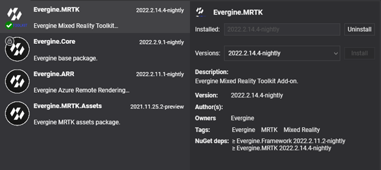

# Add-ons

---
Add-ons are **Evergine** packages that add specific functionalities and assets to your project. They are meant resolve some key issues that companies face when they create industrial 3D application using their common resources.

They may contain assets, prefabs, behaviors, components and nuget packages that will be incorporated to your project after install.

## Available Add-ons

* [MRTK](mrtk/index.md)
* [ARR](arr/index.md)

## Add-ons in Evergine Studio

To check wich packages are installed in your application, you just need to take a look to the Project Explorer tab in Evergine Studio, and inspect the Dependencies section:

## Add-ons Manager

The Add-ons manager help you installing new ones. There are 3 posibilities to open it:

1. Use File menu, where you will find a new “Manage dependencies” menu item.
1. Under Assets explorer, there is a node with name “Dependencies”. Right click on that will show a context menu with a menu entry with the same name in the point above.
1. Access to “Project settings”, there are two tabs now, one for project profiles, and other for project add-ons.

The manager contains two tabs: _Browse_, where you can find all available add-ons; and _Installed_, where you can check all add-ons that are currently in use in your project. Both tabs contain a similar user interface. Above those tabs, you will find a searching area:

* Text search, to filter results by name and tags.
* Source selector, to limit results to an specific packages source.

Depending on search criteria, number of displayed add-ons may vary. Each add-on item within the list displays following information:

* Name, icon and description.
* Under the icon, in bottom left corner, it will display a tick inside a green circle if you are already using last available version, or an arrow inside a blue circle if you are using that add-on, but there is a newer version available.
* On top right corner, you will find latest available version vs installed version (if any). For those add-ons which last version is already in use, a single version label is displayed.
* Also, if you move your mouse over list items, some buttons to install last add-on version or remove an add-on should appear.

When selecting an item in the list, a detail view is loaded with all the information related to an add-on. There, you can also install or uninstall the add-on, and you are even able to install a specific version. Note the NuGet dependencies section, that indicates minimal versions of engine and/or third-party NuGet packages. As it is mandatory to have aligned versions of the engine packages, if you try to install an add-on with an engine dependency higher than the one you are using, a project restart will be required and automatically scheduled.

For add-ons which NuGet dependencies are not expressed as explicit version number, you should install those packages manually. In other hand, for third-party NuGet dependencies with explicit version number, they will be added or updated automatically once package is added.

## Customize assets

By default, all assets included in a package cannot be modified. This is indicated by this lock icon: .

However, you can modify an asset included in the package. When you modify a package asset, and try to save it, the following message apperas, indicating if you want to create a new copy of this asset in your project:

Automatically a new copy of the asset will be created on your local folder project, overwriting the one provided by the package. By doing this allows you to modify or adapt Evergine core assets to your application requirements

## Develop new Add-ons

The ability to include new add-ons to external companies will be available in future releases. For now only add-ons created by **Evergine Team** can be installed through **Evergine Studio**.

### Upcoming packages

Evergine is on continuous development, and more upcoming packages are coming:

| Package | Description |
| --- | --- |
| **Noesis GUI** | Using [NoesisGUI](https://www.noesisengine.com/) with Evergine allows you to create appealing User Interfaces using powerful XAML tools like Microsoft Expression Blend. |
| **CAD Formats** | Take your industrial CAD/3D model and bring it into your Evergine application. |
| **Bing Maps** | Provides [Bing Maps](https://www.bingmapsportal.com/) integration with Evergine, that allows you to utilize Bing Maps 3D mapping data in your application. |
