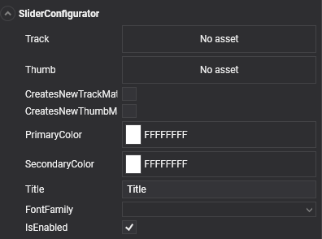

# Configurators
---
The configurator components were created to ease the customization process and, in some cases, extend the functionality of certain controls. To use them, add them to the prefab root after instancing a prefab.

There are some examples for all configurators in the *test scenes* in the *MRTK Demo* project.

## Standard button configurator
This configurator can manage the configuration of certain aspects of a basic button, like the icon, the button text and the material plate. If the color should also be changed, the *CreatesNewIconMaterialInstance* and *CreatesNewBackPlateMaterialInstance* checkboxes will do so that the change does not affect other instances.

## ToggleButton
When added to a button, the *ToggleButton* component extends its base functionality, so the button will have two different styles depending on whether it is in the *ON* or the *OFF* state. This component adds two *ToggleButtonConfigurator* components, which can be used to configure each state in a very similar way as the *StandardButtonConfigurator*.

## MultiState buttons
The *ToggleButton* component adds the *ToggleStateManager* and two *ToggleButtonConfigurators* to the button. There's also an implementation for tristate buttons by way of adding a *MultiStateStateManager* and three *MultiStateButtonConfigurator* components to a button.

All these **StateManager* classes extend the *BaseStateManager* class using an enum with all the states a button can have. If more than three states are needed, a new class can be created using this base class and a custom enum. The configurator components also need to be implemented using this enum, so each one is associated to a single state.

## Slider configurator
This configurator contains specific settings to change the track and thumb materials and the label text in a slider.

