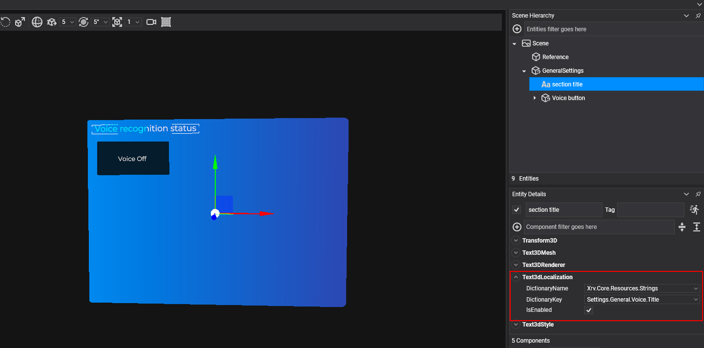

# Localization

If you want to create an application that supports different target languages, you may find useful localization mechanism provided by _XRV_. It scans your assemblies looking for embedded resource files (.resx), and provides a set of _Evergine_ components that let you choose a dictionary name-entry pair for a 3D texts or buttons. Lookup assemblies must be decorated with _EvergineAssembly_ attribute with _UserProject_ or _Extension_ as value.

> [!NOTE]
> In current state, we only support _English_ (fallback) and _Spanish_ as available 
> languages for applications. We plan to add extension points in the future to 
> allow developers adding new languages.

You can easily change current UI culture
```csharp
var localization = this.xrvService.Localization;
localization.CurrentCulture = CultureInfo.GetCultureInfo("es");
```

When culture changes, a _CurrentCultureChangeMessage_ message is published in [PubSub](messaging.md), indicating the value of the new UI culture. It also changes current thread _CurrentUICulture_ and _CurrentCulture_ values.

## Built-in components for localization

We provide a set of components to control localization for button texts and 3D texts:
- **Text3dLocalization**: to have localized text for _Text3DMesh_ components.
- **ButtonLocalization**: you can localize buttons text for entities with _StandardButtonConfigurator_ component.
- **ToggleButtonLocalization**: you can localize toggle buttons text for entities with _ToggleStateManager_ component. You should have one component instance for each one of toggle states.



\
For a toggle button, as we said, you must add one component for each one of toggle states.\
\


## Get localized string from code

To retrieve a localized string, just use of localization service.
```csharp
var localization = this.xrvService.Localization;
var localizedString = this.localization.GetString(() => Resources.Strings.MyString);
```

### Hand menu buttons

_MenuButtonDescription_ has a way to set localized text for hand menu buttons. If your button is a toggle button, you can also indicate different strings for each one of the 
toggle states.

```csharp
var localization = this.xrvService.Localization;
var description = new MenuButtonDescription()
{
    TextOn = () => localization.GetString(() => Resources.Strings.MyString),
    TextOff = () => localization.GetString(() => Resources.Strings.MyString),
};
```

### Tab items

_TabItem_ lets you to set a _Func<string>_ that will be invoked on first run or when current culture changes.

```csharp
var localization = this.xrvService.Localization;
var item = new TabItem()
{
    Name = () => localization.GetString(() => Resources.Strings.MyString),
    Contents = this.HelpContent,
};
```

### Window title

_WindowConfigurator_ also uses an specific _Func<string>_ property to have localized text for window title.

```csharp
var windowsSystem = this.xrvService.WindowsSystem;
var localization = this.xrvService.Localization;
var window = windowsSystem.CreateWindow(config => 
{
    config.LocalizedTitle = () => localization.GetString(() => Resources.Strings.MyString),
});
```

### Alert dialogs

_WindowsSystem_ API has overload methods for both _ShowAlertDialog_ and _ShowConfirmationDialog_, where you can assign _Func<string>_ callbacks to have localized dialogs.

```csharp
var windowsSystem = this.xrvService.WindowsSystem;
var dialog = windowsSystem.ShowAlertDialog(
    () => localization.GetString(() => Resources.Strings.MyAlertTitle),
    () => localization.GetString(() => Resources.Strings.MyAlertMessage),
    () => localization.GetString(() => Resources.Strings.MyAlertOk));
```