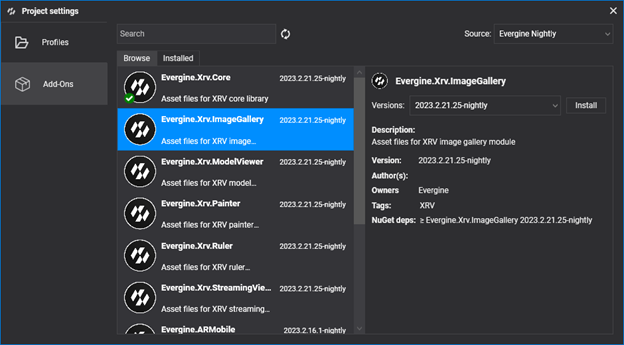

# Image Gallery module

With this module, you can display a gallery of images, that can be stored remotely. A new element will be added in hand menu to provide direct access to gallery window. This window counts with some UI elements like a slider or buttons that lets the user load an image or other.

.

If data source contains only one image, no navigation buttons will be displayed at all. A single images data source is supported in current module version.

> [!NOTE]
> In current version, there is a restriction: all images should be of the same size.

| Properties          | Description                              |
| ------------------- | ---------------------------------------- |
| `ImagePixelsWidth`  | Image width for the viewer in pixels.    |
| `ImagePixelsHeight` | Image height for the viewer in pixels.   |
| `FileAccess`        | Images data source. Please refer to [Storage](../../storage.md) section for more information. |

## Installation

This module is packaged as [Evergine add-on](../../../index.md). To use it in your project, just install it from _Project Settings > Add-Ons_ window.



Then, just register the module programmatically within your XRV service instance.

```csharp

// Find XrvService instantiation...
FileAccess imagesDataSource = <Create FileAccess instance>;
var xrv = new XrvService()
.AddModule(new ImageGalleryModule()
{
    ImagePixelsWidth = 640,
    ImagePixelsHeight = 640,
    FileAccess = imagesDataSource,
});
```

## Usage

- To open gallery window, just tap on  hand menu button.
- You can navigate between images by clicking on next  or previous  buttons. You can also change current image using attached slider.