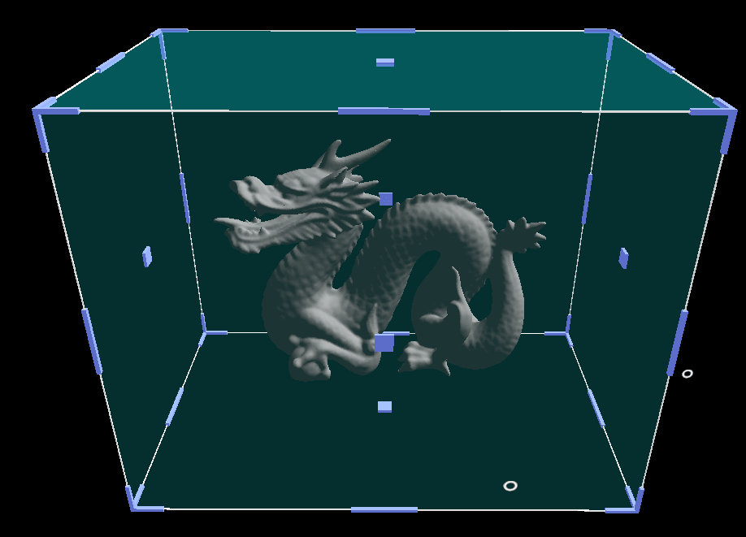
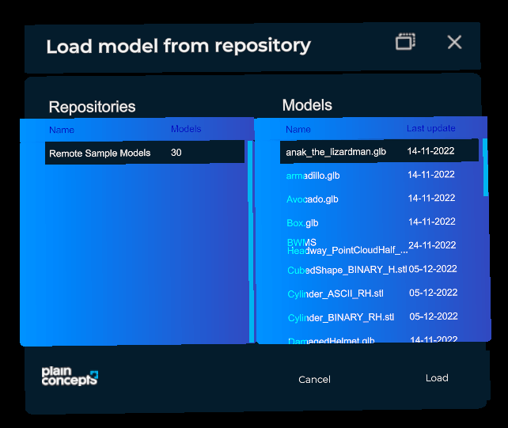
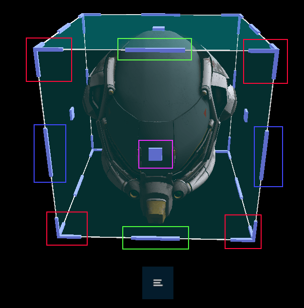

# Model Viewer module

One of the most common tasks while developing a XR experience is loading 3D models. With this module, you have a way to load models from a remote location into your application. When loaded, a model can be moved, rotated and scaled thanks to its bounding box. Transformations can be performed by near or far interaction, indistinctly.



This module lets you to define an unlimited number of model repositories, each one can contain an unlimited number of 3D models.

| Properties               | Description                                                                        |
| ------------------------ | ---------------------------------------------------------------------------------- |
| `NormalizedModelEnabled` | If true will override original scale of the model and set the same for all models. |
| `NormalizedModelSize`    | Size in meters for models when loaded                                              |
| `Repositories`           | Array of model repositories.                                                       |

A repository counts with following properties.

| Properties   | Description                                     |
| ------------ | ----------------------------------------------- |
| `Name`       | This name will be displayed on model load list. |
| `FileAccess` | Models data source. Please refer to [Storage](../../storage.md) section for more information. |

## Installation

This module is packaged as [Evergine add-on](../../../index.md). To use it in your project, just install it from _Project Settings > Add-Ons_ window.


Then, just register the module programmatically within your XRV service instance.

```csharp
FileAccess modelsDataSource = <Create FileAccess instance>;
var xrv = new XrvService()
    .AddModule(new ModelViewerModule
    {
        Repositories = new Repository[]
                       {
                            new Repository()
                            {
                                Name = "Remote Sample Models",
                                FileAccess = loadModelFileAccess,
                            }
                       },
        NormalizedModelEnabled = true,
        NormalizedModelSize = 0.2f,
    });
```

## Usage

- To open model selection window, just tap on  hand menu button.
- Select a model from _Models_ list. Each repository can have a different set of models. Once you know which model you want to load, just press _Load_ button.

.

### Manipulation

By using manipulators can move, scale and rotate models. Manipulators are shown over bounding box.



We have marked interaction areas with colors, depending on their manipulation possibilities.
- **Red**: Scale, pinch on corners and drag for scale model.
- **Green**: Roll, pinch on upper middle manipulator and drag for roll rotation.
- **Blue**: Pitch, pinch on side middle manipulator and drag for pitch rotation.
- **Pink**: stretch, pinch on center manipulator and drag for stretch scale.

### Actions

Each model has a submenu with a set of options. Tap on  button to expand list of available actions.
-  : Manipulation is disabled for the model. This is, it could not be moved, rotated or scaled until it is unlocked again.
-  : Reset model to original scale and orientation. Position won't be modified.
-  : Removes model from virtual space.


