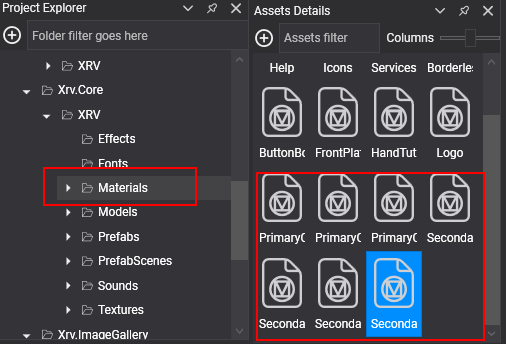
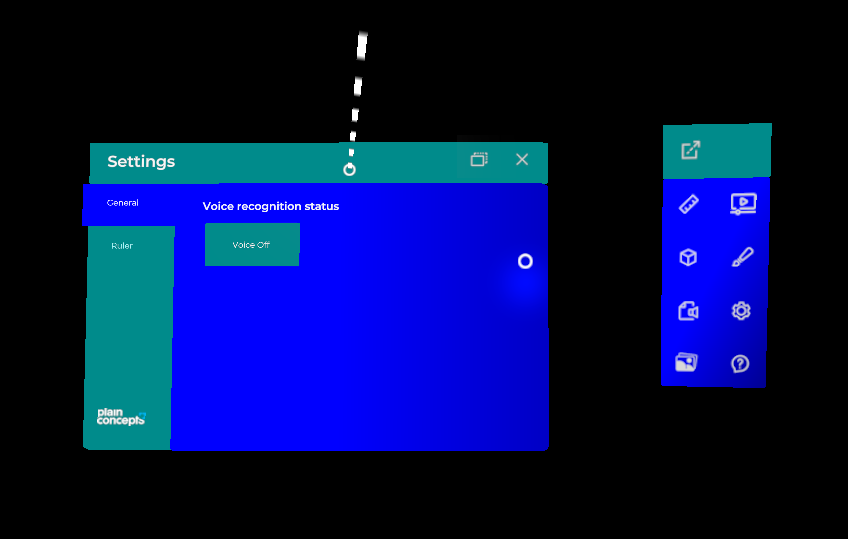
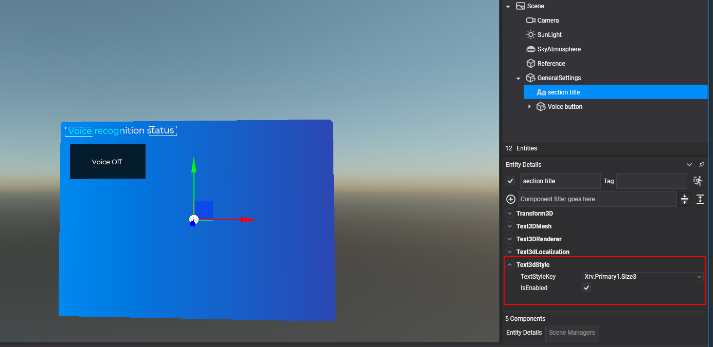

# Themes System

If you need to customize colors used by your application, you should know that _XRV_ uses a system for application theming. A palette of colors is defined by generic color names.

| Color | Description |
| ------ | ------------------- |
| **PrimaryColor1** | Used for windows title bar plate, text color for light buttons, lists selected item background color. |
| **PrimaryColor2** | Color applied to scroll bar color. |
| **PrimaryColor3** | This color is for global texts and for active items in a tab control. |
| **SecondaryColor1** | Color for inactive items in tab controls, backplate color for some buttons, text color for selections, some manipulators, etc. |
| **SecondaryColor2** | Color applied to some manipulators. |
| **SecondaryColor3** | Applies to accept option backplate in confirmation dialogs. |
| **SecondaryColor4** | Windows front plate gradient start and plate color for dialog buttons. |
| **SecondaryColor5** | Windows front plate gradient end. |

Associated to these built-in colors, we provide a set of materials that you should use in your custom UI elements if you need to make use of themes and change default set of colors provided by _XRV_.



Depending on values indicated in the theme, these materials are modified at runtime. As material instances are shared by different _MaterialComponent_ instances, new color will be applied application wide. If you create your own materials, of course, they will be not modified by theme system. On the other hand, if you apply any of default materials in your own UI elements, they will be modified at runtime by themes system.

## Modifying a theme color

To change a theme color, just access to _ThemesSystem_ and take a look to its _CurrentTheme_ property, that you can use to modify values for current theme or assign a new _Theme_ instance. A new _Theme_ instance has default _XRV_ colors by default. You can modify color properties to apply modifications on UI elements.

```csharp
var theme = this.xrvService.ThemesSystem.CurrentTheme;
theme.PrimaryColor1 = Color.DarkCyan;
theme.SecondaryColor4 = Color.Blue;
theme.SecondaryColor5 = Color.DarkBlue;
```
\
For piece of code above, following changes would be presented when loading _XRV_ windows and rest of visual elements.



You can have as many theme instances as you want, an switching them in _CurrentTheme_ property should change colors at runtime.

## Modify a theme font

Themes also provide a set of fonts used in different parts of UI elements.

| Font | Description |
| ------ | ------------------- |
| **PrimaryFont1** | Used for windows title, buttons, section labels and tab items. |
| **PrimaryFont2** | Font used for context texts, hand menu and window buttons. |

In the same way as colors, you can change these default fonts. Just add a new font asset and assign its identifier to any of the predefined font properties.

```csharp
theme.PrimaryFont1 = EvergineContent.MyCustomFont_ttf;
theme.PrimaryFont2 = EvergineContent.MyCustomFont_ttf;
```

## Shared text styles

_XRV_ also tries to provide helpful ways of having uniform UI definitions. For this purpose, we have defined _text styles_ that are shared globally, and that let you to define a font type, size and color, and reuse this definition and apply it to any number of 3D texts within application.

In each _TextStyle_ instance, you can set the following.

| Property | Description |
| ------ | ------------------- |
| **Font** | You can optionally set a font asset identifier here as text font. This will be applied if _ThemeFont_ is _null_. |
| **TextColor** | Color for the text. This will be applied if _ThemeColor_ is _null_. |
| **TextScale** | Text scale for the style. |
| **ThemeColor** | This will indicate that this style will use one of theme defined colors. |
| **ThemeFont** | This will indicate that this style will use one of theme defined fonts. |

You will also find a set of built-in components to make your own 3D text to apply global styles.

- **Text3dStyle**: Associates a _Text3DMesh_ to a text style.
- **ButtonTextStyle**: Associates a text style to a _StandardButtonConfigurator_ instance.
- **ToggleButtonTextStyle**: Associates a text style to a _ToggleButton_. You must set a component for each toggle state.



In the next table you can see the list of default text styles. As you may notice, they are all attached to theme fonts and colors.

> [!NOTE]
> Please, note that in this case, changing text style values will only work on application startup. We don't have support right now to do this at runtime.

| Style key | Default values |
| ------ | ------------------- |
| **Xrv.Primary1.Size1** | font: ThemeFont.PrimaryFont1, scale = 0.012f,  color = ThemeColor.PrimaryColor3 |
| **Xrv.Primary1.Size2** | font: ThemeFont.PrimaryFont1, scale = 0.01f,  color = ThemeColor.PrimaryColor3 |
| **Xrv.Primary1.Size3** | font: ThemeFont.PrimaryFont1, scale = 0.008f,  color = ThemeColor.PrimaryColor3 |
| **Xrv.Primary2.Size1** | font: ThemeFont.PrimaryFont2, scale = 0.007f,  color = ThemeColor.PrimaryColor3 |
| **Xrv.Primary2.Size2** | font: ThemeFont.PrimaryFont2, scale = 0.006f,  color = ThemeColor.PrimaryColor3 |
| **Xrv.Primary2.Size3** | font: ThemeFont.PrimaryFont2, scale = 0.005f,  color = ThemeColor.PrimaryColor3 |
| **Xrv.Primary2.Size3.Alt** | font: ThemeFont.PrimaryFont2, scale = 0.005f,  color = ThemeColor.PrimaryColor1 |

### Add or modify an existing text style
If you need to add new styles, or modify an existing one, you can do it implementing _ITextStyleRegistration_. Its single method named _Register_ passes as parameter the global styles dictionary: you can add new entries or modify existing ones. 

```csharp
public MyTextStylesRegistration : ITextStyleRegistration
{
    public void Register(Dictionary<string, TextStyle> registrations)
    {
        // override a default style
        if (registrations.ContainsKey(DefaultTextStyles.XrvPrimary1Size1))
        {
            var defaultStyle = registrations[DefaultTextStyles.XrvPrimary1Size1];
            defaultStyle.TextScale = 0.015f;
        }

        // add a new style with theme-independent color
        registrations["RedStyle"] = new TextStyle
        {
            ThemeFont = ThemeFont.PrimaryFont1,
            TextScale = 0.013f,
            Color = Color.Red,
        };
    }
}
```

As this registrations are scanned by _XRV_, you can add your own text styles, and they will be available for text styling built-in components.

## How-to respond to theme changes
You may be wondering what happens with custom defined materials and theme changes. As we said above, _Theme System_ will not update these materials. Don't worry, as you can create your own code to control changes for themes at runtime. _ThemeSystem_ counts with an event named _ThemeUpdated_ that will be invoked on theme changes. It has arguments of type _ThemeUpdatedEventArgs_ that contains information about theme changes.

| Property | Description |
| ------ | ------------------- |
| **IsNewThemeInstance** | It indicates if message has been sent by a complete theme change (a new instance of theme has been set). |
| **Theme** | Theme instance that is being applied at the moment of message emission. |
| **UpdatedColor** | If just one of the theme colors has been updated, it indicates which one of themed colors has been involved |

So, if you want that your component listens changes on current theme (for example, to change a custom material tint color), you will need something like the following.

```csharp
public MyComponent : Component
{
    [BindService]
    private XrvService xrvService = null;
    
    private ThemesSystem themes => this.xrvService.ThemesSystem;

    protected override bool OnAttached()
    {
        bool attached = base.OnAttached();
        if (attached)
        {
            this.themes.ThemeUpdated += this.ThemesSystem_ThemeUpdated;
        }

        return attached;
    }

    
    protected override bool OnDetached()
    {        
        base.OnDetached();
        this.themes.ThemeUpdated -= this.ThemesSystem_ThemeUpdated;
    }
  
    private void ThemesSystem_ThemeUpdated(object sender, ThemeUpdatedEventArgs args)
    {
        if (args.IsNewThemeInstance)
        {
            // Respond to theme instance changes
            return;
        }

        switch (args.UpdatedColor)
        {
            case ThemeColor.PrimaryColor1:
                // Respond to PrimaryColor1 changes
                break;
            // ...
            default:
                break;
        }
    }
}
```