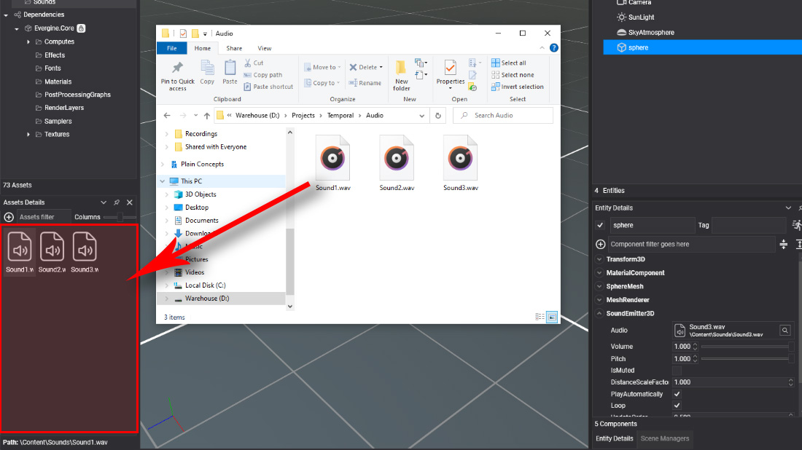
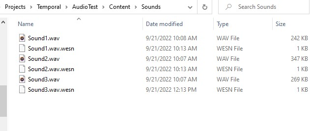

# Import Audio
---

The **Audio** asset allows you to play sound effects and music in your project.

## Import a Audio asset in Evergine Studio
You can create an audio asset by dragging an audio file to the [Assets Details](../../evergine_studio/interface.md) panel, as explained [in this article](../../evergine_studio/assets/create.md).

## Audio files in content directory
**Audio** imported in **Evergine** create an aditional metadata `.wesn` file.

## Supported formats:
**Evergine** supports the following audio file formats:

| Extension |  Description | 
| ----| ----| 
| `.wav`| 

**Waveform Audio File Format** is an audio file format standard, developed by IBM and Microsoft, for storing an audio bitstream on PCs. It is the main format used on Microsoft Windows systems for uncompressed audio. The usual bitstream encoding is the linear pulse-code modulation (LPCM) format. 

|
| `.mp3` | 

**MPEG-2 Audio Layer III** is a coding format for digital audio developed largely by the Fraunhofer Society in Germany, with support from other digital scientists in the United States and elsewhere. Originally defined as the third audio format of the MPEG-1 standard, it was retained and further extended — defining additional bit-rates and support for more audio channels — as the third audio format of the subsequent MPEG-2 standard. A third version, known as MPEG 2.5 — extended to better support lower bit rates — is commonly implemented, but is not a recognized standard.
 