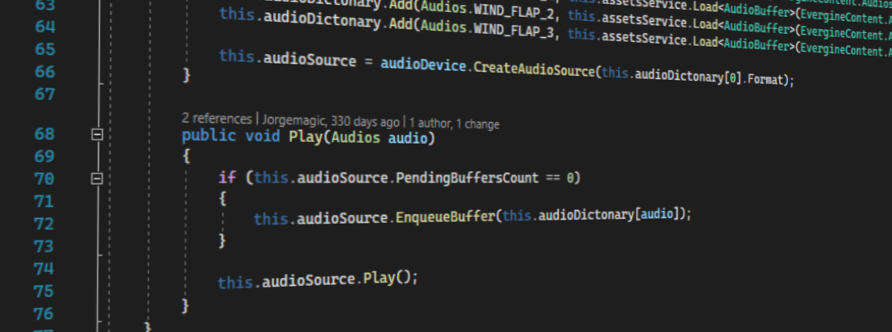

# Create Audio from Code



In this section, the essential elements for reproducing audio in your project are explained in more detail.

## Audio Device
An **Audio Device** is a class that represents an audio output device. Evergine supports two audio device implementations:

| Audio Device Implementation | Platforms Supported         | Description |
| ----                        | ----                        | ----        |
| **XAudioDevice**            | Windows, Hololens           | A lower-level audio API for Microsoft Windows, Xbox 360, and Windows Phone 8. It is the successor to DirectSound on Windows and a supplement to the original XAudio on the Xbox 360. |
| **ALAudioDevice**           | Windows, Web, Android, IOS, Linux, Mac | A cross-platform audio application programming interface (API) designed for efficient rendering of multichannel three-dimensional positional audio. Its API style and conventions deliberately resemble those of OpenGL. OpenAL is an environmental 3D audio library that can add realism to a game by simulating attenuation (degradation of sound over distance), the Doppler effect (change in frequency as a result of motion), and material densities. OpenAL was originally intended to be an open standard and open-source replacement for proprietary (and generally incompatible) 3D audio APIs such as DirectSound and Core Audio, though in practice it has largely been implemented on various platforms as a wrapper around said proprietary APIs or as a proprietary and vendor-specific fork. |

In the **Program.cs** class in the Evergine project template, it is possible to see the implementation used as an Audio Device:

**Creating a XAudio2 Implementation**
```csharp
// Creates XAudio device
var xaudio = new global::Evergine.XAudio2.XAudioDevice();
application.Container.RegisterInstance(xaudio);
```

**Creating an OpenAL Implementation**
```csharp
// Creates OpenAL device
var audioDevice = new Evergine.OpenAL.ALAudioDevice();
application.Container.RegisterInstance(audioDevice);
```
Its most relevant methods are:

| Method  | Description  |
| ----    | ----         |
| **CreateAudioSource** | Creates an audio source where you can enqueue audio buffers. |
| **CreateAudioBuffer** | Creates an audio buffer. |


## Audio Buffer

An **Audio Buffer** represents a sound. When you drag an audio file into Evergine Studio, an audio asset is created automatically. You can load an AudioBuffer from an audio asset using the [**AssetService**](../evergine_studio/assets/use.md):
```csharp
// Create audioBuffer from audio asset.
AudioBuffer audioBuffer = assetsService.Load<AudioBuffer>(EvergineContent.Audio.sound1_wav);
```
It is also possible to create an audio buffer with procedural data:

```csharp
// Create buffer
this.format = new WaveFormat(false);
this.buffer = this.AudioDevice.CreateAudioBuffer();

// Fill with data
var bufferData = new byte[100 * this.format.BlockAlign];
this.buffer.Fill(bufferData, 0, bufferData.Length, this.format);
```

For more details, see the [AudioBuffer](xref:Evergine.Common.Audio.AudioBuffer) API reference.


## Audio Source

An **Audio Source** represents the audio queue where it is possible to enqueue several audio buffers and reproduce them one after another.


To enqueue an audio buffer and play it:
```csharp

// Load audio buffer
AudioBuffer audioBuffer = assetsService.Load<AudioBuffer>(EvergineContent.Audio.sound1_wav);

// Get Audio Device instance
AudioDevice audioDevice = Application.Current.Container.Resolve<AudioDevice>();

// Create Audio Source
AudioSource audioSource = audioDevice.CreateAudioSource(audioBuffer.Format);

// Enqueue audio buffer
if (audioSource.PendingBufferCount == 0)
{
	audioSource.EnqueueBuffer(audioBuffer);
}

// Play the audio source.
audioSource.Play();
```

Its most relevant methods are:

| Method  | Description  |
| ----    | ----         |
| **EnqueueBuffer**  |  Enqueues an audio buffer.  |
| **Play**           | Plays all buffers enqueued in the audio source. |
| **Pause**          | Pauses the audio source reproduction. |
| **Stop**           | Stops the audio source reproduction. |

For more details, see the [AudioSource](xref:Evergine.Common.Audio.AudioSource) API reference.