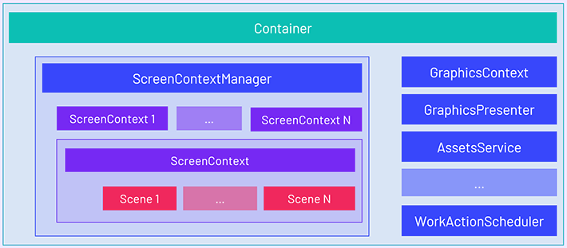

# Application Container

The **Application Container** is a class responsible to store objects that will be accesses from the entire application. The application iteself does not have functionality itself, and all logic is made using registered instances into the Container.

The application Container could be accessed using the `Container` property in the Application class.

Here you will register all [Services](../services.md) of your application, among other instances to control your project (like the [GraphicContext](../../graphics/low_level_api/graphicscontext.md) to expose the graphic API, or AssetsService to control the asset library of your application, and [ScreenContextManager](../scenes/using_scenes.md) to control the scenes that will be played in your application).

> [!TIP]
> In general terms, in the **Container** you will register all Services and logic that will be consumed for every Scene or Component in your Application.

> [!NOTE]
> There can be only one instance per Type in the Container. Every object registerd here is treated like a Singleton.



## Using the Container

### Register Instances

You can register elements inside the Container by two ways:

#### Register a Type

You can register a type in the Container. If this functionality will be needed in the future, the Container will create an instance and will offer it to everyone that require this instance. This is dome by the `Container.RegisterType<T>()` method:

| Method | Description |
| --- | --- |
| `RegisterType<T>()` | Register the specified type `T`  to the container. |

A small example:

 ```csharp
 public partial class MyApplication : Application
    {
        public MyApplication()
        {
            // Previous code :)

            // You could register the service by type...
            this.Container.RegisterType<MyService>();
        }
    ...
 ```

#### Register an Instance

In the other hand, you can register directly an instance, this useful if you want to properly initiate the service, or offer an implementation of an abstract class:

| Methods | Description |
| --- | --- |
| `RegisterInstance(T instance)` | Register the instance object into the Container. It will associate to the type of the instance. |
| `RegisterInstance<T> (T instance)` | Register the instance object into the Container. It will associate to the type of the generic type `<T>`. the instance parameter type must be a subclass of `<T>`.  |

A small example:
 ```csharp
 public partial class MyApplication : Application
    {
        public MyApplication()
        {
            // Previous code :)

            // Register directly the service instance...
            this.Container.RegisterInstance(new MyService());

            // You can register a instance but specifying a parent class to indicates
            // the type that you want to expose.
            // In that case, you are offering the DX11 implementation when someone request the GraphicsContext...
            this.Container.RegisterInstance<GraphicsContext>(new DX11GraphicsContext());
        }
    ...
 ```

### Get instances

Is easy to obtains instances from the Application Container

#### Using [BindService] tag attribute

You can use the [BindService] attribute in your Component, SceneManager or even from another Services to automatically inject the Service instance into your property.

```csharp
using Evergine.Framework;
using System;

namespace MyProject
{
    public class MyBehavior : Behavior
    {
        // Use the BindService attribute on top of the property or attribute 
        // in which you want to inject the Service
        [BindService]
        private MyService myService = null;

        protected override void Update(TimeSpan gameTime)
        {
            this.myService.DoRequest();
        }
    }
}
```

#### Using Resolve() methods
The Container has the following mehtods to obtains instances:

| Methods | Description |
| --- | --- |
| `T Resolve<T>()` | Obtains the instance of the type `<T>` specified. |
| `object Resolve(Type type)` | Other way to obtains an objects, but without C# generics.  |


 ```csharp
using Evergine.Framework;
using System;

namespace MyProject
{
    public class MyBehavior : Behavior
    {
        private MyService myService = null;

        protected override bool OnAttached()
        {            
            // Use the Resolve<Type> method from the Application Container....
            this.myService = Application.Current.Container.Resolve<MyService>();

            return base.OnAttached();
        }

        protected override void Update(TimeSpan gameTime)
        {
            this.myService.DoRequest();
        }

        protected override bool OnDettached()
        {
            // Release the reference when a component is being dettached...
            this.myService = null;
        }
    }
}
 ```