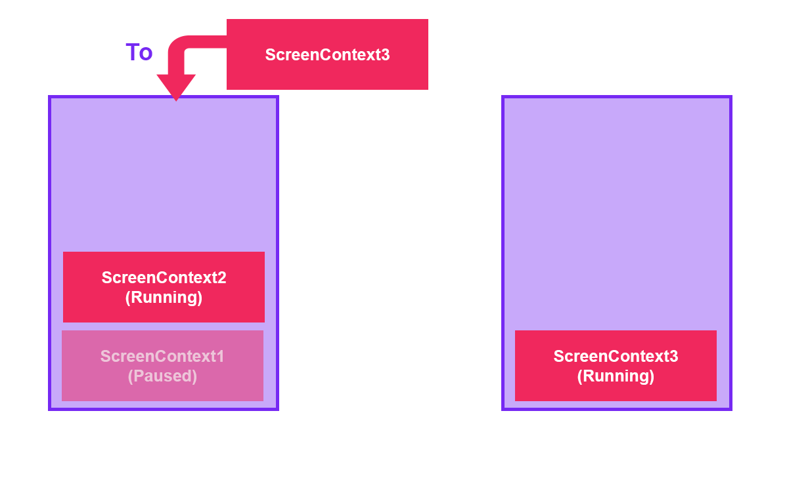

# ScreenContext Manager

The **ScreenContext Manager** allows you to load a ScreenContext with single or multiple scenes simultaneously and transit to other ScreenContext while the application is running. Then the Screen Context manager is used to control the flow of your application through multiple scenes.

## ScreenContext

A **ScreenContext** could be simple if only contains a single scene or multiple if contains several scenes.


## Transit to other ScreenContext

The ScreenContext Manager has the **To**, **Push** and **Pop** methods to transit between different ScreenContexts.

| Method  | Description |
| ----    | ----        |
|   To    | <p>The Screen ContextManager stack unloads and clears all ScreenConnect enqueued before and loads only the new ScreenContext.</p><p>By default, the method dispose all ScreenContexts previously in the stack, but this behavior can be modified using an overloading method with the paramaeter _doDispose_</p> </br>  |
|  Push   | <p>The ScreenContextManager stack pauses the last ScreenContext enqueued and enqueues the new ScreenContext. Only the peek ScreenContext is running.</p> </br>. |
|  Pop    | <p>The ScreenContextManager stack unloads and dequeues the ScreenContext located in the peek and the previous ScreenContext in the stack will be running.</p> <p>By default, the method dispose of the dequeued ScreenContext, but this behavior can be modified using an overloading method with the parameter _doDispose_</p></br> |

## Using ScreenContent Manager

The **ScreenContext Manager** is only available from code so is not possible to configure it from Evergine Studio. If you inspect the **MyApplication** class created by the Evergine project template, you can see the method **Initialize** with the following code:

```csharp
public override void Initialize()
{
    base.Initialize();

    // Get ScreenContextManager
    var screenContextManager = this.Container.Resolve<ScreenContextManager>();
    var assetsService = this.Container.Resolve<AssetsService>();

    // Navigate to scene
    var scene = assetsService.Load<MyScene>(EvergineContent.Scenes.MyScene_wescene);
    ScreenContext screenContext = new ScreenContext(scene);
    screenContextManager.To(screenContext);
}
```
In the code below a simple ScreenContext is created with the MyScene scene and the ScreenContextManager transit to this ScreenContext using the **To** method explain before.

In addition, you can assign names to the ScreenContexts using:

```csharp
ScreenContext screenContext = new ScreenContext("Menu", scene);
```

To find the ScreenContext in the stack you can use the following line:

```csharp
var menuScreenContext = screenContextManager.FindContextByName("Menu");
```

## ScreenContext behaviors
When a ScreenContext has been paused the update and draw method of the scenes inside of ScreenContext they will not run. But this behavior can be modified using the parameter **Behavior** in the ScreenContext class.

```csharp
ScreenContext screenContext = new ScreenContext("Menu", scene)
{
    Behavior = ScreenContextBehaviors.UpdateInBackground | ScreenContextBehaviors.DrawInBackground
};
```

| Behavior | Description |
| ----     | ----        |
| UpdateInBackground | The scenes inside of ScreenContext keep updating when the ScreenContext is paused. |
| DrawInBackground   | The scenes inside of ScreenContext keep drawing when the ScreenContext is paused. |