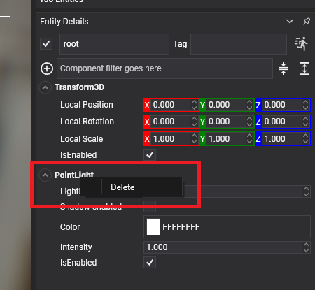

# Components


A **Component** allows to add functionality and logic to an **Entity**. The `Component` class is the one of every component in Evergine. 

There are two types of Components which are broadly used along the engine:
* [Behavior:](behaviours.md) It is thought to add logic to the associated Entity. It provices an `Update()` method which is executed on each game loop.
* [Drawable](drawables.md): In charge of managing the rendering on the screen. In the same way as above one, this provides a `Draw()` abstract method invoked during the rendering cicle. It is suitable to register and update objects to be rendered.
* **Component**: You could derive directly from the Component class to add functionality whithout an Update() or Draw() calls. You could register to events or expose some logic, the only limit is your imagination :)

## Component Lifecycle
Please, check [Lifecycle of element](../lifecycle_elements.md) for details regrding the lifecycle of elements in Evergine, including Components.

## Using Components

You can deal with Components both in Evergine Studio and directly from code.

### From Evergine Studio

In Evergine Studio, you can add/remove Components to an Entity, and modify its properties.

#### Add a Component
In Evergine Studio, first select an Entity that you want to add the Component, and click the   button in the Entity Details section:


A Component selector dialog appears. Select the component type that you want to add:


#### Remove a Component
The process of removing a component is quite simple. First, select the Entity that you want to remove one Component. Later, on the Entity Details, right click in the Component name area, and click the Delete button:



### From Code

#### Add Components

To add Components, you just need to invoke the `Entity.AddComponent()` method:

```csharp

Entity entity = new Entity("MyAwesomeEntity");

// Add a Component (Transform3D)...
entity.AddComponent(new Transform3D());

// You can chain AddComponent() calls...
entity.AddComponent(new CubeMesh())
    .AddComponent(new MaterialComponent())
    .AddComponent(new MeshRenderer());
```

#### Remove Components

You have several options to specify the component or components that you want to remove. You can remove components by indicating the Component instance itself, or by giving the type of the component to remove.

In every methot to remove the component specifying the type, you have the optional parameter `isExactType`, which indicate if the component to search and remove must match the given type, or for contrary, it can be a subclass of the type.

```csharp
// Remove a component passing the instance:
entity.RemoveComponent(component); 

// Remove a component with the type (MeshRenderer in that case):
entity.RemoveComponent<MeshRenderer>();

// An alternative way to remove a Component using the type:
entity.RemoveComponent(typeof(MeshRenderer));

// You can remove all components that match the specified type (all Drawables in that example)
// keep in mind that isExactType is false...
entity.RemoveAllComponentsOfType<Drawable>(isExactType: false)

```

## Create a new Component

Evergine provides a good Component library, but when you are developing a custom application, you will need to create your own Components to accomplish your application requirements.

### Write the C# code of your Component
You only need to create a class that inherit from `Component` class, and add to your application project:

```csharp
public class MyComponent : Component
{
    // Add some properties to expose data :)    
    public int Value { get; set; }

    // Override the Start method, which is called once the Entity is started:
    protected override void Start()
    {
        base.Start();

        Trace.TraceInformation($"The component has been started: {this.Value}");
    }
}
```