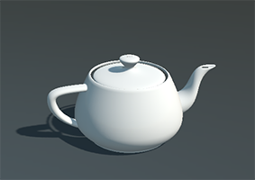

# Drawables
---

The **Drawables** are one kind of Component that allows you to do and action each Draw/Render cycle of the Application. A Drawable is associated with an Entity and all Drawables in a scene are managed by [**RenderManager**](../../../graphics/rendering_overview.md).

## Drawable3D


**Drawables3D** are a kind of drawables that is designed to provides 3D content. They will be processed on every **Camera3D** render. In these components you usually create graphics elements to draw 3D features (models, billboard, background environment, etc...)

Add the following property:
 
| Property | Description |
| --- | --- |
| **CastShadows** | Boolean value indicating whether this model will cast shadows. True by default. |

### Creating a Drawable3D
From Visual Studio you can create a c# class with the following code:

```csharp
using Evergine.Common.Graphics;
using Evergine.Framework;
using Evergine.Framework.Graphics;
using Evergine.Mathematics;
using System;

namespace MyProject
{
    public class BBoxDrawable : Drawable3D
    {
        [BindComponent]
        private Transform3D transform;

        public Vector3 Size {get;set;} = Vector3.One;
        public Color Color {get; set;} = Color.Red;

        public override void Draw(DrawContext drawContext)
        {
            var orientedBBox = new BoundingOrientedBox(
                this.transform.Position, 
                this.Size, 
                this.transform.Orientation);

            // Draw an oriented boundingbox with the specified color and size...
            this.Managers.RenderManager.LineBatch3D.DrawBoundingOrientedBox(orientedBBox, this.Color);
        }
    }
}
```
## Drawable2D


This drawables will be processed on every **Camera2D** render. In the other hand with Drawable2D you will render 2D content (Sprites, UI...).

Add the following properties:
 
| Property | Description |
| --- | --- |
| **Layer** | Suggest the [**RenderLayer**](../../../graphics/render_layers.md) that will use all 2D content used by this Drawable. |

### Creating a Drawable2D
From Visual Studio you can create a c# class with the following code:

```csharp
using Evergine.Common.Graphics;
using Evergine.Framework;
using Evergine.Framework.Graphics;
using Evergine.Mathematics;
using System;

namespace MyProject
{
    public class CircleDrawable : Drawable2D
    {
        [BindComponent]
        private Transform2D transform;

        public float Radius {get;set;} = 0.5f;
        public Color Color {get; set;} = Color.Red;

        public override void Draw(DrawContext drawContext)
        {
            // Draw a circle...
            this.Managers.RenderManager.LineBatch2D.DrawCircle(
                this.transform.Position, 
                this.Radius, 
                this.Color, 
                this.transform.DrawOrder);
        }
    }
}
```


## Graphics content

A Drawable will add to RenderManager objects to be drawn (sprites, meshes, etc...). Read [Render Overview](../../../graphics/rendering_overview.md) document for further details.

## Add/Remove a Drawable
To add/remove a Drawable to/from your entity both from code or Evergine Studio is the same that adding/removing a component because a Drawable is a kind of component. You can see how to add/remove a component [here](index.md)