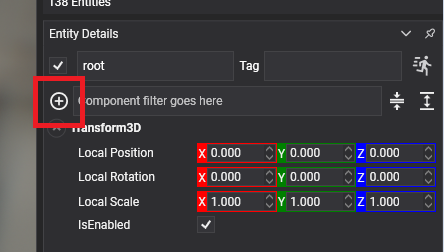

# Components


A **Component** allows the addition of functionality and logic to an **Entity**. The `Component` class is the base class for every component in Evergine.

There are three types of Components widely used throughout the engine:
* [Component](index.md): You can derive directly from the Component class to add functionality without Update() or Draw() calls. You can register for events or expose some logic; the only limit is your imagination :)
* [Behavior](behaviours.md): This is designed to add logic to the associated Entity. It provides an `Update()` method that is executed in each game loop.
* [Drawable](drawables.md): Responsible for managing the rendering on the screen. Similar to the previous one, this provides a `Draw()` abstract method invoked during the rendering cycle. It is suitable for registering and updating objects to be rendered.

## Component Lifecycle
Please, check [Lifecycle of element](../../lifecycle_elements.md) for details regarding the lifecycle of elements in Evergine, including Components.

## Using Components

You can manage Components both in Evergine Studio and directly from code.

### From Evergine Studio

In Evergine Studio, you can add/remove Components to an Entity and modify its properties.

#### Add a Component
In Evergine Studio, first select an Entity that you want to add the Component to, and click the  button in the Entity Details section:



A Component selector dialog appears. Select the component type that you want to add:


#### Remove a Component
The process of removing a component is quite simple. First, select the Entity from which you want to remove one Component. Then, in the Entity Details, right-click on the Component name area and click the Delete button:


### From Code

#### Add Components

To add Components, you just need to invoke the `Entity.AddComponent()` method:

```csharp
Entity entity = new Entity("MyAwesomeEntity");

// Add a Component (Transform3D)...
entity.AddComponent(new Transform3D());

// You can chain AddComponent() calls...
entity.AddComponent(new CubeMesh())
    .AddComponent(new MaterialComponent())
    .AddComponent(new MeshRenderer());
```

#### Remove Components

You have several options to specify the component or components that you want to remove. You can remove components by indicating the Component instance itself or by giving the type of the component to remove.

In every method to remove the component specifying the type, you have the optional parameter `isExactType`, which indicates if the component to search and remove must match the given type, or if it can be a subclass of the type.

```csharp
// Remove a component passing the instance:
entity.RemoveComponent(component); 

// Remove a component by type (MeshRenderer in this case):
entity.RemoveComponent<MeshRenderer>();

// An alternative way to remove a Component using the type:
entity.RemoveComponent(typeof(MeshRenderer));

// You can remove all components that match the specified type (all Drawables in this example)
// keep in mind that isExactType is false...
entity.RemoveAllComponentsOfType<Drawable>(isExactType: false)
```

## Create a new Component

Evergine provides a robust Component library, but when developing a custom application, you may need to create your own Components to meet your specific requirements.

### Write the C# code for your Component
You only need to create a class that inherits from the `Component` class and add it to your application project:

```csharp
public class MyComponent : Component
{
    // Add some properties to expose data :)    
    public int Value { get; set; }

    // Override the Start method, which is called once the Entity is started:
    protected override void Start()
    {
        base.Start();
        Trace.TraceInformation($"The component has been started: {this.Value}");
    }
}
```

## Allow multiple instances

By default, an Entity can only have one Component per type (for instance, an Entity can't have more than one Transform3D).

However, in some cases, it is useful for an Entity to have multiple instances of a type (for example, if you want to add several colliders).

In that case, you need to add the [AllowMultipleInstances] attribute to your class:

```csharp
[AllowMultipleInstances]
public MyComponent : Component
{
    // The entity can have multiple instances of this component type...    
}
```

```csharp
// This is valid because MyComponent has the [AllowMultipleInstances] attribute...
Entity entity = new Entity()
    .AddComponent(new MyComponent())
    .AddComponent(new MyComponent())
    .AddComponent(new MyComponent())
    .AddComponent(new MyComponent())
    .AddComponent(new MyComponent());
```