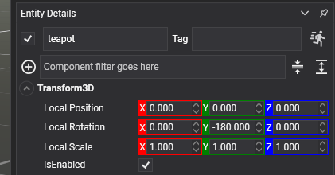

# Using Entities
Manipulate Entities is quite straightforward in Evergine.

## From Evergine Studio

### Add Entity in Evergine Studio

In the **Entities Hiearchy** area in an oppened SceneEditor,  just click the  button. A popup menu will appear:


This menu gives you several options to create entities. If you just want to create an Entity with only the Transform3D component, click the `Empty entity`  button.

If an Entity is selected, you can change its properties (Name, Tag, enable) in the Entity Details panel:



## From Code

### Create a new Entity from code
Creating and Entity from code is a not a complex task:

```csharp
Entity entity = new Entity("EntityName");

// Set the Entity Tag...
entity.Tag = "Tag"

// Add some components...
entity.AddComponent(new Transform3D());
    .AddComponent(new TeapotMesh())
    .AddComponent(new MaterialComponent())
    .AddComponent(new MeshRenderer())

// Add to the EntityManager
this.Managers.EntityManager.Add(entity);
```

### Create a simple Hierarchy from code

```csharp
// Create the parent entity...
Entity parentEntity = new Entity()
    .AddComponent(new Transform3D());

// Create the child entity...
Entity childEntity = new Entity()
    .AddComponent(new Transform3D());

// Add the child entity to the parent...
parentEntity.AddChild(childEntity);

// Add only the parent entity to the EntityManager
this.Managers.EntityManager.Add(parentEntity);
```
