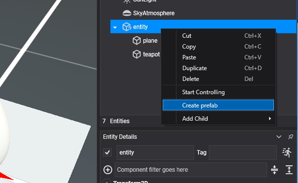

# Prefabs
Sometimes you need to reuse entities, including their components and descendants. Instead of using copy and paste or entity duplication, which can create maintenance problems, you can use the concept of a _prefab_. A _prefab_ is a type of asset that helps developers with this basic function: reusing.

## Creating a Prefab
To create a prefab, first you need to build your entities’ hierarchy and assign components. For example, you can create an entity with a teapot and a plane, and add a [Spinner](xref:Evergine.Components.Graphics3D.Spinner) component to the top of this hierarchy.


To create a prefab, right-click on the top-most entity that you want to include in it, and select the _Create prefab_ option.



This will create a new asset with a _weprefab_ extension in the same folder that you have selected in the _Project Explorer_ panel. If you create the prefab in the wrong folder, don't worry. Like any other Evergine asset, you can move it wherever you want.


If you save changes and reload the scene, you will realize that entities that were part of the created prefab are now marked with a "(Prefab)" suffix. Using the prefab creation option **is not reversible once you save the scene**. You can also drag and drop asset elements from the _Asset Details_ panel to your scene to create new prefab instances. 

### Prefabs Edition

If you change values on those entities, this will not affect new and existing prefab instances. To add, remove, or modify elements in your prefab architecture, including associated components, you must use the prefab asset editor. 

To open the prefab editor, just double-click the prefab asset.


Nesting of prefabs is now supported, so you can create prefabs based on the composition of other prefabs. There are some logical limitations, such as not allowing cyclical dependencies among prefabs. If you try to introduce a cycle, a warning message will be displayed in the _Output_ console.

### Prefab Instantiation

To create a prefab instance programmatically, you can use the following code snippet:
```csharp
var prefab = this.assetsService.Load<Prefab>(EvergineContent.Scenes.Entity_weprefab);
var entity = prefab.Instantiate();
```