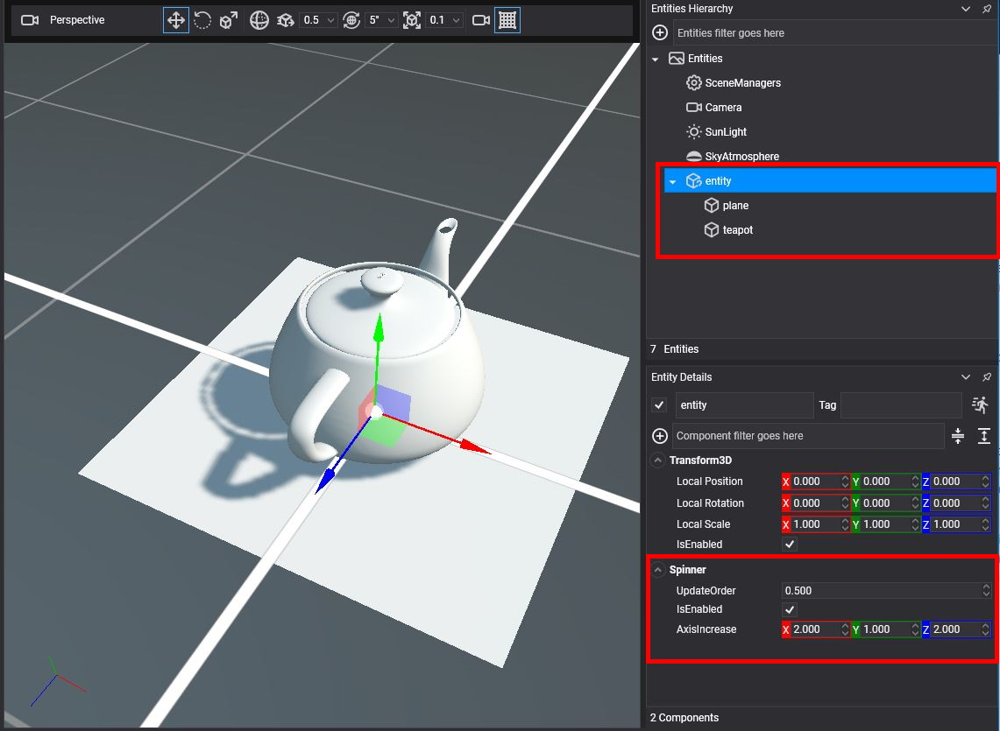
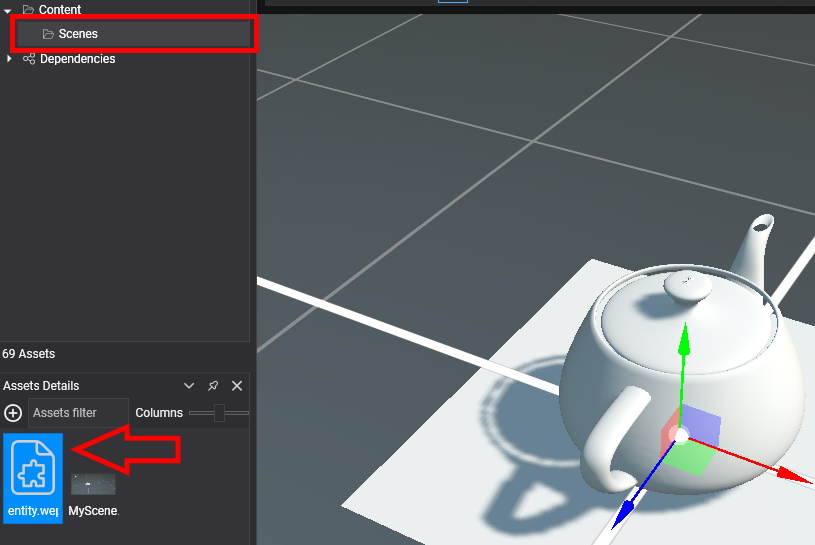
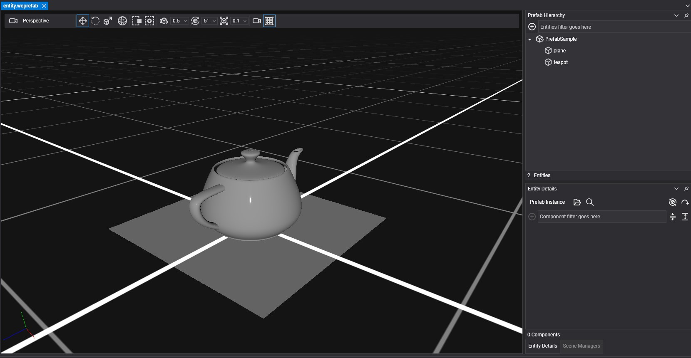

# Prefabs
Sometimes you need to reuse entities including their components and their descendants. Instead of use copy and paste or entity duplication for doing this, that will create maintenance problems, you can use the concept of _prefab_. A _prefab_ is a type of asset which helps developers with this basic function: reusing.

## Creating a prefab
To create a prefab, first you need to build your entities hierarchy and assign components. For example, we can create an entity with a teapot and a plane, and a [Spinner](xref:Evergine.Components.Graphics3D.Spinner) component to the top of this hierarchy.



To create a prefab, right click on the top-most entity that you wan to include in it, and select _Create prefab_ option.


This will create a new asset with _weprefab_ extension the same folder that you have selected in _Project Explorer_ panel. If you created prefab in the wrong folder, don't worry as they are like any other Evergine asset, you can move it wherever you want.



If you save changes and reload the scene, you will realize that entities that were part of created prefab, are marked now with a "(Prefab)" suffix. Using prefab creation option **is not reversible once you save the scene**. You can also drag and drop asset element from _Asset Details_ panel to your scene, to create new prefab instances. 

### Prefabs edition

If you change values on those entities, this will no affect to new and existing prefab instances. To add, remove or modify elements in your prefab architecture, within associated components, you must use prefab asset editor. 

To open prefab editor, just double click prefab asset.



Nesting of prefabs is supported now, so you can create prefabs based on other prefabs composition. There are some logic limitations as not allowing cycle dependencies along prefabs. If you try to introduce a cycle, a warning message will be displayed in _Output_ console.

### Prefab instantiation

To create a prefab instance programmatically, you can use following code snippet:
```csharp
var prefab = this.assetsService.Load<Prefab>(EvergineContent.Scenes.Entity_weprefab);
var entity = prefab.Instantiate();
```
