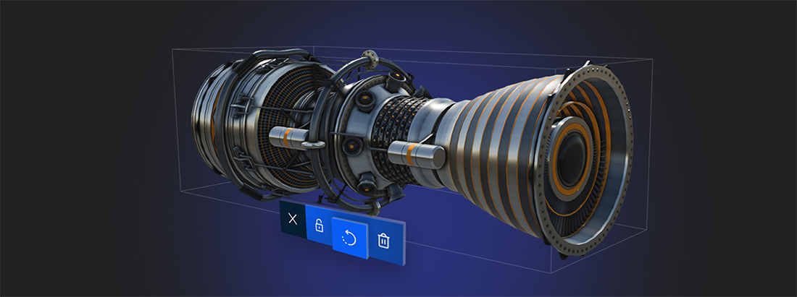

# Basics

---

This chapter explains the basic concepts you need to know before starting to develop **Evergine** applications.

## Evergine and .NET

Evergine is a powerful component based engine  developed on .NET and designed to be completely multiplatform.

Because of this, when you develop an **Evergine** application, all code are written in **C#**. You can edit your source code in [Visual Studio](https://visualstudio.microsoft.com/es/) or your preferred IDE that supports .NET.

At last, an Evergine application is a .NET application, so you can integrate every library or service available in this ecosystem.

### NuGet Packages

Evergine libraries are distributed using [NuGet package system](https://nuget.org/). As a result, is straightforward to update your application and integrate with tons of libraries available in the large .Net community ❤.

> [!CAUTION]
> To update the version of your **Evergine application**, use [Evergine Launcher](..\evergine_launcher\index.md) instead of NuGet Package Manager in Visual Studio.

## In this section

* [Project structure](project_structure.md)
* [Component Based Architecture](component_arch/index.md)
* [Lifecycle of elements](lifecycle_elements.md)
* [Scenes](scenes.md)
* [Services](services.md)
* [Application](application.md)
