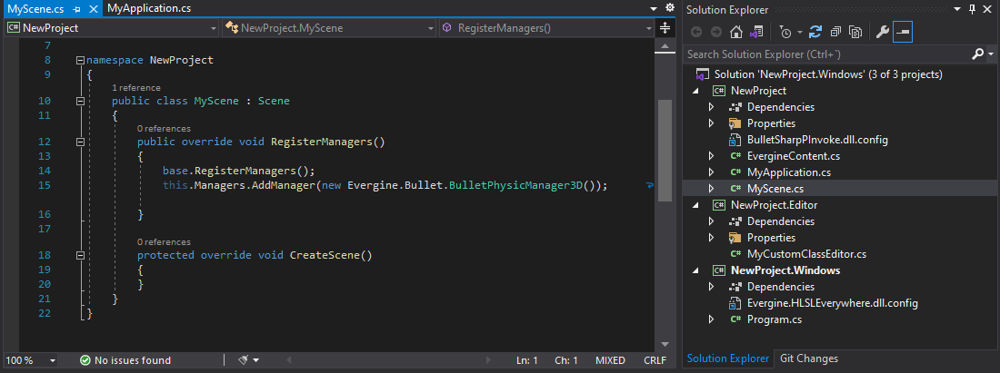

# Project Structure

When we create our **Evergine** application, it defines by default one **Visual Studio Solution** for every **Project profile** we creates. It will also define the following folders:

| Folder | Content description |
| ------ | ------------------- |
| **Content** | Contains all the **Evergine assets** of the project.   |
| **[ProjectName]**| It contains _[ProjectName].csproj_, the **base** project where usually the main **Evergine** elements are defined (_scenes, components, services, etc._) |defined here.|
| **[ProjectName].[Profile]** | There will be a folder with every application profile. It contains _[ProjectName].[Profile].csproj_,  the **Launcher** application for that specific profile carrying all its specific classes and logic. For example, the project for **UWP.MixedReality** will be a UWP Mixed Reality application. |
| **[ProjectName].Editor**| Contains _[ProjectName].Editor.csproj_ project that contains the **Evergine Editor** customizations. For example, for showing a custom panel for a specific component is created here. 

## Custom structue
**Evergine** supports custom structures in your application. It only requires that every specific profile solution can build properly.
