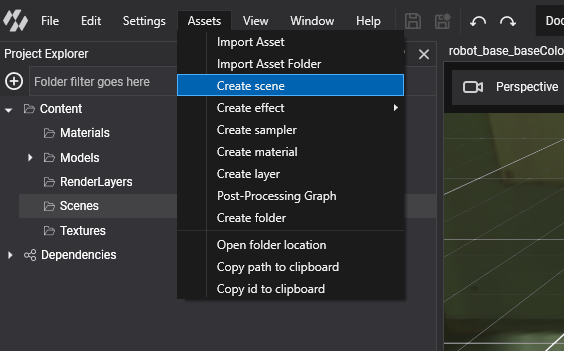

# Create scenes

When you create a project, it contains a initial **Scene**  (`MyScene.wescene`) containing some base entities.

In **Evergine** scenes are created like another Asset. 

## Create scene from Evergine Studio

There are two ways of creating a **Scene** from **Evergine Studio**.

- In the **Assets Details** panel, right click and select **Create scene** menú item.


- Alternatively, in the main menu, select **Assets > Create scene**




>[!NOTE]
> When creating a **Scene**, the new asset will be placed in the current selected Asset Folder, the one selected in **Project Explorer** panel and the one showed in **Assets Details** panel.


## Create a scene by code

To generate a new **Scene** by code we just need to create a new class extending **Scene**:

1. Create a new class in your **Evergine** project (`MyScene.cs` for example).
2. Make that class inherit from **Scene** class.
3. You can override the following important methods:

| Method | Description |
| ------ | ----------- |
| **CreateScene()** | Method where all the scene entities are created and added to the **Scene**.
| **RegisterManagers()** | Method where the **SceneManagers** are loaded. `base.RegisterManagers()` will register the default **SceneManagers**. 
| **Start()** | Called just before the **Scene** start updating and drawing.
| **End()** | Ends the scene 
| **Pause()** | Called when the scene is paused. It can be due the app being suspended or either manually paused through the **ScrenContextManager**.
| **Resume()** | Resume the **Scene** when it's dead..

Here is a code example:
````csharp

public class MyScene : Scene
{
    public override void RegisterManagers()
    {
        base.RegisterManagers();
        this.Managers.AddManager(new Evergine.Bullet.BulletPhysicManager3D());        	
    }

    protected override void CreateScene()
    {
        // Add scene entities.

        // Create a camera
        var cameraEntity = new Entity("camera")
            .AddComponent(new Transform3D())
            .AddComponent(new Camera3D())
            .AddComponent(new FreeCamera3D());

        this.Managers.EntityManager.Add(cameraEntity);
    }
}

````
