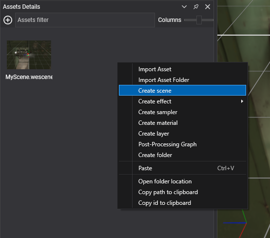

# Create scenes

When you create a project, it contains a initial **Scene**  (`MyScene.wescene`) containing some base entities.

In **Evergine** scenes are created like another Asset. 

## Create scene from Evergine Studio

There are two ways of creating a **Scene** from **Evergine Studio**.

- In the **Assets Details** panel, right click and select **Create scene** menú item.



- Alternatively, in the main menu, select **Assets > Create scene**


>[!NOTE]
> When creating a **Scene**, the new asset will be placed in the current selected Asset Folder, the one selected in **Project Explorer** panel and the one showed in **Assets Details** panel.


## Create a scene by code

To generate a new **Scene** by code we just need to create a new class extending **Scene**:

1. Create a new class in your **Evergine** project (`CodeClass.cs`).
2. Make that class inherit from **Scene** class.
3. You can override the following important methods:

! Method | Description |
| ------ | ----------- |
| CreateScene() | Method where all the scene entities are created and added to the **Scene**.
| RegisterManagers() | Method where the **SceneManagers** are loaded. `base.RegisterManagers()` will register the default **SceneManagers**. 
| Start() | Called just before the **Scene** start updating and drawing.
| End() | Ends the scene 
| Pause() | Called when the scene is paused. It can be due the app being suspended or either manually paused through the **ScrenContextManager**.
| Resume() | Resume the **Scene** when it's dead..

````csharp

public class MyScene : Scene
{
    public override void RegisterManagers()
    {
        base.RegisterManagers();
        this.Managers.AddManager(new Evergine.Bullet.BulletPhysicManager3D());        	
    }

    protected override void CreateScene()
    {
        // Add scene entities.

        // Create camera
        var cameraEntity = new Entity("camera")
            .AddComponent(new Transform3D())
            .AddComponent(new Camera3D())
            .AddComponent(new FreeCamera3D());

        this.Managers.EntityManager.Add(cameraEntity);
    }
}

````

## Load scene from code.

For loading and launching a **Scene** from code we have to use **ScreenContextManager** and understand the concept of **ScreenContexts**.

### ScreenContext

A **ScreenContext** represents a list of **Scenes** that can be simultanously loaded in the application at the same time. 


>[!NOTE]
> For example, this the diagram above depicts a **ScreenContext** containing two scenes: _MainScene_ for the application logic, and _UIScene_ another one just the **UI**.

### ScreenContextManager
**ScreenContextManager** is an service that manages the **Scene navigation** between scenes or, more accurately, **ScreenContext**.
Its main methods are:

| Method | Description | 
| ------ | ----------- |
| To   |  Navigating to a new **ScreenContext**  (passed by parameter), replacing the previous **ScreenContext.** |
| Push |  Navigtes to a new **ScreenContext** but keeps the previous one in a stack so we can restore later.
| Pop  |  Removes the current **ScreenContext** and restores the previous stacked one. 
| FindContextByName | For searching among the **ScreenContext** list.

So loading and navigating to a **Scene** by code would be like this (this code is placed in the **Application** class):

```csharp

// Loads the scenes. will create MyScene and UIScene objects which should be existing classes that intherit Scene class.
var baseScene = assetsService.Load<MyScene>(EvergineContent.Scenes.MainScene_wescene);
var uiScene = assetsService.Load<UIScene>(EvergineContent.Scenes.UIScene_wescene);

// Creates a context and navigate to it.
ScreenContext screenContext = new ScreenContext(scene, uiScene);
screenContextManager.To(screenContext);

```
