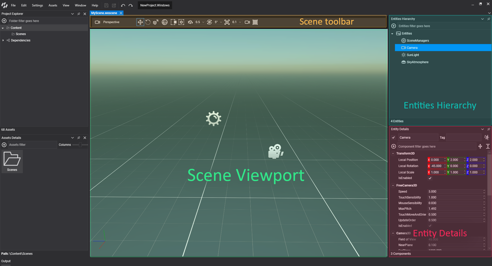
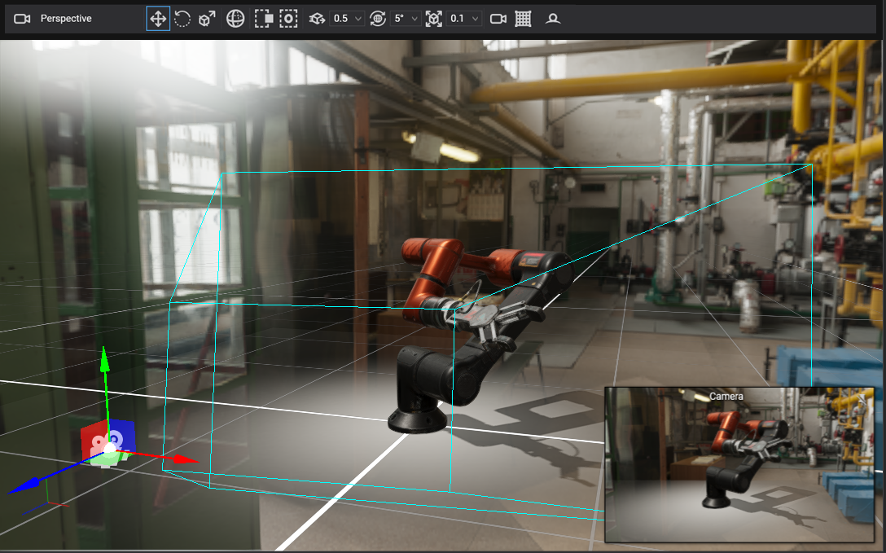
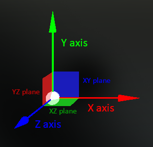
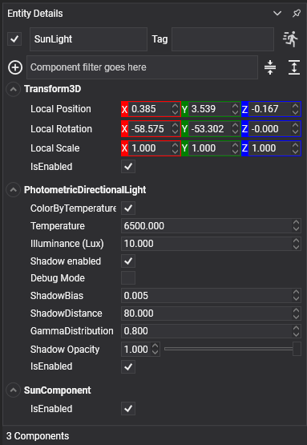

# Scene Editor

**Evergine** supports a complete **Scene Editor**. It allows creating entities, modifying them, adding / removing components. It contains the following sections:

- Scene Toolbar.
- Scene Viewport.
- Entities Hierarchy.
- Entity Details.

 ## Scene Toolbar

 It contains useful controls for adjusting the scene edition.

 | Control | Description |
 | ------- | ----------- |
 |  | Camera selection. Allow the **Scene Viewport** to visualize one of the scene cameras. **Perspective** is the default value, representing **Evergine Studio** camera. |
 |  | Set the transform manipulation in **Translation Mode**.|
 |  | Set the transform manipulation in **Rotation Mode**. |
 |  | Set the transform manipulation in **Scale Mode**. |
 |  /   | Toggles the transform manipulation from local axis to global axis. |
 |  /   | Toggles the selection mode between **Crossing Mode** (Selects any entity that touches the rectangle selection) and **Window Mode** (Selects only the entities wholly inside the selection rectangle.). |
 |  / |  Switch the pivot location between **the last entity selected** and **the center of all the selected entities**.  |
 |  | When enabled, translation manipulation is done by steps of a custom value (0.5, 1, 5, 10, 50, 100) |
 |  | When enabled, rotation manipulation is done by steps of a custom value (5, 10, 15, 30, 45, 60 and 90 degrees) |
 |  | When enabled, scale manipulation is done by steps of a custom value (0.001, 0.01, 0.1, 0.5, 1, 5, 10) |
 |  | Open a dialog with the properties of the editor scene camera. (More details below) |
 |  | Toggles the visibility of the grid in the viewport. |

 ### Editor Camera properties

 

 This dialog sets the properties of the **Editor camera**. This camera is the default camera when editing your scene. The properties shown in this panel are the same that appear when editing a **Camera3D** component. More information in [this article](../../graphics/cameras.md)

## Scene Viewport

This area allows navigating the camera through the scene and also selecting, transforming and manipulate all the en **entities** of the **scene** (**Cameras**, **Lights** and other types). 

On top of the viewport there is the **Scene toolbar** where the user can adjust how the viewport behaves.

### Controls

| Action | Description |
| ------ | ----------- |
| **Left Mouse** | Select entity. |
| **Drag Left Mouse** | Rectangle selection. |
| **Ctrl + Left Mouse** | Add entity to selection. |
| **Alt + Left Mouse** | Removes entity from selection. |
| **Right Mouse** | Rotate camera. |
| **Right Mouse + Arrows / WASD** | Move camera. |
| **Right Mouse + Mouse Wheel** | Change camera speed up / down.|
| **Right Mouse + Shift** | Speed up camera by 2.|
| **Middle Mouse** | Pan camera |
| **Middle Mouse + Shift** | Orbit camera |
| **Mouse Wheel** | Dolly in/out camera. |
| **Mouse Wheel + Ctrl** | Zoom in/out camera. |
| **Ctrl + D** | Duplicate selected entity.|
| **G** | Toggle Grid visibility|
| **W** | Set Translating manipulation mode. |
| **E** | Set Rotating manipulation mode. |
| **R** | Set Scaling manipulation mode. |

### Basic Manipulation
When selecting an entity, a **Bounding Selection Box** will appear and also a **manipulator** for adjusting the entity **Transform3D**.

There are 3 different transform manipulation, selected by the above keys (W, E and R), or throug the **Toolbar**:

#### Translation

  
 
 Moves the entity through the scene. It allows to translate the entity:
 
 - **3 main axis** (X, Y an Z) as an one dimension translatio.
 - **3 main surfaces** (XY, XZ and YZ) as a two dimensional translation.

 #### Rotation

  
 
 Rotates the entity through one rotation axis. Those axis are:
 
 - **X axis**.
 - **Y axis**.
 - **Z axis**.
 - **Screen Axis**, the entity will rotate around the camera (using the camera forward as axis).

 #### Scale

  
 
 Scales the entity in one or more axis:
 
 - **X axis**.
 - **Y axis**.
 - **Z axis**.
 - **Uniform**, scales proportionally so the entity proportions remain the same.

 >[!NOTE]
 >Scaling manipulations always use local axis.

## Entities Hierarchy

This panel shows the entity tree of the scene. Every node represents an **entity** so it reflects entity hierarchy. When a node has some children mean that entity has some entity children.

#### Operations

- **Entities can be rearranged**. This will cause the entities to be relocated to another parent. When this operation is made the overal world transform (scale, rotation and translation) tries to remain constant during the process.
- **Entities can be removed**. Pressing the **Supr** button will delete the selected entity and all their children.
- **Double click in an entity** will focus it in the **Scene Viewport**.

- **Clicking in the**  **button** will show the **Add Entity dialog**. More details in the [Using Entities](../component_arch/entities/using_entities.md) article.

- In the botton bar shows the **total number of entities** in the scene (_137 in above image_)

 ## Entity Details

 

 This panel shows all the properties of a selected entity. It shows all the entity parameters like **name**, **tag** and enable status, and also shows an accordion panel of their components. Here are some specific controls:

 #### Controls

 |Control | Description |
 | ------ | ----------- |
 |  | Toggles the entity as static entity. |
 |  | Collapses the visibilisation of all the components |
 |  | Expand the visibilisation of all the components |

  More details in the [Using Entities](../component_arch/entities/using_entities.md) article.