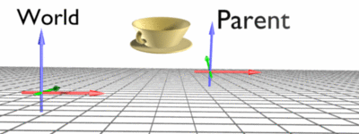

# Transform3D

Transform3D is maybe the most important [Component](component_arch/components/index.md) in Evergine.

The Transform3D components are used to store the Entity positiom, rotation and scale.

## Parent / Child hierarchy

when an Entity is a Parent of another Entity, the Child Entity will move, rotate and scale in the same way as its Parent does. You can think of parent / child hierarchy as being like the relationship between your arms and your body; whenever your body moves, your arms also move along with it. Child objects can also have children. Your hands can be considered as children of your arms, and your fingers are hands children.

## Local vs World space

3D and 2D position and transformations exist within a coordinate systems called spaces:

### World Space

**World Space**  is the coordinate system for the entire scene. Its origin is at the center of the scene: 
* Position [0, 0, 0]
* Scale [1, 1, 1]
* Rotation [0, 0, 0]

In an entity hierarchy this space is used to get the global position of your body hand (following the example explained above).

### Local Space

**Local Space** is the coordinate system where position, rotate and scale is used taking the entity parent as reference.

## Transform3D Properties

When you set a local property, the equivalent world property is set automatically, and vice versa. So, you can place a child object in a global position, and the Transform3D component translates it to local space.

### Local Space properties

The following properties are used to modify Transform3D in local space:

| Property | Type | Default | Description |
| --- | --- | --- | --- |
| **LocalPosition** | `Vector3` | `Vector3.Zero` | This is the position of the entity in local space |
| **LocalOrientation** | `Quaternion` | `Quaternion.Identity` | This is the orientation of the entity in local space |
| **LocalRotation** | `Vector3` | `Vector3.Zero` | This is the rotation of the entity in local space expressed in Euler angles. |
| **LocalScale** | `Vector3` | `Vector3.One` | This is the scale of the entity in local space |
| **LocalTransform** | `Matrix4x4` | The transform matrix relative to the parent transform. Is obtained by combining the LocalPosition, LocalOrientation and LocalScale (TRS matrix).

> [!NOTE]
> As you can see, we use the terminology **Orientation** to express quaternion properties, and **Rotation** to express Euler angles.

> [!TIP]
> Internally the orientation/rotation are stored in a Quaternion value, so, for performance reasons, we reconmend to use Quaternion properties (apart from the great benefits that Quaternion offers itself).

### World Space properties

The following properties are used to modify Transform3D in local space:

| Property | Type | Description |
| --- | --- | --- | --- |
| **Position** | `Vector3` | This is the position of the entity in world space |
| **Orientation** | `Quaternion` |This is the orientation of the entity in world space |
| **Rotation** | `Vector3` | This is the rotation of the entity in world space expressed in Euler angles. |
| **Scale** | `Vector3` | This is the scale of the entity in world space |
| **WorldTransform** | `Matrix4x4` | The matrix that transforms from local space to world space. Is obtained by combining the Position, Orientation and Scale (TRS matrix).

> [!NOTE]
> The initial Position, Orientation and Scale values depends on parent Transforms, because parent translation, scaling or orientation chages are propagated.

### Events

You can subscribe to transform events to be notified when one of its properties changes:

| Event | Description |
| --- | --- | --- | --- |
| **LocalPositionChanged** | Triggered when the **LocalPosition** is changed. |
| **LocalOrientationChanged** | Triggered when the **LocalOrientation** is changed. |
| **LocalScaleChanged** | Triggered when the **LocalScale** is changed. |
| **LocalTransformChanged** | Triggered when the **LocalTransform** is changed. |
| **PositionChanged** | Triggered when the **Position** is changed. |
| **OrientationChanged** | Triggered when the **Orientation** is changed. |
| **ScaleChanged** | Triggered when the **Scale** is changed. |
| **TransformChanged** | Triggered when the **WorldTransform** is changed. |

### Hierarchy properties

| Property | Description |
| --- | --- |
| **ParentTransform** | Indicates the transform of the parent entity. `null` if the entity has no parents. |
| **ChildrenTransform** | The list of children Transforms. |
| **LocalScaleChanged** | Triggered when the **LocalScale** is changed. |
| **LocalTransformChanged** | Triggered when the **LocalTransform** is changed. |
| **PositionChanged** | Triggered when the **Position** is changed. |
| **OrientationChanged** | Triggered when the **Orientation** is changed. |
| **ScaleChanged** | Triggered when the **Scale** is changed. |
| **TransformChanged** | Triggered when the **WorldTransform** is changed. |

### Useful methods

| Method | Description |
|--- | --- |
| **LookAt(targetPosition, up)** | Rotates the entity to point to the target position and up vector. All calculations are made in **world space**. |
| **LocalLookAt(targetPosition, up)** | Rotates the entity to point to the target position and up vector. All calculations are made in **local space**. |
| **SetLocalTransform (localPosition, localOrientation, localScale)** | Compute the local transform and update all local space properties. |

> [!TIP]
> We reconmend to invoke the `SetLocalTransform()` method instead of setting LocalPosition, LocalOrientation and LocalScale by separate.
