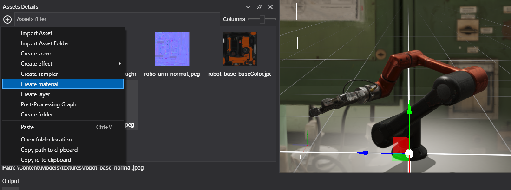
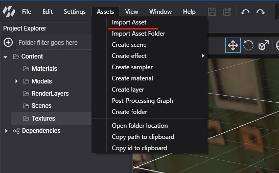

# Create Assets
In **Evergine**, there are two ways of creating an asset depending on its type:

* Importing a **resource file** to the **Assets Details** panel, either with _drag and drop_ or by selecting the **Import Asset** menu item. This works with images, 3D models, and sound files.
* Creating an asset directly from **Evergine Studio**, which is only for non-resource and **Evergine**-specific assets.

## Metafile Generation
When creating an asset, a **Metafile** will be generated with the same name as the resource file. That file will contain all the properties and profile specifications of the asset. Every asset type has a different extension, described below.

## Importing Assets

### Drag and Drop the Resource File

You can drag any file into **Evergine Studio** to import that asset file into the project and create an asset with it. Depending on the file extension, **Evergine Studio** will decide what kind of asset will be created in the panel folder:

| Asset Type | Metafile Extension | Supported File Extensions |
|------------|---------------------|----------------------------|
| Texture    | `.wetx`             | `.jpg`, `.jpeg`, `.png`, `.bmp`, `.tga`, `.ktx`, `.dds`, `.hdr` |
| Model      | `.wemd`             | `.gltf`, `.glb`, `.fbx`, `.3ds`, `.obj`, `.dxf`, `.dae` |
| Audio      | `.wesn`             | `.wav`, `.mp3`, `.ogg` |
| File       | `.wefile`           | Any other file. |
| Font       | `.weft`             | `.ttf`, `.otf` |

Import an asset by dragging and dropping a resource file from your _File Explorer_ to the **Assets Detail** panel.

### Use the Import Asset Menu Item

You can also import a resource file by selecting the **Import Asset** menu item located in:

* The **Assets** main menu.
* The  button on the **Assets Details** panel.
* The **Asset Details** panel contextual menu.

## Create Assets Without a Resource File

**Evergine** uses a variety of assets that don't require external resource files. These assets can be created directly from **Evergine Studio**. Like in the previous section, you can access the Assets menu items in three places:

* The **Assets** item in the main menu.
* The  button on the **Assets Details** panel.
* The **Assets Details** contextual menu.

In this way, we can create the following assets:

| Asset Type                             | Metafile Extension | Additional Files |
|----------------------------------------|---------------------|------------------|
| Scene                                  | `.wesc`             | `.wescene` file with the scene elements. A folder with the scene name that contains Scene sub-assets like the environment probe. |
| Effect _(graphic effect and compute shader)_ | `.wefx`      | `Sources` folder, containing a `Shader.fx` file with the shader description |
| Sampler                                | `.wesp`             |
| Material                               | `.wemt`             |
| Render Layer                           | `.werl`             |
| Post-Processing Graph                  | `.wepp`             |

> [!NOTE]
> If there is already an asset with the same name as the importing resource file, the new asset will be renamed by adding a number suffix in the name.
> For example, _texture.jpg_ would be renamed to _texture(1).jpg_ and _texture(2).jpg_ if another file with the same name is imported.