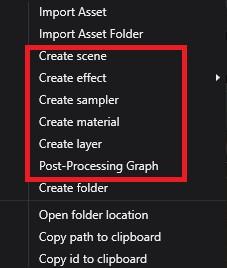

# Create assets

In **Evergine** there are two ways of creating an asset depending on its type :

* Importing a **resource file** to the **Assets Details** panel, either with _drag and drop_ or selecting the **Import asset** menu item. This works with images, 3d models and sound files.
* Creating an asset directly from **Evergine Studio**. Only for non resource and **Evergine** specifics assets.

## Importing assets

### Drag and drop the resource file

You can drag any file into the **Evergine Studio** to import that asset file into the project and create an asset with it. Depending of the file extension **Evergine Studio** will decide what kind of asset will be created in the panel folder:

| Asset type | Supported file extensions|
|--------------------|-------------|
| Texture | .jpg, .jpeg, .png, .bmp, .tga, .ktx, .dds, .hdr|
| Model |  .gltf, .glb, .fbx, .3ds, .obj, .dxf, .dae|
| Sound |  .wav, .mp3, .ogg
| File |  Any other file.

Import an asset by dragging and dropping a resource file from your _File Explorer_ to the **Assets Detail** panel.

### Use the import asset menu item

You can also import a resource file selecting the **Import Asset** menu item located in:

1. In the **Assets** main menu.

2. In the  button on the **Assets Details** panel.

2. The **Asset Details** panel contextual menu.

## Create assets without resource file.

**Evergine** uses a variety of assets that don't require external resource files. Those assets can be created directly from the **Evergine Studio**. 
Like in the previous section, you can access the Assets menu items in two places: 

1. In the **Assets** item in the main menu.
2. In the  button on the **Assets Details** panel.
3. In the **Assets Details** contextual menu.

This way we can create the following assets:

- Scene.
- Effect _(graphic effect and compute shader)_.
- Sampler.
- Material.
- Render layer.
- Post-Processing Graph.

> [!NOTE]
> If there is already an asset with the same name than the importing resource file, the new asset will be renamed adding a number suffix in the name. 
> For example,  _texture.jpg_ would be renamed to _texture(1).jpg_ and _texture(2).jpg_ if another file with the same name is imported.
