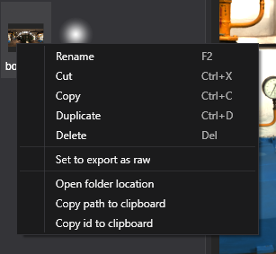
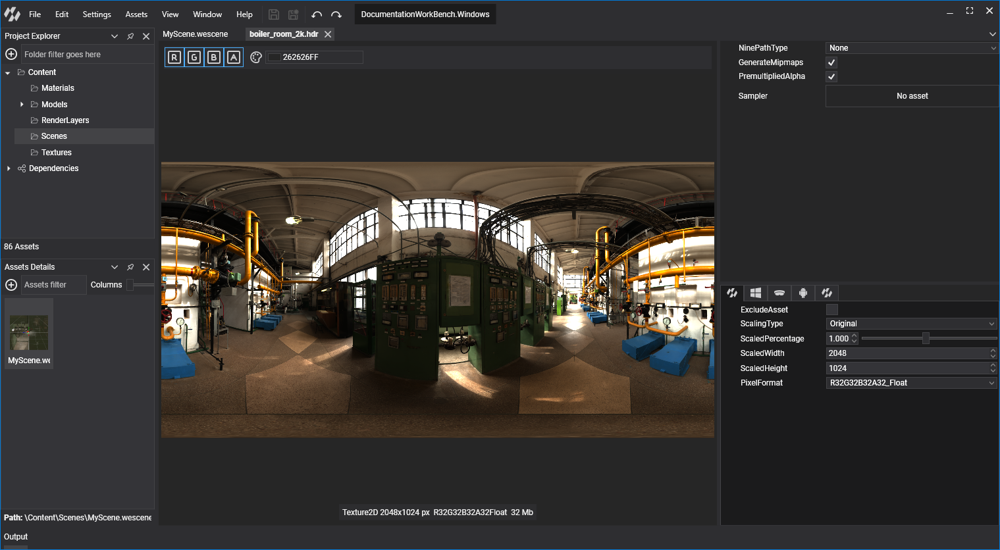

# Edit assets
**Evergine Studio** offers the possibility of editing plenty of properties of every asset to fully customize the use of that asset into your app. Also, every **Evergine** project also defines a set of **profiles**, so you can also set different properties per profile. 

> [!NOTE]
> For example, we can halve the resolution of a texture for the _Android_ or _iOS_ profiles. Or sets a different _PixelFormat_. 

## Contextual Actions

We can apply some actions to the assets regardless its type. **Right click** to an asset in the **Assets Details** panel to show a contextual menu with the following actions:

* **Rename** the asset.
* **Cut** the asset _(For cut/paste operation)_.
* **Copy** the asset _(For copy/paste operation)_.
* **Duplicate** will create an exact copy of the asset but with different **Id**.
* **Delete** asset.
* **Set to export as raw** copies to the _Export Content Folder_ the resource file instead the compiled exported version. 
* **Open folder location** will open the File explorer in the same location of the asset.
* **Copy path to clipboard**. Copies the path of the asset **metafile**.
* **Copy id to clipboard**.

## Assets Editor
To edit an asset:

1. Click on it in the **Assets Details** panel. 
2. A new panel will be opened, specific for that asset.

Every **Asset editor** panel is different, but some of the most common areas are the next ones:

* Asset viewer area.
* Global properties panel.
* Profile properties panel(s).

### Viewer area

Usually the viewer area of the asset will show a visual representation of the asset. It's also common to have some sort of controls to change the visualization settings. Some examples are:
* Enabling / disabling Texture channels.
* Selecting the **Level of Mipmap** of a Texture.
* Play/Pause a **Model** animation.
* Set the geometry where a **Material** is applied.

### Global properties

Usually the global properties are the one that applies for all the **Project profiles**. Next image shows the **Render Layer** parameters:

### Profile properties
Present in many assets there is a **Profile parameters** area where users can customize properties per profile.
Usually this area is similar to this:

This area shows:
- **Profile tabs**:   It shows the _default profile_ tab and one tab per **Project profile**. Allows to switch to a specific profile property panel.
- **Default profile**:  Sets the profile properties by default when no other profile is specified.
- **Override Default Property**: When enabled, it enables the custom properties of this profile. If disabled, the default profile will be used.
- **Exclude Asset**: Property that allows an asset not to be exported in a specific profile, hence making it only available in some of the profiles.

