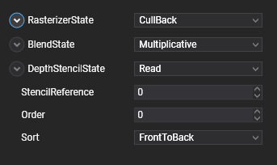
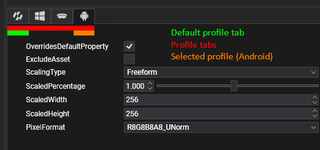

# Edit Assets
**Evergine Studio** offers the possibility of editing numerous properties of every asset to fully customize its use in your app. Additionally, every **Evergine** project defines a set of **profiles**, allowing you to set different properties per profile.

> [!NOTE]
> For example, we can halve the resolution of a texture for the _Android_ or _iOS_ profiles, or set a different _PixelFormat_.

## Contextual Actions

You can apply some actions to the assets regardless of their type. **Right-click** an asset in the **Assets Details** panel to show a contextual menu with the following actions:

* **Rename** the asset.
* **Cut** the asset _(for cut/paste operation)_.
* **Copy** the asset _(for copy/paste operation)_.
* **Duplicate**, which will create an exact copy of the asset but with a different **Id**.
* **Delete** the asset.
* **Set to export as raw**, which copies the resource file to the _Export Content Folder_ instead of exporting the compiled version.
* **Open folder location**, which opens the File Explorer to the asset's location.
* **Copy path to clipboard**, which copies the path of the asset's **metafile**.
* **Copy id to clipboard**.

## Assets Editor
To edit an asset:

1. Click on it in the **Assets Details** panel.
2. A new panel specific to that asset will open.

Every **Asset Editor** panel is different, but some of the most common areas are the following:

* Asset viewer area
* Global properties panel
* Profile properties panel(s)

### Viewer Area

Usually, the viewer area of the asset shows a visual representation of the asset. It's also common to have some controls to change the visualization settings. Some examples are:
* Enabling/disabling texture channels
* Selecting the **Level of Mipmap** of a texture
* Play/Pause a **Model** animation 
* Setting the geometry where a **Material** is applied

### Global Properties

Usually, the global properties are the ones that apply to all the **Project profiles**. The next image shows the **Render Layer** parameters:

### Profile Properties
In many assets, there is a **Profile Parameters** area where users can customize properties per profile. This area usually looks like this:

This area shows:
- **Profile tabs**:  This shows the _default profile_ tab and one tab per **Project profile**, allowing you to switch to a specific profile property panel.
- **Default profile**:  This sets the profile properties by default when no other profile is specified.
- **Override Default Property**: When enabled, this allows the customization of properties for this profile. If disabled, the default profile will be used.
- **Exclude Asset**: This property allows an asset not to be exported in a specific profile, making it available only in some profiles.