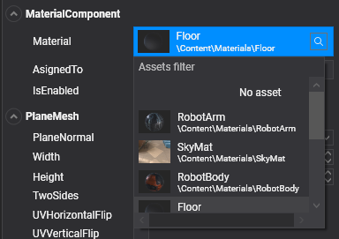

# Use assets


We can use an asset in our project in these ways:

* Reference it in an entity **Component**.
* Reference it from another asset.
* Load it from code.

## Reference asset from components.
Lots of components can use assets. For example, _MeshComponent_ uses **Model** assets and _Sprite_ uses **Texture** assets.

When a component uses an asset, it will show a **Asset Selection Control** in its section in the **Entity Details** panel.


To add an asset to that component, we need to click on it and a **Asset Picking Dialog** will appear, allowing is to select a desired asset. 



* The user can also fill the **Asset filter** textbox to filter all the assets, making it easier in big projects.
* Clicking the **lens icon**  will select the asset in the **Asset Details** panel. Useful to locate and edit a specific asset used in your scene.
* Clicking in an asset of the list will select it and set it as the property value of the component.
* To clear the asset reference, just select the **No Asset**  element on the list (it's the first one). 


> [!NOTE]
> The dialog will only shows assets of the same type of the defined by the component property or field.

## Reference asset by other assets

In the same way as the components, assets can reference other assets. For example, a **Material** can reference a **Texture** and a **Texture** references a **SamplerState** asset.

You can reference those assets in the same way you add them to components (see above).


## Reference assets by code.

An asset can be loaded an accessed at runtime using in two ways depending of the asset scope:

*  **AssetsService**: For loading global assets, used in more than one **Scene**.
* **AssetsSceneManager**: For loading assets in a **Scene**.

### AssetsService loading

**AssetsService** is a _Service_ that manages all the assets in the application. When loading an asset using this service we are also responsible of unloading it when it's no longer needed.

```csharp

var assetsService = Application.Current.Container.Resolve<AssetsService>();

Texture textureAsset;    

// Asset loading.

// Load asset by id (using EvergineContent).
textureAsset = assetsService.Load<Texture>(EvergineContent.Textures.SampleTexture_png);

// Load asset by path.
textureAsset = assetsService.Load<Texture>("SampleTexture.wetx");

// Load asset by stream (we need to provide an asset name anyways).
textureAsset = assetsService.Load<Texture>("SampleTexture.wetx", stream);

// Asset unloading.

// Unloads asset by id.
assetsService.Unload(EvergineContent.Textures.SampleTexture_png);

// Unload asset by path.
assetsService.Unload("SampleTexture.wetx");
```

### AssetsSceneManager loading

**AssetsSceneManager** is a _SceneManager_ that controls all the assets in a specific **Scene**. All the assets loaded through this _SceneManager_ will be unloaded when the **Scene** is disposed (When navigating to other scenes, for example). 

Its methods are pretty similar to the **AssetsService**.

```csharp

var assetSceneManager = this.Managers.AssetSceneManager.

Texture textureAsset;    

// Asset loading.

// Load asset by id (using EvergineContent).
textureAsset = assetSceneManager.Load<Texture>(EvergineContent.Textures.SampleTexture_png);

// Load asset by path.
textureAsset = assetSceneManager.Load<Texture>("SampleTexture.wetx");

// Load asset by stream (we need to provide an asset name anyways).
textureAsset = assetSceneManager.Load<Texture>("SampleTexture.wetx", stream);

// Asset unloading.

// Unloads asset by id.
assetSceneManager.Unload(EvergineContent.Textures.SampleTexture_png);

// Unload asset by path.
assetSceneManager.Unload("SampleTexture.wetx");
```


### Force new instance when loading

By default when an asset is loaded either in the **AssetsService** or the **AssetsSceneMangaer** only one instance of the asset is generated. This saves _GPU memory_ and time. 

However, in some certain occasions we want to load a *different instance** of an already loaded asset. For example, we want to load and use a **Material** and changing it but we don't want to change the rest of instances, only this one.

In this case we can do using the **forceNewInstance** in the Load method.

```csharp

// Forces a new instance to load.
Texture textureAsset = assetSceneManager.Load<Texture>(EvergineContent.Textures.SampleTexture_png, true); 
Texture textureAsset = assetsService.Load<Texture>(EvergineContent.Textures.SampleTexture_png, true);
```