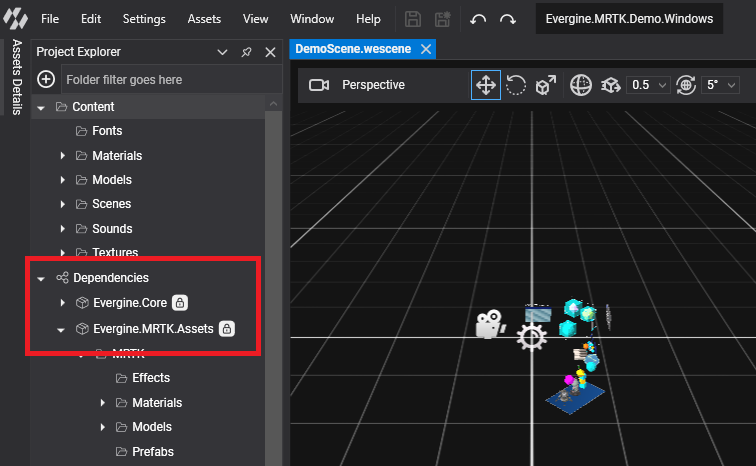

# Packages

Packages are Evergine extensions that add specific functionalities and assets to your project.

When a package is added, its assets (textures, sounds, meshes, etc.), source code (components, behaviors, services, etc.) and its nuget dependencies are automatically added for you, so you can start using them.



## Supported packages

- [Mixed Reality Toolkit](https://github.com/EvergineTeam/MixedRealityToolkit)
  - Id: Evergine.MRTK.Assets
  - Latest Version: 2021.11.4.5-nightly
  - NuGet Dependencies:
    - Evergine.Framework
    - Evergine.MRTK
- Azure Remote Rendering - Comming soon
- CAD Formats - Comming soon
- Noesis - Comming soon
- Bing Maps - Comming soon

## Add a new package

Unfortunately, there is no way right now from Evergine Studio to automatically search and install an extension in a project. For now, a slightly more manual steps must be done:

1. Check each package documentation for its Id, version and nuget dependencies.
1. Add it manually to the `weproj` file at your project root, under the Packages yaml list.

```yaml
Packages:
  - Id: Evergine.Core
    Version: ...
  - Id: [PACKAGE ID]
    Version: [VERSION ACCORDING TO YOUR EVERGINE VERSION]
```

For example:

```yaml
- Id: Evergine.MRTK.Assets
  Version: 2021.9.29.2-nightly
```

3. Finally, add the nuget dependencies to your root project, the one that contains the `EvergineContent.cs` file.

## Customize assets

To modify an asset included in the package, just open it in the project explorer, modify it, and save. Automatically a new copy of the asset will be created on your local folder project, overwriting the one provided by the package.


