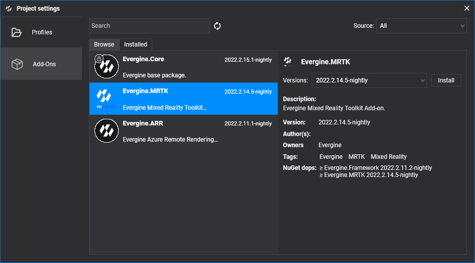

# Packages

Packages are Evergine extensions that add specific functionalities and assets to your project.

When a package is added, its assets (textures, sounds, meshes, etc.), source code (components, behaviors, services, etc.) and its nuget dependencies are automatically added for you, so you can start using them.

## Packages in Evergine Studio

To check wich packages are installed in your application, you just need to take a look to the Project Explorer tab in Evergine Studio, and inspect the Dependencies section:

## Supported packages

Evergine comes gives the possibility to extend your applications using different packages

### Evergine Core

**Evergine.Core** is the most important package in Evergine, and it is registered into your application by default. It gives your application all default [Effects](../graphics/effects/builtin_effects.md), [Materials](../graphics/materials/index.md), [Textures](../graphics/textures/index.md), [PostProcessingGraph](../graphics/postprocessing_graph/index.md) and core functionality to start developing your project.

#### Evergine.Core Package information
* Id: **Evergine.Core**
* Latest Version: *This package is installed with the same version as used in your Evergine application*
* NuGet Dependencies:
  * **Evergine.Framework**

### Mixed Reality Toolkit

[**Evergine.MRTK**](https://github.com/EvergineTeam/MixedRealityToolkit) is a package that provides a set of components and features used to accelerate cross-platform XR application development in Evergine.
Evergine.MRTK provides a set of basic building blocks for Evergine development on XR platforms such as:
* Microsoft HoloLens 2
* Windows Mixed Reality hreadsets
* OpenVR headsets (Oculus, HTC Vive, etc..)

#### Evergine.MRTK Package information
* Id: **Evergine.MRTK.Assets**
* Latest Version: **2021.11.4.5-nightly**
* NuGet Dependencies:
  * **Evergine.Framework**
  * **Evergine.MRTK**

### Upcoming packages

Evergine is on continuous development, and more upcoming packages are coming:

| Package | Description | 
| --- | --- |
| **Azure Remote Rendering** | This package provides integration of Evergine with [Azure Remote Rendering](https://azure.microsoft.com/es-es/services/remote-rendering/), allowing to render on cloud complex industrial scenes and reproduce on portable devices or HoloLens. |
| **Noesis GUI** | Using [NoesisGUI](https://www.noesisengine.com/) with Evergine allows you to create appealing User Interfaces using powerful XAML tools like Microsoft Expression Blend. |
| **CAD Formats** | Take your industrial CAD/3D model and bring it into your Evergine application. |
| **Bing Maps** | Provides [Bing Maps](https://www.bingmapsportal.com/) integration with Evergine, that allows you to utilize Bing Maps 3D mapping data in your application. |

## Add, update or remove a package

To open Package Manager go to Settings > Project Settings main menu option, or just right click on "Dependencies" node in Assets hierarchy panel and select "Manage dependencies" option.

Browse tab shows all available packages. Dependending on usage of each package on your project, an indicator may appear to display availability or not of new package versions.

You can perform typical add, update or remove operations over packages from this section.

If you modify the collection of used packages, Evergine Studio will be reloaded once you close Project Settings window.

> [!Note]
> Notice that to use packages that have third NuGet package dependencies, you still need to install them by hand. Add the nuget dependencies to your root project, the one that contains the `EvergineContent.cs` file.

### Protected add-ons
Some packages like _Evergine.Core_ are required to be synchronized with project's Evergine version, so they are considered as special packages and can't be managed using this panel.

To updgrade _Evergine.Core_ package, you should update the whole project using Evergine Launcher user interface.

## Customize assets

By default, all assets included in a package cannot be modified. This is indicated by this lock icon: .

However, you can modify an asset included in the package. When you modify a package asset, and try to save it, the following message apperas, indicating if you want to create a new copy of this asset in your project:

Automatically a new copy of the asset will be created on your local folder project, overwriting the one provided by the package. By doing this allows you to modify or adapt Evergine core assets to your application requirements

