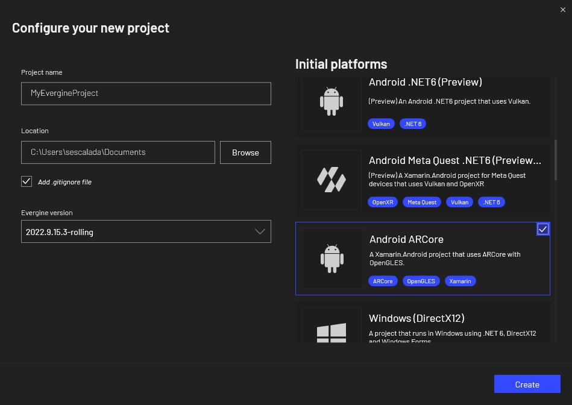
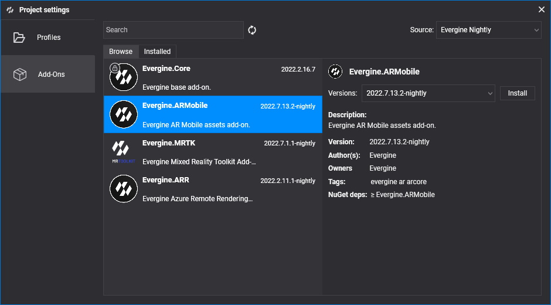
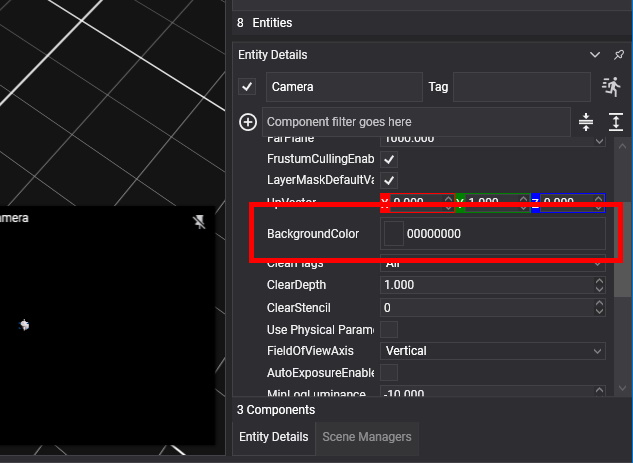
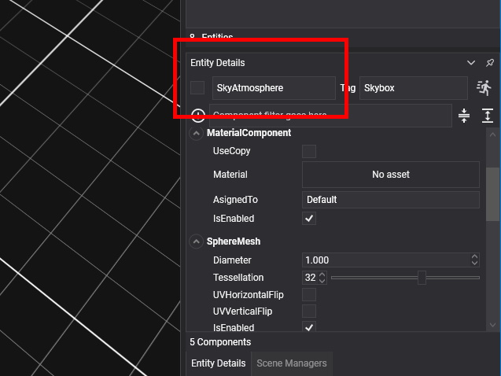
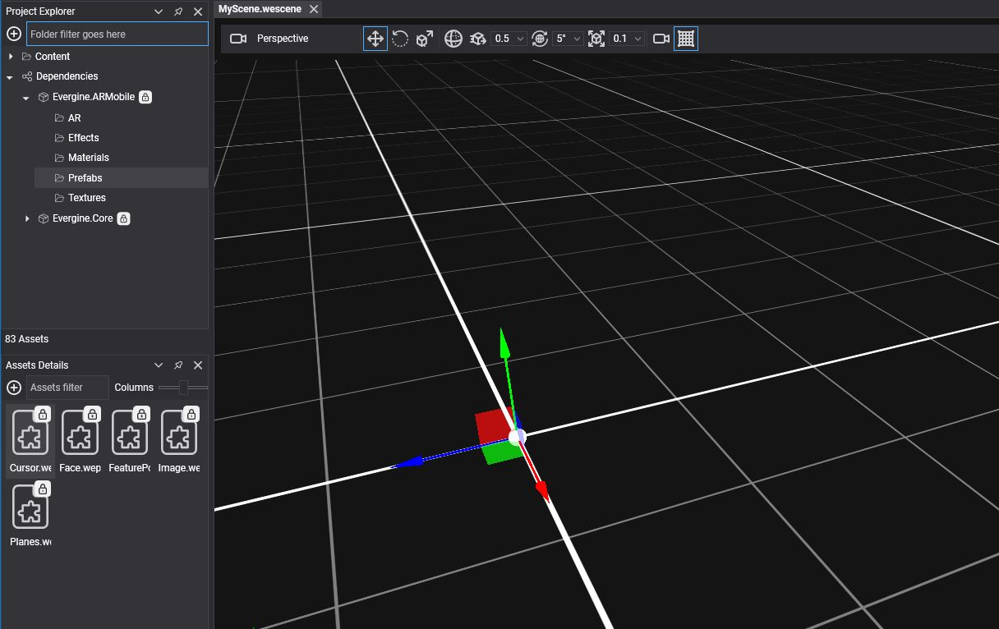
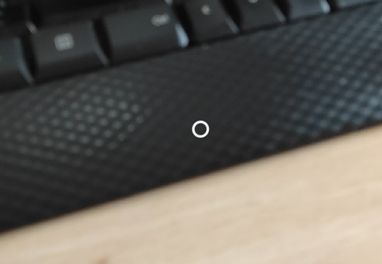
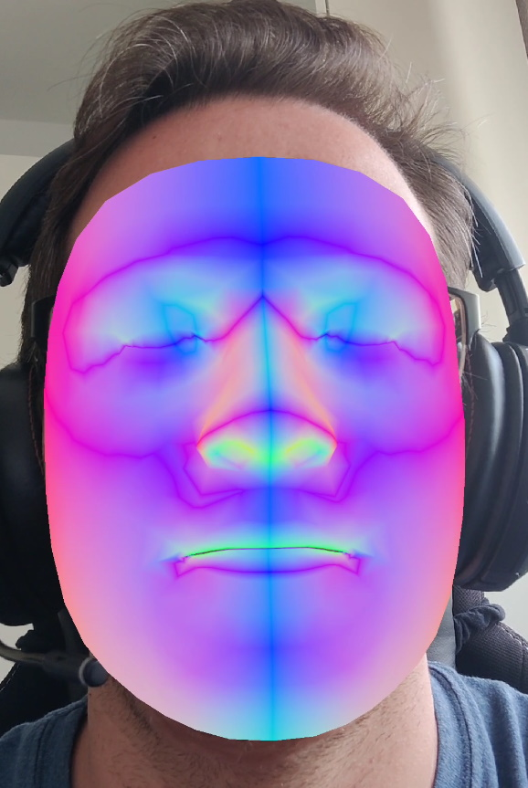
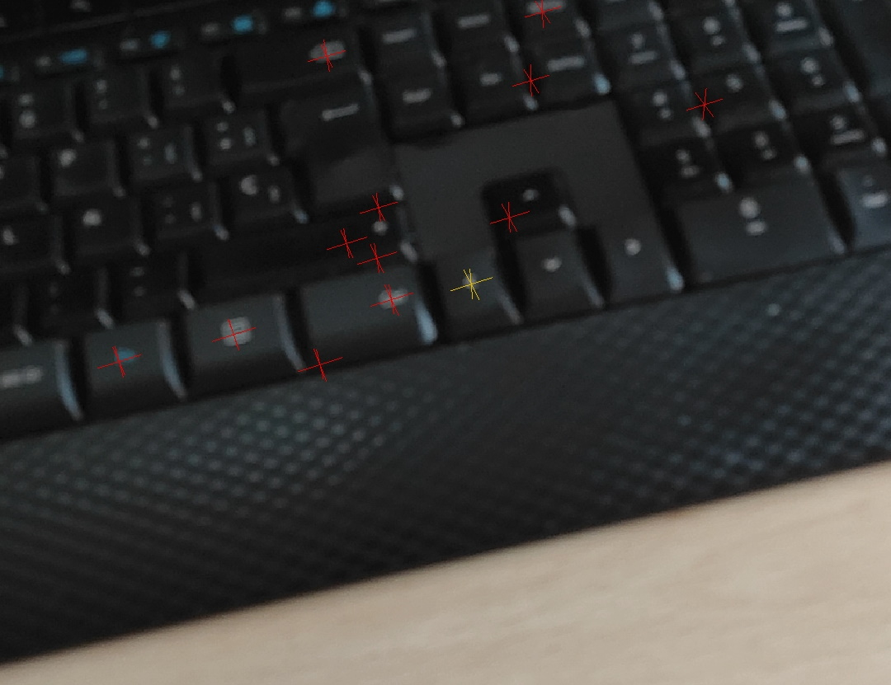

# ARMobile (Preview)
_ARMobile_ is an extension to work with _augmented reality_ experiences, so you will need compatible devices to run this kind of applications. By now, only supported platform is _Android (ARCore)_ but we also plan to support _iOS (ARKit)_ in the future. AR Mobile is based on [XR Platform](../xr/index.md).

> [!NOTE]
> Please, note that _Evergine.ARMobile_ extension is in _preview_ state, so it has some limitations and known issues described at [Known issues](#known-issues).

## Create a project using ARMobile
To make it easier to create _ARMobile_ projects, we have created a new project template for _Android ARCore_. It works with _OpenGL_ as graphics backend, due to limitations related with _ARCore_, that does not support _Vulkan_.

You also have to open _Evergine Studio_ add-ons manager and add _Evergine.ARMobile_ add-on.

Once _Evergine Studio_ loads default scene, you need to do some changes to make it work properly for _ARMobile_.
- For scene 3D camera, set background color to #00000000 color and remove _FreeCameraBehavior_ component.
- Disable _SkyAtmosphere_ entity.
- Go to _Scene Managers_ tab and add _ARMobileManager_ scene manager.

## Built-in _AR.Mobile_ add-on prefabs
_AR.Mobile_ add-on provides a set of prefabs that you can use for common _AR_ scenarios. Expand _Dependencies > Evergine.ARMobile > Prefabs_. You can find following prefabs here: _Cursor_, _Face_, _FeaturePoints_, _Image_ and _Planes_.

### Cursor prefab
This prefab draws a cursor which orientation changes depending on surface detection. Drag and drop _Cursor_ prefab to your scene and set its position to (0, 0, 0).

If you select prefab entity, will realize that apart from plane mesh components, there is a _ARMobileHitTestBehavior_ that lets you choose about how plane collision is detected: every frame or just when user taps on the screen.

### Face prefab
Face prefab allows you to use face tracking capabilities from _AR_ platform. Drag and drop _Face_ prefab to your scene and set its position to (0, 0, 0). Then, go to _Scene Managers_ and mark _FaceTrackingEnabled_ as checked. 

When you use face tracking detection, rear camera is no longer used and front camera is used instead. Because of this, any other _AR_ mode like image tracking or plane detection will not work.

If you select prefab entity, you can use attached _MaterialComponent_ to change face material. You also can realize that there is a component called _XRFaceTrackingMesh_ that creates face mesh from native buffers.

### Feature Points prefab
This prefab uses [LineBatch3D](xref:Evergine.Framework.Graphics.LineBatch3D) to render feature points in green, orange or red color, from more confident to less confident results. Confidence is saved in _W_ field of _Points_ property in [XRFeaturePoints](xref:Evergine.Framework.XR.FeaturePoints.XRFeaturePoints). Drag and drop _FeaturePoints_ prefab to your scene and set its position to (0, 0, 0) and enable feature points detection in _ARMobileManager_ scene manager.

### Image prefab
With image prefab you can easily track images, and place 3D objects when those images are detected and their real world position changes. It includes a _MaterialComponent_ that you can change to use a custom material for plane that appears once target image has been detected. Drag and drop _Image_ prefab to your scene and set its position to (0, 0, 0) and enable image detection in _ARMobileManager_ scene manager.

Under _Dependencies > Evergine.ARMobile > AR_ you will find default images dataset. It includes a single image, named _arimage.jpg_. Dataset file is in _CSV_ format:
- Each line represents a single image from dataset.
- First column is the relative path to the image file. Second column is expected image size in real world, measured in meters. So, for default image, we expect it to be 20 centimeters wide.
- For each one of the images, we use file name (without extension) as image name, that we internally register in dataset database. This is why default _ImageName_ value for _XRImageTracking_ component in _Image_ prefab is _arimage_, as this is the file name for default image in _Evergine.ARMobile_ add-on.

If you want a custom set of images, just create your own dataset within your project folders. Then, you have to change _ImageDataSetPath_ value in _ARMobileManager_ scene manager to meet your dataset path.

### Planes prefab
We provide this prefab to visualize detected planes. For this, drag and drop _Planes_ prefab to your scene and set its position to (0, 0, 0). Then, go to _Scene Managers_ and 
select a plane detection mode.

Prefab counts with a [XRPlaneRenderer](xref:Evergine.Components.XR.XRPlaneRenderer) that lets you change the material used to draw the planes.

## Known issues
As _ARMobile_ extension is in a _preview_ state, you could find some issues while running applications. This is a list of known issues:
- Application crashes when returning back from background.
- You will find, in Debug configuration, some _Google.AR.Core.Exceptions.DeadlineExceededException_ exceptions that are written to output console, depending on _ARMobileManager_ configuration.
- When dragging AR prefabs to the scene, you need to ensure that their _Transform3D_ location is set to (0, 0, 0) position. Any other position could provoke an _OpenGL_ rendering issue that results in a fullscreen green texture.