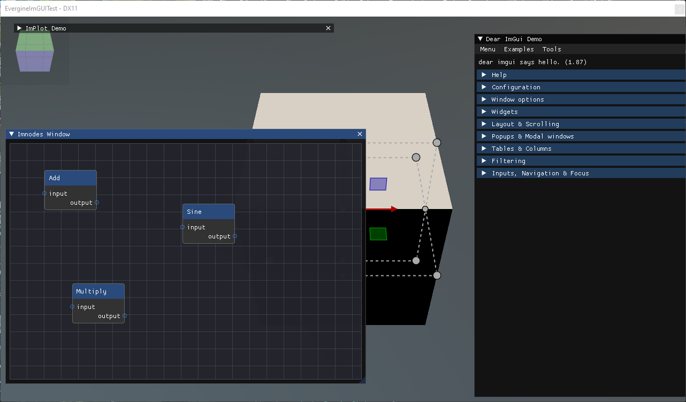

# ImNodes
---



This extension also allow you to use the ImNodes library, this is a simple, immediate-mode interface for creating a node editor within an ImGui window, this project and source code is available on github at: https://github.com/Nelarius/imnodes.

> [!NOTE]
> The C# wrapper is generated on top of a c-api wrapper version of this library, so some samples may not work directly but all the features are supported.

Imnodes aims to provide a simple, immediate-mode interface for creating a node editor within an ImGui window. Imnodes provides simple, customizable building blocks that a user needs to build their node editor.

## Features

Create nodes, links, and pins in an immediate-mode style. The user controls all the state.


## Usage

```csharp
private bool imnodesDemoOpen = true;
...
ImguiNative.igSetNextWindowSize(new Vector2(500, 500), ImGuiCond.Appearing);
ImguiNative.igBegin("ImNodes Demo", this.imnodesDemoOpen.Pointer(), ImGuiWindowFlags.None);

string[] nodes = new string[] { "Node1", "Node2", "Node3" };
ImnodesNative.imnodes_BeginNodeEditor();
int id = 0;
for (int i = 0; i < nodes.Length; i++)
{
    var node = nodes[i];

    ImnodesNative.imnodes_BeginNode(id++);

    ImnodesNative.imnodes_BeginNodeTitleBar();
    ImguiNative.igText(node);
    ImnodesNative.imnodes_EndNodeTitleBar();

    ImnodesNative.imnodes_BeginInputAttribute(id++, ImNodesPinShape.Circle);
    ImguiNative.igText("input");
    ImnodesNative.imnodes_EndInputAttribute();

    ImnodesNative.imnodes_BeginOutputAttribute(id++, ImNodesPinShape.Circle);
    ImguiNative.igIndent(40);
    ImguiNative.igText("output");
    ImnodesNative.imnodes_EndOutputAttribute();

    ImnodesNative.imnodes_EndNode();
}

ImnodesNative.imnodes_MiniMap(0.25f, ImNodesMiniMapLocation.BottomRight, IntPtr.Zero, IntPtr.Zero);
ImnodesNative.imnodes_EndNodeEditor();

ImguiNative.igEnd();
```