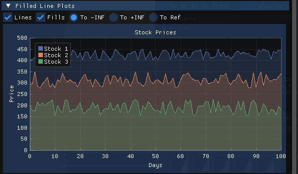
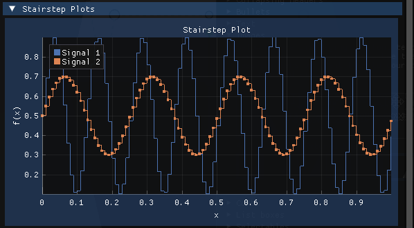

## ImPlot
---

This extension allows you to use the ImPlot library, an immediate mode, GPU-accelerated plotting library for ImGUI. This project and its source code are available on GitHub at: https://github.com/epezent/implot.

> [!NOTE]
> The C# wrapper is generated on top of a C-API wrapper version of this library, so some samples may not work directly, but all the features are supported.

# Features

The list of supported plots includes:

## Line Plots

A **line plot** or chart plot is a type of chart that displays information as a series of data points called 'markers' connected by straight line segments. It is a basic type of chart common in many fields. It is similar to a scatter plot except that the measurement points are ordered (typically by their x-axis value) and joined with straight line segments. A line plot is often used to visualize a trend in data over intervals of time.

## Filled Line Plots

A **Filled Line Plot** or area chart graphically displays quantitative data. It is based on the line chart. The area between the axis and the line is commonly emphasized with colors. Commonly, one compares two or more quantities with an area chart.

## Shaded Plots

A **Shaded Plot** is a type of chart that graphically displays the difference between two series based on lines. The area between two lines of the same graph is colored to highlight when they are further apart.

## Scatter Plots

A **scatter plot** is a type of plot or mathematical diagram that uses Cartesian coordinates to display values for typically two variables for a set of data. If the points are coded (color/shape/size), one additional variable can be displayed. The data are displayed as a collection of points, each having the value of one variable determining the position on the horizontal axis and the value of the other variable determining the position on the vertical axis.

## Realtime Plots

A **Realtime Plot** or Realtime chart is a type of chart that displays information as a series of data captured in real-time. It is common to display fps (frames per second) or other types of measurements in a graphical application.

## Stairstep Plots

A **Stairstep Plot** is a type of chart that represents digital signals advancing discreetly by jumps or steps in a staircase pattern.

## Bar Plots

A **bar plot** or bar chart is a chart or graph that presents categorical data with rectangular bars with heights or lengths proportional to the values that they represent. The bars can be plotted vertically or horizontally.

## Bar Groups

**Bar groups** or clustered charts are similar to bar charts but, in this case, the bars in the same category are drawn together.
 

## Bar Stacks

A **bar stack** is based on a bar plot, but in this case, it stacks bars on top of each other so that the height of the resulting stack shows the combined result. Stacked bar charts are not suited to data sets having both positive and negative values.

## Error Bars

An **Error bar chart** is a type of chart used to visualize a series of data and the distance to errors in those data.
 

## Stem Plots

A **Stem Plot** is a type of chart used to compare two or more stem series in the same chart. It uses vertical lines to highlight the area between the stem series.

## Infinite Lines

An **Infinite Line Chart** is used to show a grid, and the values are represented by horizontal lines as constant values.

## Pie Charts

A pie chart (or a circle chart) is a circular statistical graphic, which is divided into slices to illustrate numerical proportion. In a pie chart, the arc length of each slice (and consequently its central angle and area) is proportional to the quantity it represents. While it is named for its resemblance to a pie that has been sliced, there are variations in the way it can be presented.

## Heatmaps

A heat map (or heatmap) is a data visualization technique that shows the magnitude of a phenomenon as color in two dimensions. The variation in color may be by intensity, giving obvious visual cues to the reader about how the phenomenon is clustered or varies over space.

## Histogram

A **histogram** is an approximate representation of the distribution of numerical data. To construct a histogram, the first step is to divide the entire range of values into a series of intervals and then count how many values fall into each interval.

## Histogram 2D

A **Histogram 2D chart** is similar to the histogram chart but, in this case, information from a legend is also displayed that allows you to understand the colors displayed.

## Digital Plots

A **Digital Plot** is a type of chart that displays digital or analog signals over time. This is useful for showing electronic signals inside an application.

