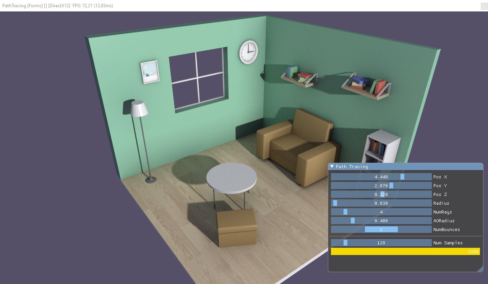

# Getting Started
---


## Install Evergine.ImGUI Extension

To start using this extension, add the Evergine.ImGui package to your project using the NuGet package manager from Visual Studio.

```xml
<PackageReference Include="Evergine.ImGui" Version="2024.6.28.781" />
```
## Usage

Make sure you have the necessary namespaces added to your scene:
```csharp
using Evergine.UI;
```

Register the ImGuiManager in your scene:

```csharp
public class ImGuiSceneTest : Scene
{
    public override void RegisterManagers()
    {
        base.RegisterManagers();
        this.Managers.AddManager(new global::Evergine.Bullet.BulletPhysicManager3D());
        this.Managers.AddManager(new ImGuiManager()
        {
            ImGuizmoEnabled = true,
            ImPlotEnabled = true,
            ImNodesEnabled = true,
        });
    }
...
}
```
### Step 1: Allow unsafe block
As the ImGui C# binding we are going to use is lightweight, it requires the use of unsafe code.

To enable unsafe code:
    **Option 1:** go to the project in which you are going to write it, open Properties, and in the Build tab, you will find an option called Allow unsafe code, enable it.
    **Option 2**: Edit the project file and add the following line:
```xml
<AllowUnsafeBlocks>True</AllowUnsafeBlocks>
```
### Step 2: Creating a Custom UI Behavior
- Create a new Behavior class in your project. Name it, for example, MyUI.
- Extend the class from the Behavior base class.
- Override the Update method to include ImGui calls.

```csharp
using Evergine.Framework;
using System;
using Evergine.UI;
using Evergine.Bindings.Imgui;
using Evergine.Mathematics;

namespace ImGUI
{
    public class MyUI : Behavior
    {
        protected override unsafe void Update(TimeSpan gameTime)
        {
            bool open = true;
            ImguiNative.igBegin("Debug", open.Pointer(), ImGuiWindowFlags.None);

            ImguiNative.igText("Hello, world 123");
            if (ImguiNative.igButton("Save", Vector2.Zero))
            {
                // MySaveFunction();
            }
            float f = 0.5f;
            ImguiNative.igSliderFloat("float", &f, 0.0f, 1.0f, null, ImGuiSliderFlags.None);

            ImguiNative.igEnd();
        }
    }
}
```
### Step 3: Adding MyUI to an Entity in the Scene
- Open the Evergine Editor.
- Create a new Empty Entity in your scene.
- Attach the MyUI behavior to the entity you just created from the Evergine Studio.
- Save the scene and run the project.

When you run the project, the MyUI behavior will be executed, and you should see a basic ImGui window with a button labeled "Click Me!". If you click the button, the text "Button Clicked!" will appear inside the window:


<br><br>

## Advanced example
Now let's see a more advanced example:

```csharp
bool open = false;
ImguiNative.igBegin("Path Tracing", open.Pointer(), ImGuiWindowFlags.None);

float x = this.worldInfo.LightPosition.X;
float y = this.worldInfo.LightPosition.Y;
float z = this.worldInfo.LightPosition.Z;

ImguiNative.igSliderFloat("Camera Pos X", &x, -10.0f, 10.0f, null, ImGuiSliderFlags.None);
ImguiNative.igSliderFloat("Camera Pos Y", &y, -10.0f, 10.0f, null, ImGuiSliderFlags.None);
ImguiNative.igSliderFloat("Camera Pos Z", &z, -10.0f, 10.0f, null, ImGuiSliderFlags.None);

this.worldInfo.LightPosition.X = x;
this.worldInfo.LightPosition.Y = y;
this.worldInfo.LightPosition.Z = z;
float lightRadius = this.worldInfo.LightRadius;
ImguiNative.igSliderFloat("Light Radius", &lightRadius, 0.0f, 0.2f, null, ImGuiSliderFlags.None);
this.worldInfo.LightRadius = lightRadius;

int numRays = this.worldInfo.NumRays;
ImguiNative.igSliderInt("AO Num Rays", &numRays, 0, 32, null, ImGuiSliderFlags.None);
this.worldInfo.NumRays = numRays;

float aoRadius = this.worldInfo.AORadius;
ImguiNative.igSliderFloat("AO Radius", &aoRadius, 0.0f, 2.0f, null, ImGuiSliderFlags.None);
this.worldInfo.AORadius = aoRadius;

int numBounces = this.worldInfo.NumBounces;
ImguiNative.igSliderInt("GI Num Bounces", &numBounces, 0, 3, null, ImGuiSliderFlags.None);
this.worldInfo.NumBounces = numBounces;

float reflectanceCoef = this.worldInfo.ReflectanceCoef;
ImguiNative.igSliderFloat("Reflectance Coef", &reflectanceCoef, 0, 1, null, ImGuiSliderFlags.None);
this.worldInfo.ReflectanceCoef = reflectanceCoef;

float roughness = this.worldInfo.Roughness;
ImguiNative.igSliderFloat("Roughness", &roughness, 0, 1, null, ImGuiSliderFlags.None);
this.worldInfo.Roughness = roughness;

ImguiNative.igSpacing();
ImguiNative.igSeparator();
ImguiNative.igSpacing();            

int numSamples = this.pathTracerNumSamples;
ImguiNative.igSliderInt("Num Samples", &numSamples, 0, 1024, null, ImGuiSliderFlags.None);
this.pathTracerNumSamples = numSamples;

ImguiNative.igProgressBar((float)this.pathTracerSampleIndex / (float)this.pathTracerNumSamples, Vector2.Zero, null);

ImguiNative.igEnd();
```

This is the result:



Take a look at this in our [path tracer demo](https://github.com/EvergineTeam/Raytracing).

Note: This project needs to create an ImGuiRenderer because it uses the **Evergine** low-level API, but this is unnecessary in a default project created from **Evergine Studio**.