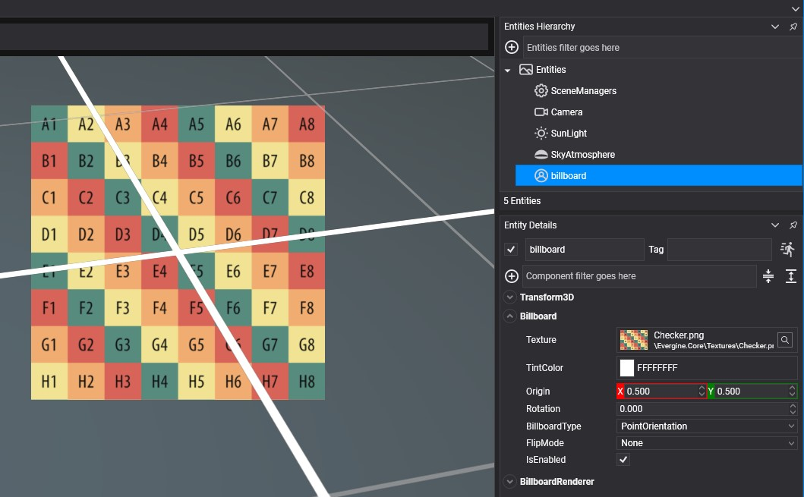

# Create Billboard


**Billboard** allows simulating far objects like bushes or trees reducing the amount of geometry needed to render your scene.

## Create a Billboard in Evergine Studio
You can create a billboard click button on  from [Entity Hierarchy](../../evergine_studio/interface.md) panel to deploy a create menu options and click on the option _"Billboard"_


A billboard entity will be added to your scene



In the billboard component of your billboard entity you will find the following properties:

|Property                       | Description |
|-------------------------------|-------------|
| **Texture**               | The billboard texture. |
| **TintColor**                 | Each pixel of the Billboard will be multiplied by such color during the drawing. By default, it is white. |
| **Origin**        | Gets or sets the Billboard Origin. The origin (also known as pivot) from where the entity scales, rotates and translates. Its values are included in [0, 1] where (0, 0) indicates the top left corner. Such values are percentages where 1 means the 100% of the rectangle's width/height.    |
| **Rotation**                   | The Billboard rotation. |
| **BillboardType**           | The billboard type. The available types are Point orientation or Axial orientation.|
| **FlipMode**    | Allows flipping the texture coords in Horizontal or Vertical. |

## Create a Billboard from code
The following code shows the list of components necessary to convert an entity into a billboard entity. 

```csharp
public class MyScene : Scene
{
    protected override void CreateScene()
    {                       
        var assetsService = Application.Current.Container.Resolve<AssetsService>();

        // Load default texture
        Texture treeTexture = assetsService.Load<Texture>(EvergineContent.Textures.BillboardTree_png);

        // Load default sampler
        SamplerState linearClampSampler = assetsService.Load<SamplerState>(EvergineContent.Samplers.LinearClampSampler);

        // Load a Render Layer description...
        RenderLayerDescription layer = assetsService.Load<RenderLayerDescription>(EvergineContent.RenderLayers.Alpha);

        var billboard = new Entity()
            .AddComponent(new Transform3D())
            .AddComponent(new Billboard()
            {
                Texture = treeTexture,
                Sampler = linearClampSampler,
                BillboardType = BillboardType.Axial_Orientation,
            })
            .AddComponent(new BillboardRenderer()
            {
                Layer = layer,
            });

        this.Managers.EntityManager.Add(billboard);
    }
}
```

The result:

