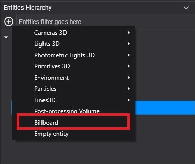
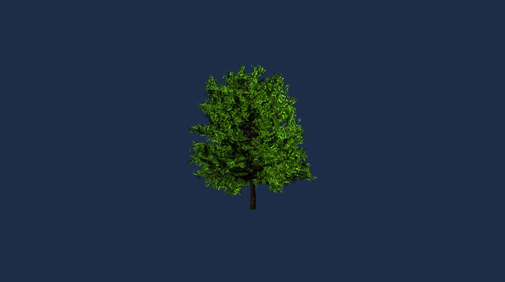

# Create Billboard


**Billboard** allows simulating far objects like bushes or trees, reducing the amount of geometry needed to render your scene.

## Create a Billboard in Evergine Studio
You can create a billboard by clicking the  button from the [Entity Hierarchy](../../evergine_studio/interface.md) panel to deploy the create menu options and then selecting the option _"Billboard"_



A billboard entity will be added to your scene.


In the billboard component of your billboard entity, you will find the following properties:

| Property       | Description |
|----------------|-------------|
| **Texture**    | The billboard texture. |
| **TintColor**  | Each pixel of the billboard will be multiplied by this color during drawing. By default, it is white. |
| **Origin**     | Gets or sets the billboard origin. The origin (also known as pivot) is where the entity scales, rotates, and translates. Its values are in the range [0, 1], where (0, 0) indicates the top left corner. These values are percentages where 1 means 100% of the rectangle's width/height. |
| **Rotation**   | The billboard rotation. |
| **BillboardType** | The billboard type. The available types are Point orientation or Axial orientation. |
| **FlipMode**   | Allows flipping the texture coordinates horizontally or vertically. |

## Create a Billboard from code
The following code shows the list of components necessary to convert an entity into a billboard entity. 

```csharp
public class MyScene : Scene
{
    protected override void CreateScene()
    {                       
        var assetsService = Application.Current.Container.Resolve<AssetsService>();

        // Load default texture
        Texture treeTexture = assetsService.Load<Texture>(EvergineContent.Textures.BillboardTree_png);

        // Load default sampler
        SamplerState linearClampSampler = assetsService.Load<SamplerState>(EvergineContent.Samplers.LinearClampSampler);

        // Load a Render Layer description...
        RenderLayerDescription layer = assetsService.Load<RenderLayerDescription>(EvergineContent.RenderLayers.Alpha);

        var billboard = new Entity()
            .AddComponent(new Transform3D())
            .AddComponent(new Billboard()
            {
                Texture = treeTexture,
                Sampler = linearClampSampler,
                BillboardType = BillboardType.Axial_Orientation,
            })
            .AddComponent(new BillboardRenderer()
            {
                Layer = layer,
            });

        this.Managers.EntityManager.Add(billboard);
    }
}
```

The result:

