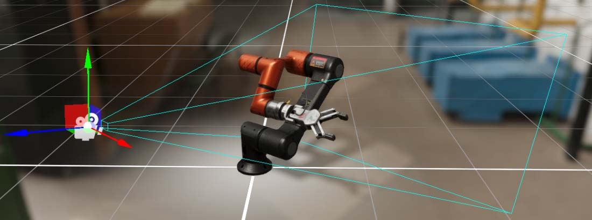
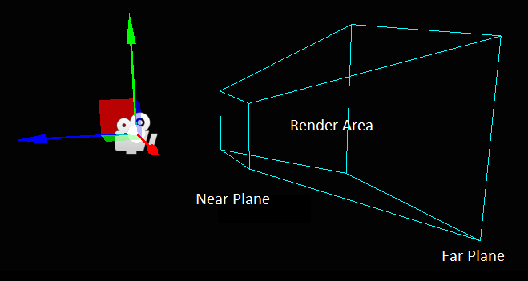
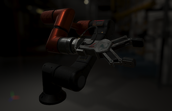
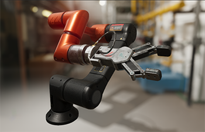
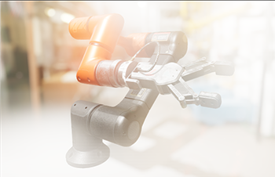

# Cameras


**Cameras** are responsible to capture your scene and display it to the user. By customizing and manipulating cameras, you can make the visual composition of your scene truly appealing.

You can create an unlimited number of cameras in a **Scene**. They can be set to render in any order, at any place on the screen, and choose the render target destination of this camera.

## Create a Camera3D from code
The following sample code can be used to instantiate a new camera entity in a scene.

```c#
protected override void CreateScene()
{
    // Create a new camera entity.
    Entity cameraEntity = new Entity()
        .AddComponent(new Transform3D())
        .AddComponent(new Camera3D()
        {
            BackgroundColor = Color.CornflowerBlue,
        });

    // Add the camera entity to the entity manager.
    this.Managers.EntityManager.Add(cameraEntity);
}
```

## Create a Camera3D in Evergine Studio
In the Entities Hierarchy panel of your Scene Editor, click the "Add Entity and select **Camera3D**, then choose the kind of camera you want to create:
* **Fixed Camera:** This camera does not have any built-in behaviour, it is static.
* **View Camera:** This camera can be moved using the mouse, touch or keyboard while respecting the look-at point.
* **Free Camera:** This camera can be moved using the mouse, touch or keyboard. 


## Camera3D properties

### Basic Camera3D properties

|Property           | Description |
|--------------------|-------------|
| [Field of View](xref:Evergine.Framework.Graphics.Camera.FieldOfView) | The Camera’s view angle, measured in degrees along the axis specified in the Field of View Axis drop-down.|
| [Field of View Axis](xref:Evergine.Framework.Graphics.Camera.FieldOfViewAxis) | Field of view axis: <ul><li>**Vertical:** The camera uses a vertical field of view axis.</li><li>**Horizontal:** The camera uses a horizontal field of view axis.</li></ul> |
| [Near Plane](xref:Evergine.Framework.Graphics.Camera.NearPlane) | The nearest distance the camera can see.|
| [Far Plane](xref:Evergine.Framework.Graphics.Camera.FarPlane) | The furthest distance the camera can see.|
| [Background Color](xref:Evergine.Framework.Graphics.Camera.BackgroundColor) | The color applied to the background. |
| [Clear Flags](xref:Evergine.Framework.Graphics.Camera.ClearFlags) | This flags indicates wich part of the framebuffer will be cleared before rendering: <ul><li>**Target:** Clear the color buffer attachments.</li><li>**Depth:** Clear the depth buffer attachment.</li><li>**Stencil:** Clear the stencil buffer attachment.</li><li>**All:** Clear all attachments described before.</li></ul>|
| [HDR Enabled](xref:Evergine.Framework.Graphics.Camera.HDREnabled) | Render the camera output in a HDR format |
| [Camera Order](xref:Evergine.Framework.Graphics.Camera.CameraOrder) | Specify the order in which the camera will be rendered. Lower values produces that the camera will be rendered first.|

### Frustum
The camera frustum is the region of the space that will be appear on the screen.



Is defined by near, far planes and field of view properties.

The near and far planes determine where the camera's view begins and ends.
* The **near plane** is the closest point the camera can see. The default value is 0.1. Objects before this point aren't drawn.
* The **far plane**, also known as the draw distance, is the furthest point the camera can see. Objects beyond this point aren't drawn. The default setting is 1000.

## Photometric properties

By default, the camera uses basic properties to specify camera views (field of view and exposure). However, is possible to specify these values using physical values used in real cameras.

To enable physical parameters:

|Property           | Description |
|-------------------|-------------|
| [Enable Physical Parameters](xref:Evergine.Framework.Graphics.Camera.UsePhysicalParameters) | Boolean to indicate if the camera will use the physical parameters to define its field of view. |

### Focal Length and sensor size
|Property           | Description |
|-------------------|-------------|
| [Focal Length (milimeters)](xref:Evergine.Framework.Graphics.Camera.FocalLength) | The [Focal length](https://en.wikipedia.org/wiki/Focal_length) is a common terms in photography to describe the field of view. |
| [Sensor Size (milimeters)](xref:Evergine.Framework.Graphics.Camera.SensorSize) | The [Sensor size](https://en.wikipedia.org/wiki/Image_sensor_format) describes the size in milimeters of the camera sensor. It has several implications in combination with other properties. For example, Sensor Size and Focal length defines the camera field of view. |

### Exposure
The Exposure property specifies the overal factor that will be applied to the render output. In combination with HDR render output and environments will produce realistic results:

| Exposure = 0.2 | Exposure = 1.0 | Exposure = 3.0 | 
| --- | --- | --- |
|  |  |  |

The exposure can be specified using the Exposure property, but if you use photometric camera properties you could reproduce physical behavior concerning the amount of light gathered by the camera:

|Property           | Description |
|-------------------|-------------|
| [Aperture](xref:Evergine.Framework.Graphics.Camera.Aperture) (f-stops) | The [Aperture](https://en.wikipedia.org/wiki/Aperture), expressed in f-stops, controls how open or closed the camera system's aperture is. In addition to the exposition, the aperture setting controls the depth of field. |
| [Shutter speed](xref:Evergine.Framework.Graphics.Camera.ShutterSpeed) (Seconds) | The [Shutter speed](https://en.wikipedia.org/wiki/Shutter_speed), expressed in seconds, controls how long the aperture remains opened. In addition to the exposition, the shutter speed controls motion blur. |
| [Sensitivity](xref:Evergine.Framework.Graphics.Camera.Sensitivity) (ISO) | The [Focal length](https://en.wikipedia.org/wiki/Focal_length), expressed in ISO, controls how the light reaching the sensor is quantized. In addition to the exposition, the sensitivity setting controls the amount of noise. |
| [Compensation](xref:Evergine.Framework.Graphics.Camera.Compensation) (EV units) | The [Compensation, Exposure Compensation or EC](https://en.wikipedia.org/wiki/Exposure_compensation) is expressed in EV units. Applying an exposure compensation EC is a simple as adding an offset to the final exposure. |

> [!Tip]
> Exposure of 1 could be achieved using Aperture 1 f-stop, Shutter Speed of 1.2 seconds and Sensitivity of 100 ISO

## Camera render output

By default, the camera render output will be targeted to the default **Display** registered in the **GraphicPresenter** service.

This behavior could be modified using two properties:

|Property           | Description |
|-------------------|-------------|
| [DisplayTag](xref:Evergine.Framework.Graphics.Camera.DisplayTag) | It controls wich Display will be used to output the render. Each display is registered into the GraphicPresenter using a DisplayTag. Setting this property will be used to specify the camera output to the framebuffer defined in this display. |
| [Framebuffer](xref:Evergine.Framework.Graphics.Camera.FrameBuffer) | However, you can override this behavior by setting a Framebuffer instance. If you are doing that, the camera output will be targeted to this framebuffer instance, even if you have previously specified a DisplayTag. | 