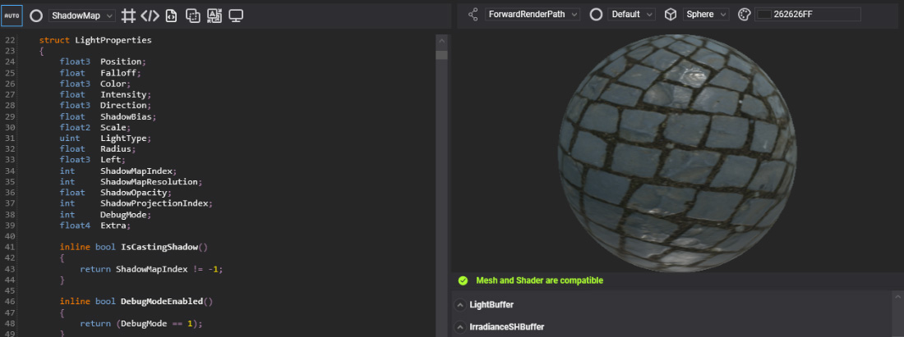
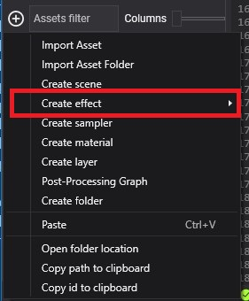

# Create Effects



An **effect** is a _uber-shader_ so be able to represent a single shader or a large group of shaders. There are two type of effect in Evergine:

<br> 

| Effect type | Description |
|------------ | ----------- |
| Graphics Effect | Defines a rasterization pipeline Vertex Shader, Geometry Shader, Hull Shader, Domain shader, Pixel Shader and are useful to create materials. |
| Compute Effect | Defines a compute pipeline with Compute Shader and are useful to create [compute task]() and [post-processing graph](../postprocessing/index.md) nodes.|

## Create a Effect asset in Evergine Studio

You can create an effect click button on  from [Assets Details](../../evergine_studio/interface.md) panel to deploy a create menu options and click on the option _"Create effect->Graphics Effect or Compute Effect"_



### Inspect effects in Asset Details

You can find the effect assets in the [**Assets Details**](../../evergine_studio/interface.md) panel when you select a folder in the [**Project Explorer**](../../evergine_studio/interface.md).


### Effects files in content directory

The effect file has the `wefx_` extension and always come together a folder with the same name of the effect.


## Create a new Effect from code

The following sample code can be used to create a new effect and create a material associated to apply to an entity in your scene.

```csharp
protected override void CreateScene()
{
    protected override void CreateScene()
        {
            var graphicsContext = Application.Current.Container.Resolve<GraphicsContext>();
            var assetsService = Application.Current.Container.Resolve<AssetsService>();

            string shaderSource = @"
                [Begin_ResourceLayout]

					cbuffer PerDrawCall : register(b0)
					{
						float4x4 WorldViewProj	: packoffset(c0);	[WorldViewProjection]
					};

					cbuffer Parameters : register(b1)
					{
						float3 Color			: packoffset(c0);   [Default(1.0, 0.0, 0.0)]
					};

				[End_ResourceLayout]

				[Begin_Pass:Default]
					[Profile 10_0]
					[Entrypoints VS=VS PS=PS]

					struct VS_IN
					{
						float4 Position : POSITION;
						float3 Normal	: NORMAL;
						float2 TexCoord : TEXCOORD;
					};

					struct PS_IN
					{
						float4 pos : SV_POSITION;
						float3 Nor	: NORMAL;
						float2 Tex : TEXCOORD;
					};

					PS_IN VS(VS_IN input)
					{
						PS_IN output = (PS_IN)0;

						output.pos = mul(input.Position, WorldViewProj);
						output.Nor = input.Normal;
						output.Tex = input.TexCoord;

						return output;
					}

					float4 PS(PS_IN input) : SV_Target
					{
						return float4(Color,1);
					}

				[End_Pass]
            ";

            // Create effect
            Effect myEffect = new EffectFromCode(graphicsContext, shaderSource);

            // Create material asociated
            Material myMaterial = new Material(myEffect)
            {
                LayerDescription = assetsService.Load<RenderLayerDescription>(EvergineContent.RenderLayers.Opaque),
            };

            // Apply to an entity
            Entity primitive = new Entity()
                    .AddComponent(new Transform3D())
                    .AddComponent(new MaterialComponent() { Material = myMaterial })
                    .AddComponent(new SphereMesh())
                    .AddComponent(new MeshRenderer());

            this.Managers.EntityManager.Add(primitive);
        }
}