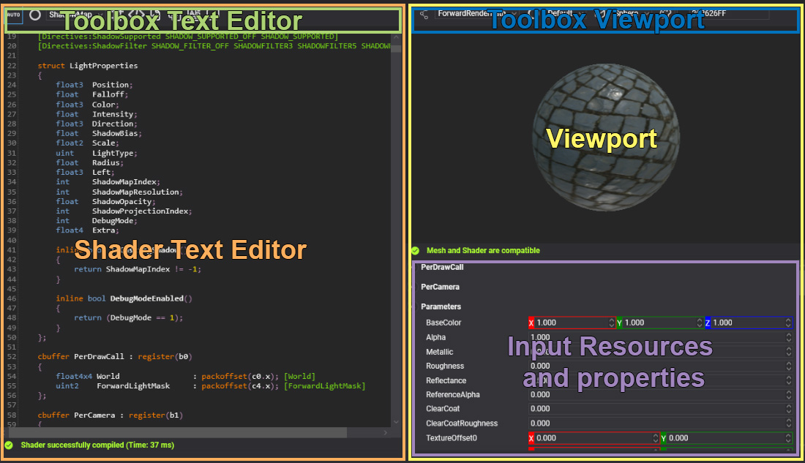

# Effect Editor

**Effect Editor** allows editing the effect assets. Double click over a effect asset shown in [Assets Details](../../evergine_studio/interface.md) will open this editor. The editor is composed of 2 main parts Shader Text Editor and Viewport:

## **Shader Text Editor**

The shader text editor allows writing your effects in [**HLSL**](https://docs.microsoft.com/en-us/windows/win32/direct3dhlsl/dx-graphics-hlsl-pguide) language with [**metatags**](effect_metatags.md). This editor has the common code editor feature included error marks, syntax highlighting and code completion (`Ctrl+Space`) that help you to create your custom effects. 

| Actions | Description |
|---------| ----------- |
| Ctrl+Space | Code completion. |
| Ctrl+F | Search word toolbox |
| Alt+Left mouse button | Edit multiple code lines. |

The effect is compiled automatically while you are writing the shader and on the editor bottom side, you can see the compilation process result.

When the compilation results with errors, you can click on the error text and de editor will mark the error line and scroll view to it.

### **Toolbox**
The shader text editor has a toolbox that helps you with some important task as enable/disable directives, generate material decorator associated or configure effect asset properties. The complete option list is:

| Icon  | Description |
| ----- | ----------- |
| | Toggle button to indicate if the automatic compilation mode is enabled or manual compilation mode _(Key `F5`)_ is enabled. |
| | Combo box to enable the current effect pass. |
| | Shows the effect directive list and allows enable/disable combinations. |
| | Allow to add common snippet codes into your effects. |
| | Generates the Material Decorator class in your project. |
| | Compiles all directive combinations and shows the combinations with errors. |
| | Shows the automatically translation from original `HLSL` to `SPIRV`(Vulkan), `GLSL`(OpenGL/OpenGLES) or `MSL`(Metal) when it will be used in other backends. |
| | Allows configure the asset profile as: exclude an effect on a single platform or pre-compile effect for a single platform. |

### Translation Panel
The translation panel is shown below the shader text editor after aclick on it button and shows the result to translate the HLSL current pass and directive combinations to other languages. The panel includes two combo boxes to select the translation languages: `GLSL`, `ESSL`, `WebGL1`, `WebGL2`, `MSL` or `SPIRV` and another to select the stage to translate: _Vertex_, _Geometry_, _Hull_, _Domain_ or _Compute_.

### Profile Panel
This panel allows configuring the effect asset properties by platform. The first tab is the default or global configuration but you can modify the default configuration using the platform tabs. 

 
The effect asset properties are:

| Property | Values | Description |
| -------- | ------ | ----------- |
| ExludeAsset | True, false | If it is enabled the effect asset will be excluded in the building project for the platform. If it is enabled in the Default configuration tab the asset never will be included in the build project process. |
| GraphicsBackend | ByPlatform, DirectX11, DirectX12, OpenGL, OpenGLES, Metal, Vulkan, WebGL1, WebGL2 or WebGPU. | Defines the backend and languages that the effect will be translated and compiled. ByPlatform value indicates that the data will get from project settings (`weproj` file)|
| Compile | ByPlatform, Yes or No | Defines if the effect will be pre-compiled or no. ByPlatform value indicates that the data will get from project settings (`weproj` file). |

## **Viewport**
Shows the result of the current effect in real-time. The viewport has text on the bottom side that indicates if the primitive mesh vertex input is compatible with vertex input shader because it otherwise will not possibly display the result.

| Actions | Description |
|---------| ----------- |
| Left mouse button | To rotate the camera around the primitive. |
| Right mouse button | To rotate two lights around the primitive. |
| Mouse wheel | To make zoom in/out camera. |

### **Toolbox**

The viewport toolbox is on the top side of the Viewport and has the following options:

| Icon  | Description |
| ----- | ----------- |
|  | Defines the current RenderPipeline Path used by the viewport |
|  | Defines the current pass used by the viewport |
|  | Allows change the primitive used by the viewport. |
|  | Allows change the background color of the viewport. |

### **Input Resources and properties**

The property list panel below the viewport allows to test the effect with different values for constant buffer properties, textures, or samplers, and the changes will update the viewport automatically.

The resources and properties are updated automatically with any change in the effect resource layout block. The values are not stored so only are useful for testing proposes.