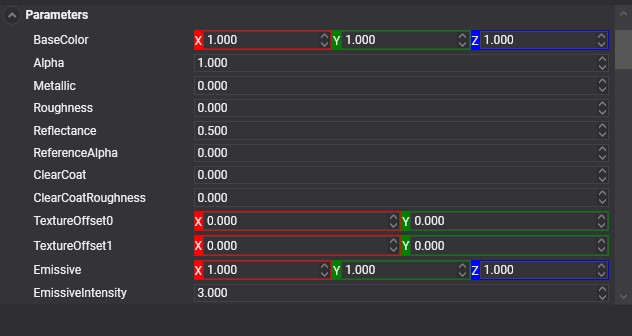

# Effect Editor

---

**Effect Editor** allows editing the effect assets. Double-clicking on an effect asset shown in [Assets Details](../../evergine_studio/interface.md) will open this editor. The editor is composed of two main parts: the Shader Text Editor and the Viewport.

## **Shader Text Editor**

The shader text editor allows you to write your effects in [**HLSL**](https://docs.microsoft.com/en-us/windows/win32/direct3dhlsl/dx-graphics-hlsl-pguide) language with [**metatags**](effect_metatags.md). This editor includes common code editor features such as error marks, syntax highlighting, and code completion (`Ctrl+Space`) to help you create your custom effects.

| Actions  | Description |
|----------|-------------|
| Ctrl+Space | Code completion. |
| Ctrl+F     | Search word toolbox. |
| Alt+Left mouse button | Edit multiple code lines. |

The effect is compiled automatically while you are writing the shader, and at the bottom of the editor, you can see the compilation process result.

When the compilation results in errors, you can click on the error text, and the editor will mark the error line and scroll the view to it.

### **Toolbox**

The shader text editor has a toolbox that helps you with several important tasks such as enabling/disabling directives, generating the associated material decorator, or configuring effect asset properties. The complete options list is:

| Icon  | Description |
|-------|-------------|
| | Toggle button to indicate if the automatic compilation mode is enabled or manual compilation mode _(Key `F5`)_ is enabled. |
| | Combo box to enable the current effect pass. |
| | Shows the effect directive list and allows enabling/disabling combinations. |
| | Allows adding common snippet codes into your effects. |
| | Generates the Material Decorator class in your project. |
| | Compiles all directive combinations and shows the combinations with errors. |
| | Shows the automatic translation from original `HLSL` to `SPIRV`(Vulkan), `GLSL`(OpenGL/OpenGLES), or `MSL`(Metal) when it will be used in other backends. |
| | Allows configuring the asset profile, such as excluding an effect on a single platform or pre-compiling an effect for a single platform. |

### Translation Panel

The translation panel is shown below the shader text editor after clicking on the  button. It shows the result of translating the current HLSL pass and directive combinations to other languages. The panel includes two combo boxes to select the translation languages: `GLSL`, `ESSL`, `WebGL1`, `WebGL2`, `MSL`, or `SPIRV`, and another to select the stage to translate: _Vertex_, _Geometry_, _Hull_, _Domain_, or _Compute_.

### Profile Panel

This panel allows configuring the effect asset properties by platform. The first tab is the default or global configuration, but you can modify the default configuration using the platform tabs.

The effect asset properties are:

| Property       | Values                                            | Description |
|----------------|---------------------------------------------------|-------------|
| ExcludeAsset   | True, false                                       | If enabled, the effect asset will be excluded in the building project for the platform. If enabled in the Default configuration tab, the asset will never be included in the build project process. |
| GraphicsBackend | ByPlatform, DirectX11, DirectX12, OpenGL, OpenGLES, Metal, Vulkan, WebGL1, WebGL2, or WebGPU | Defines the backend and languages that the effect will be translated and compiled for. The ByPlatform value indicates that the data will be retrieved from project settings (`weproj` file).|
| Compile       | ByPlatform, Yes, or No                             | Defines if the effect will be pre-compiled or not. The ByPlatform value indicates that the data will be retrieved from project settings (`weproj` file). |

## **Viewport**

The viewport shows the result of the current effect in real-time. Text at the bottom of the viewport indicates whether the primitive mesh vertex input is compatible with the vertex input shader because otherwise, it will be impossible to display the result.

| Actions              | Description |
|----------------------|-------------|
| Left mouse button    | Rotate the camera around the primitive. |
| Right mouse button   | Rotate two lights around the primitive. |
| Mouse wheel          | Zoom in/out camera. |

### **Toolbox**

The viewport toolbox is on the top side of the Viewport and has the following options:

| Icon  | Description |
|-------|-------------|
|  | Defines the current RenderPipeline Path used by the viewport. |
|              | Defines the current pass used by the viewport. |
|    | Allows changing the primitive used by the viewport. |
|   | Allows changing the background color of the viewport. |

### **Input Resources and Properties**

The property list panel below the viewport allows testing the effect with different values for constant buffer properties, textures, or samplers. The viewport updates automatically with these changes.

The resources and properties update automatically with any change in the effect resource layout block. The values are not stored and are only useful for testing purposes.