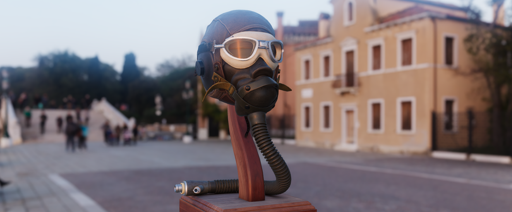
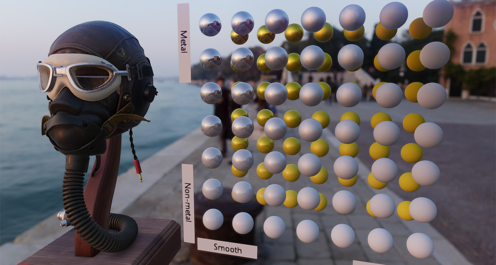

# Environment
---

In this section we will cover how you can control in Evergine the environmental light.

## Image Based Lighting (IBL)

**Image Based lighting (IBL)** is a rendering technique which involves capturing an omnidirectional representation of real-world light information as an image, typically using a 360° camera. This image is then projected onto a dome or sphere analogously to environment mapping, and this is used to simulate the lighting for the objects in the scene. This allows highly detailed real-world lighting to be used to light a scene, instead of trying to accurately model illumination using an existing rendering technique.

Image-based lighting often uses **high-dynamic-range** (HDR) imaging for greater realism.

IBL involves the creation of two lighting components:
- **Irradiance map** (Diffuse): For the diffuse illumination, we need what is called an Irradiance Map. This usually involves a cubemap (or Spherical Harmonics) that stores the amount of light coming from each direction.
- **Radiance map** (Specular): Now, when we get to specular illumination, we need a texture called  **Pre-filtered Mip-Mapped Radiance Environment Map (PMREM)**. This is another cubemap that pre-calculate the reflected environment. An as an addition, it store in its MipMap levels different reflections for roughness values.  [*Credits LearnOpenGL*](https://learnopengl.com/PBR/IBL/Specular-IBL)

Evergine will use Image Based Lighting to create environmental illumination.

## In this section

* [Environment Manager](environment_manager.md)
* [Sky Atmosphere](sky_atmosphere.md)
* [Environment Textures](environment_textures.md)