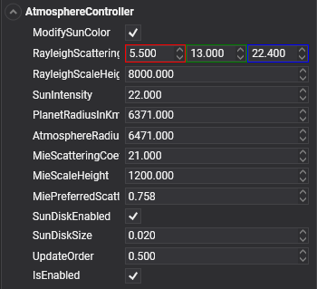
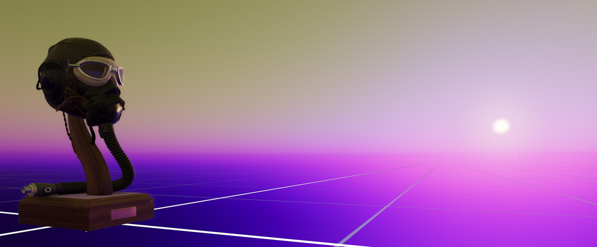
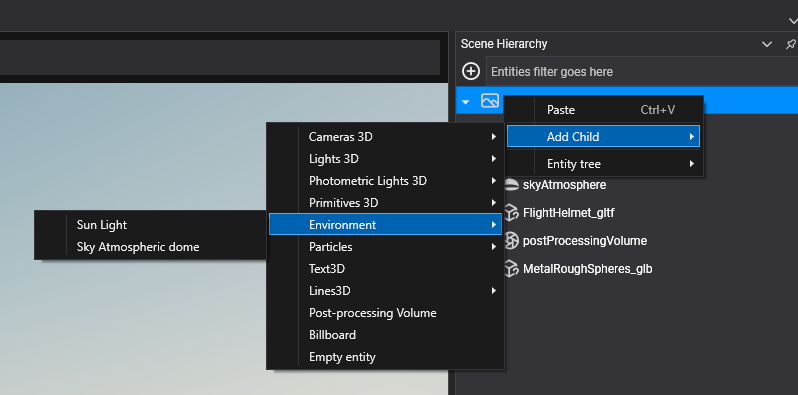

# Sky Atmosphere


This is the default way to create environment lighting in Evergine. When you create a new Scene in Evergine Studio, it will use this method to provide the environmental lighting.

They create a HDR sky texture that simulates physically the atmosphere properties. Additionally it will use a [Directional Light](../lights.md) to control the atmosphere light dispersion and light intensity and color.

# SunComponent

This component is used to mark a DirectionalLight as the light source that will use the atmosphere controller as the main source of light. When you create a Evergine Scene, it will create a DirectionalLight with a SunComponent.

Changing the DirectionalLight rotation allows you to change the visual atmospheric, simulating effects like sunset, sunrise or daylight:


<video width="600"  autoplay loop><source src="images/sky_atmosphere.mp4" type="video/mp4"></video>

This component has no properties, and the only purpose is to mark a DirectionalLight as the Sun source.

> [!NOTE]
> Only the first light with SunComponent will be used.

## AtmosphereController component

This component is responsible to control the set the physical properties of the atmosphere and render the sky dome texture.



| Property | Default | Description |
| --- | --- | --- |
| **RayleighScattering** | 5.5, 13, 22.4 | Rayleigh scattering coefficient per each color channel wavelength (Red, Green and Blue). |
| **RayleighScaleHeight** | 8000 | Scale height for Rayleigh scattering measured in meters. |
| **PlanetRadiusInKm** | 6371 | Radius of the planet in Kilometers |
| **AtmosphereRadiusInKm** | 6471 | Radius of the atmosphere in Kilometers |
| **MieScatteringCoefficient** | 21 | Mie scattering coefficient. |
| **MieScaleHeight** | 12000 | Mie scattering scale height in meters |
| **MiePreferredScattering** | 0.758 | Mie preferred scattering direction. |
| **ModifySunColor** | true | This will force to  |
| **SunIntensity** | 22.0 | The Sun intensity. |
| **SunDiskEnabled** | true | Indicates if the environment will create a sun disk. |
| **SunDiskSize** | 0.02 | The size of the sun disk in degrees |

These properties allows you to simulate another atmospheres of other worlds, like Mars (atmosphere obtained from [here](https://argos.vu/wp-content/uploads/2021/06/18591764.pdf)):


Or you can simulate any exotic atmosphere:



## Using Sky Atmosphere

### In Evergine Studio

You can add two entities from Evergine Studio under Environment menu entry:
- **Sun Light:** This will create a Photometric Directional Light marked as a Sun light with the `SunComponent`
- **Sky Atmospheric dome:** Will create a Sphere mesh with the `AtmosphereController` component to create the atmosphere. This entity also has the "Skybox" tag.



### From code

This is a small code snippet to create both entities needed to create a sky atmosphere:

```csharp
protected override void CreateScene()
{
    // Create the sun light
    var sun = new Entity()
        .AddComponent(new Transform3D() { LocalRotation = new Vector3(-2, 0, 0) }) // Add some rotation to the light...
        .AddComponent(new PhotometricDirectionalLight())
        .AddComponent(new SunComponent());

    this.Managers.EntityManager.Add(sun);

    // Create the sphere sky dome
    var skyDome = new Entity()
        .AddComponent(new Transform3D())
        .AddComponent(new MaterialComponent())
        .AddComponent(new SphereMesh())
        .AddComponent(new MeshRenderer())
        .AddComponent(new AtmosphereController());

    this.Managers.EntityManager.Add(skyDome);
}
```