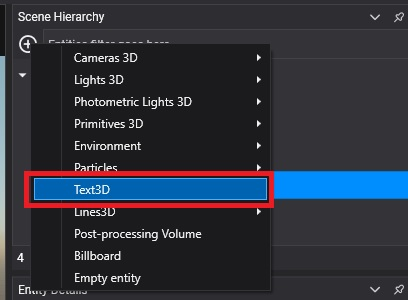
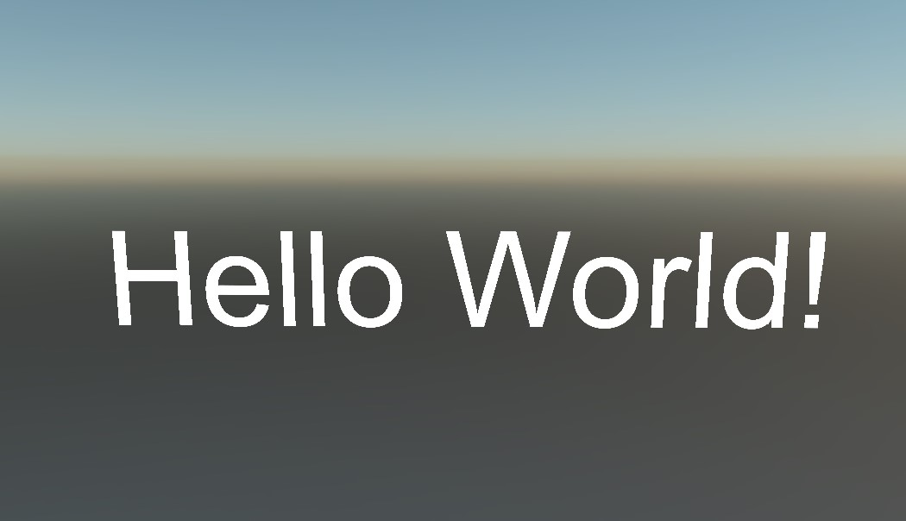
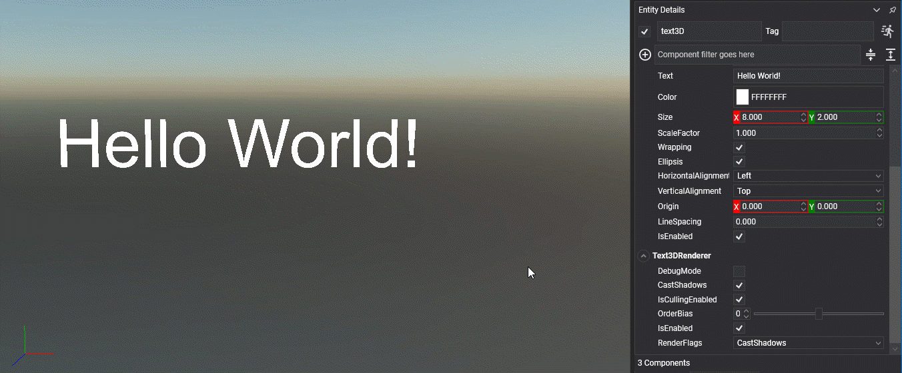

# Create Text3D


**Text3D** is a component that allows to render a paragrah in 3D space. It is possible to render a simple header text or a large paragram and configure the limit of the text, wrapping and ellipsis.

## Create a Text3D in Evergine Studio
You can create a Text3D click button on  from [Entity Hierarchy](../../evergine_studio/interface.md) panel to deploy a create menu options and click on the option _"Text3D"_



A Text3D entity will be added to your scene


In the **Text3DMesh** component of your Text3D entity you will find the following properties:

|Property                       | Description |
|-------------------------------|-------------|
| **Font**           | The font asset used. (Font family) |
| **Layer**          | RenderLayer used to render the text. |
| **Text**           | The text will be drawn. It is possible to use **/n** to line break.    |
| **Color**          | The text color. |
| **Size**           | The canvas size or area. Enable _DebugMode_ property in the **Text3DRenderer** component to show this area _(blue rectangle)_|
| **ScaleFactor**    | The text scale factor. |
| **Wrapping**       | Word wrapping. If this option is enabled line breaking will be created automatically when the current line hasn't enough space to add more words.
| **Ellipsis**       | If this option is enabled it will show a three ellipsis at the end of the text when hasn't enough space in the canvas to add more letters. |
| **HorizontalAlignment** | Allows align the text horizontally. The available values are: _Left_, _Center_, and _Right_    |
| **VerticalAlignment**   | Allows align the text vertically. The available values are: _Top_, _Center_, and _Bottom_    |
| **Origin**              | Allows to configure the origin of the Text3D entity. The value is a vector2 with values between [0-1].    |
| **LineSpacing**         | Allows to configure the space between text lines.    |

## Create a Text3D from code
The following code shows the list of components necessary to convert an entity into a billboard entity. 

```csharp
public class MyScene : Scene
{
    protected override void CreateScene()
    {                       
        var assetsService = Application.Current.Container.Resolve<AssetsService>();

        var defaultFont = assetsService.Load<Font>(DefaultResourcesIDs.DefaultFontID);

        var text = new Entity()
            .AddComponent(new Transform3D())
            .AddComponent(new Text3DMesh()
            {
                Font = defaultFont,
                Text = "Hello World!",
            })
            .AddComponent(new Text3DRenderer());

        this.Managers.EntityManager.Add(text);
    }
}
```

The result:



## Enable debug mode

Sometimes will be useful to enable _DebugMode_ property in **Text3DRenderer** component to draw the debug information of our Text3D entity. The canvas space will be shown as a blue rectangle. The text space will be shown as a yellow rectangle and a red point will be render on each character origin.

