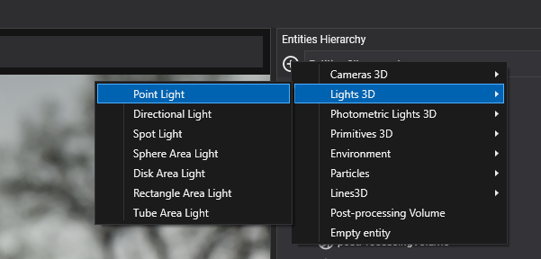
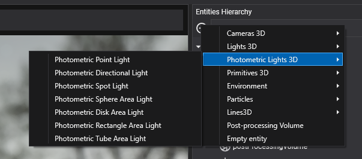
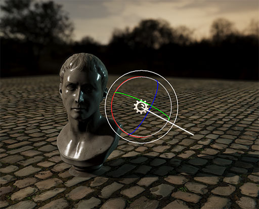
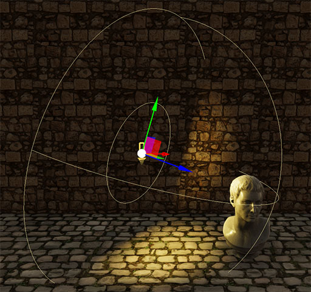

# Lights


**Evergine** uses an advanced lighting mode to simulate how light affect geometries. It also supports multiple lights in the scene, allowing a wide range of environment and possibilities. 

Every type of light is modelled in Evergine using a **Light** component.

## Create a Light in Evergine Studio

In the Entities Hierarchy panel of your Scene Editor, click the "Add Entity and select **Light**, then choose the kind of light you want to create:

* Point Light
* Directional Light
* Sphere Area Light
* Spot Light
* Disc Area Light
* Rectangle Area Light
* Rube Area Light

We discuss the light types later in this article.



Additionally we can create **photometric lights** from the same panel with theese options:

* Photometric Point Light
* Photometric Directional Light
* Photometric Sphere Area Light
* Photometric Spot Light
* Photometric Disc Area Light
* Photometric Rectangle Area Light
* Photometric Rube Area Light



## Create Light from code

The following sample code can be used to instantiate a new basic new point light entity in a scene.

```csharp
protected override void CreateScene()
{
    // Create a new light entity.
    Entity pointLightEntity = new Entity()
        .AddComponent(new Transform3D())
        .AddComponent(new PointLight()
        {
            Color = Color.Red,
            Intensity = 3,
            LightRange = 10
        });

    // Add the light entity to the entity manager.
    this.Managers.EntityManager.Add(pointLightEntity);
}
```

## Basic light properties

These are the basic properties that almost all the lights have. 

| Property | Description |
|----------|-------------|
| [Is Enabled](xref:Evergine.Framework.Graphics.Light.IsEnabled) | If the light is on / off. |
| [Shadow Enabled](xref:Evergine.Framework.Graphics.Light.ShadowEnabled) | Enable/disable shadow mapping for this light.

## Photometric / Non photometric lights
**Photometric lights** use photometric (**lighting units**) allowing you to define precisely lights as they would be in the real world. They are configured using physical parameters. **Evergine** supports both **photometric** and **non photometric** lights, and it offers all the same light types duplicated depending this choice.

#### Common Photometric properties
Every photometric light (no matter what type it is) defines this parameters, additionally each specific type of light defines its own intensity unit properties.

| Property | Description |
|----------|-------------|
| [Color By Temperature](xref:Evergine.Framework.Graphics.PhotometricPointLight.ColorByTemperature) | Indicates if the light color will be overrided using the light temperature. |
| [Temperature](xref:Evergine.Framework.Graphics.PhotometricPointLight.Temperature) | The [light temperature](https://en.wikipedia.org/wiki/Color_temperature) in **Kelvin** (K). When _ColorByTemperature_ is true, the light color is overrided by the light temperature. |

> [!Note]
> Light Intensity unit depends on the light type (for example, PointLights are measured in Lumens, whether DirectionalLights are measured in Lux)

#### Non photometric lights properties
For contrary, if you create regular lights, you could use the basic light properties:

| Property | Description |
|----------|-------------|
| [Color](xref:Evergine.Framework.Graphics.Light.Color) | The RGB color tint of the light.|
| [Intensity](xref:Evergine.Framework.Graphics.Light.Intensity) | The light intensity value in a non-standard unit. Greater values will produce brighter illumination.|

## Types of lights

There are different types of lights, each one useful for a different scenario. In general terms, lights are divided in two general categories:
* **Directional Lights:** These lights have unlimited boundaries, and every object is affected by this light type.
* **Volume Lights:** The light influence is delimited by a range.
* **Area Lights:**  A subtype of volume lights that emulate lights coming from an area instead of a point in the space.

### Directional Lights / Photometric Directional Light



**Directional lights** are lights that comes uniformly from one direction and at infinited distance. They're used to simulate distant light sources like the sun. It uses the **forward** vector of its entity **Transform3D** for calculating the light direction.

In case of using a Photometric Directional Light, the intensity is measured using the following property:

| Photometric Property | Description |
|----------|-------------|
| [Illuminance (Lux)](xref:Evergine.Framework.Graphics.PhotometricDirectionalLight.Illuminance) | The light [Illuminance](https://en.wikipedia.org/wiki/Illuminance) measured in **Lux**. Indicates the total luminous flux incident on a surface, per unit area. |

### Volume Lights

Volume lights are a common type of lights in which the light source comes from a specific point in the space, and its intensity decays with the distance.

| Property | Description |
|----------|-------------|
| [Light Range](xref:Evergine.Framework.Graphics.VolumeLight.LightRange) | The light range in meters. |

In case of using a Volume Photometric Lights, the intensity is measured using the following property:

| Photometric Property | Description |
|----------|-------------|
| [Luminous Power (Lumen)](xref:Evergine.Framework.Graphics.PhotometricPointLight.LuminousPower) | The light [luminous flux](https://en.wikipedia.org/wiki/Luminous_flux) in **Lumen**|


#### Point Light / Photometric Point Light


A **point light** is located at a point in space and it emits light in all directions equally within its sphere range. Its intensity decays with distance from the light, reaching zero at its maximum range. It's useful for local lights like lamps. 

#### Spot Light / Photometric Spot Light


A **spot light** is also placed in a specific location and it has a range over which the light decays. However, spot lights are also constrained by an angle, defining a cone shape light.

##### Specific Properties
| Property | Description |
|----------|-------------|
| [InnerConeAngle](xref:Evergine.Framework.Graphics.SpotLight.InnerConeAngle) | The inner angle of the spotlight cone. |
| [OuterConeAngle](xref:Evergine.Framework.Graphics.SpotLight.InnerConeAngle) | The outter angle of the spotlight cone |

#### Tube Area lights / Photometric Tube Area Light


**Tube Area Lights** are lights that comes from a line segment and have a range and a emission thickness. They are usefull for simulating neon lights. 

##### Specific Properties
| Property | Description |
|----------|-------------|
| [Length](xref:Evergine.Framework.Graphics.TubeAreaLight.Length) | The length of the tube light volume. |
| [Radius](xref:Evergine.Framework.Graphics.TubeAreaLight.Radius) | The radius of the tube light volume. |

#### Sphere Area Lights / Photometric Sphere Area Light


**Sphere Area Lights** behave like a phyical sphere emiting light rather a point light. They create much more softer lighting and can use for creating dynamic environment.

##### Specific Properties
| Property | Description |
|----------|-------------|
| [Radius](xref:Evergine.Framework.Graphics.SpherAreaLight.Radius) | The radius of the sphere light volume. |

#### Disc Area Lights / Photometric Disc Area Light



**Disc Area Lights** emit their light from a disc with a specified radius and at a maximum range. Useful for creating artificial soft lights.

##### Specific Properties
| Property | Description |
|----------|-------------|
| [Radius](xref:Evergine.Framework.Graphics.DiscAreaLight.Radius) | The radius of the disc area light. |

#### Rectangle Area Lights / Photometric Rectangle Area Light


**Rectangle Area Lights** emit their light from a rectangle with a specified with and height, at a maximum range. Useful for creating indoor window lighting, for example.

##### Specific Properties
| Property | Description |
|----------|-------------|
| [Width](xref:Evergine.Framework.Graphics.RectangleAreaLight.Width) | The width of the rectangle area light. |
| [Height](xref:Evergine.Framework.Graphics.RectangleAreaLight.Height) | The height of the rectangle area light. |


>[!NOTE]
> Area lights needs to make complex calculation in order to properly simulate their shape. Therefore, they are significantly more performance heavy than their punctual counterparts (Point, Spot and Directional).

## Shadows
To enable light cast shadows, the following properties has been added:

| Property | Description |
|----------|-------------|
| [Shadow Enabled](xref:Evergine.Framework.Graphics.Light.ShadowEnabled) | Enable/disable shadow mapping for this light. |
| [Debug Mode](xref:Evergine.Framework.Graphics.CubemapLight.DebugMode) | Debug ShadowMap cascades used to generate this light shadow. |
| [Shadow Opacity](xref:Evergine.Framework.Graphics.Light.ShadowOpacity) | Value [0-1] that represents the total opacity of the shadow. 1 by default. |
| [Shadow Bias](xref:Evergine.Framework.Graphics.Light.ShadowBias) | Shadow bias for this specific light. Choosing the correct bias value allows to control shadows artifacts like a Moiré-like patern or Peter panning |
