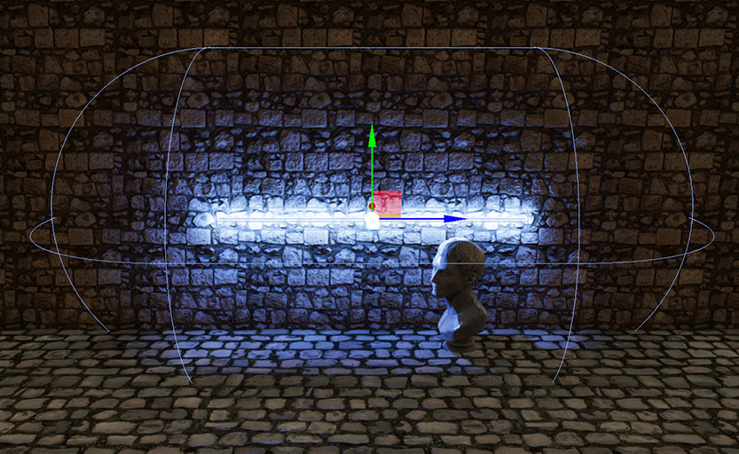
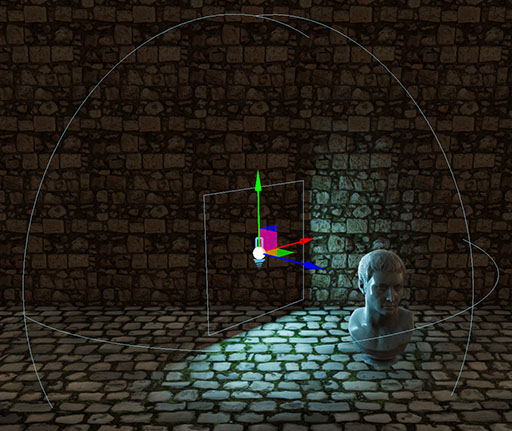

# Lights


**Evergine** uses an advanced lighting mode to simulate how light affect geometries. It also supports multiple lights in the scene, allowing a wide range of environment and possibilities. 

## Create Light from code

The following sample code can be used to instantiate a new basic new point light entity in a scene.

```csharp
protected override void CreateScene()
{
    // Create a new light entity.
    Entity pointLightEntity = new Entity()
        .AddComponent(new Transform3D())
        .AddComponent(new PointLight()
        {
            Color = Color.Red,
            Intensity = 3,
            LightRange = 10
        });

    // Add the light entity to the entity manager.
    this.Managers.EntityManager.Add(pointLightEntity);
}
```

## Create a Light in Evergine Studio

In the Entities Hierarchy panel of your Scene Editor, click the "Add Entity and select **Light**, then choose the kind of camera you want to create:

* Point Light:
* Directional Light
* Sphere Area Light
* Spot Light
* Disc Area Light
* Rectangle Area Light
* Rube Area Light

We discuss the light types later in this article.


Additionally we can create **photometric lights** from the same panel with theese options:

* Photometric Point Light:
* Photometric Directional Light
* Photometric Sphere Area Light
* Photometric Spot Light
* Photometric Disc Area Light
* Photometric Rectangle Area Light
* Photometric Rube Area Light


## Basic light properties

These are the basic properties that almost all the lights have. 

| Property | Description |
|----------|-------------|
| [Is Enabled](xref:Evergine.Framework.Graphics.Light.IsEnabled) | If the light is on / off. |
| [Light Range](xref:Evergine.Framework.Graphics.PointLight.LightRange) | The light range in units. _Directional lights don't have this property_|
| [Debug Mode](xref:Evergine.Framework.Graphics.CubemapLight.DebugMode) | Enables a debug mode where the light 6 shadow map sides are visualzied.
| [Shadow Enabled](xref:Evergine.Framework.Graphics.Light.ShadowEnabled) | Enable\disable shadow mapping for this light. (_Only when  ShadowEnabled is true_).
| [Shadow Bias](xref:Evergine.Framework.Graphics.Light.ShadowBias) | Shadow bias for this specific light. (_Only when  ShadowEnabled is true_).
| [Shadow Opacity](xref:Evergine.Framework.Graphics.Light.ShadowOpacity) | Value [0-1] that represents the total opacity of the shadow. 1 by default. (_Only when  ShadowEnabled is true_).

## Photometric / Non photometric lights
**Photometric lights** use photometric (**light energy**) values that enable you to more accurately define lights as they would be in the real world. They are configured using physical parameters. **Evergine** supports both **photometric** and **non photometric** lights, and it offers all the same light types duplicated depending this choice.

#### Photometric properties
Every photometric light (no matter what type it is) defines this parameters:

| Property | Description |
|----------|-------------|
| [Color By Temperature](xref:Evergine.Framework.Graphics.PhotometricPointLight.ColorByTemperature) | If the color will be calculated using temperature values or not. |
| [Temperature](xref:Evergine.Framework.Graphics.PhotometricPointLight.Temperature) | The light temperature in **Kelvin** (K) when _ColorByTemperature_ is true.|
| [Color](xref:Evergine.Framework.Graphics.PhotometricPointLight.Color) | The RGB color of the light when _ColorByTemperature_ is false.|
| [Luminous Power (Lumen)](xref:Evergine.Framework.Graphics.PhotometricPointLight.LuminousPower) | The light illluminance power in **Lumen**|

#### Non photometric lights properties
| Property | Description |
|----------|-------------|
| [Color](xref:Evergine.Framework.Graphics.Light.Color) | The color of the light. |
| [Intensity](xref:Evergine.Framework.Graphics.PointLight.Intensity) | The intensity multiplier of the light. 1 by default. |

## Types of lights

There are different types of lights, each one useful for a different scenario.

### Point Light / Photometric Point Light


A **point light** is located at a point in space and it emits light in all directions equally within its sphere range. Its intensity decays with distance from the light, reaching zero at its maximum range. It's useful for local lights like lamps. 

## Spot Light / Photometric Spot Light


A **spot light** is also placed in a specific location and it has a range over which the light decays. However, spot lights are also constrained by an angle, defining a cone shape light.

#### Specific Properties
| Property | Description |
|----------|-------------|
| [InnerConeAngle](xref:Evergine.Framework.Graphics.SpotLight.InnerConeAngle) | The inner angle of the spotlight cone. |
| [OuterConeAngle](xref:Evergine.Framework.Graphics.SpotLight.InnerConeAngle) | The outter angle of the spotlight cone |

## Directional Lights / Photometric Directional Light


**Directional lights** is a light that comes uniformly from one direction. They're used to simulate larg, distant light sources like the sun. It uses the **forward** vector of its entity **Transform3D** for calculating the light direction.

## Tube Area lights / Photometric Tube Area Light



**Tube Area Lights** are lights that comes from a line segment and have a range and a emission thickness. They are usefull for simulating neon lights. 

#### Specific Properties
| Property | Description |
|----------|-------------|
| [Length](xref:Evergine.Framework.Graphics.TubeAreaLight.Length) | The length of the tube light volume. |
| [Radius](xref:Evergine.Framework.Graphics.TubeAreaLight.Radius) | The radius of the tube light volume. |

## Sphere Area Lights / Photometric Sphere Area Light


**Sphere Area Lights** behave like a phyical sphere emiting light rather a point light. They create much more softer lighting and can use for creating dynamic environment.

#### Specific Properties
| Property | Description |
|----------|-------------|
| [Radius](xref:Evergine.Framework.Graphics.SpherAreaLight.Radius) | The radius of the sphere light volume. |

## Disc Area Lights / Photometric Disc Area Light


**Disc Area Lights** emit their light from a disc with a specified radius and at a maximum range. Useful for creating artificial soft lights.

#### Specific Properties
| Property | Description |
|----------|-------------|
| [Radius](xref:Evergine.Framework.Graphics.DiscAreaLight.Radius) | The radius of the disc area light. |

## Rectangle Area Lights / Photometric Rectangle Area Light



**Rectangle Area Lights** emit their light from a rectangle with a specified with and height, at a maximum range. Useful for creating indoor window lighting, for example.

#### Specific Properties
| Property | Description |
|----------|-------------|
| [Width](xref:Evergine.Framework.Graphics.RectangleAreaLight.Width) | The width of the rectangle area light. |
| [Height](xref:Evergine.Framework.Graphics.RectangleAreaLight.Height) | The height of the rectangle area light. |


>[!NOTE]
> Area lights needs to make complex calculation in order to properly simulate their shape. Therefore, they are significantly more performance heavy than their punctual counterparts (Point, Spot and Directional).