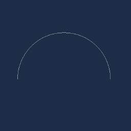
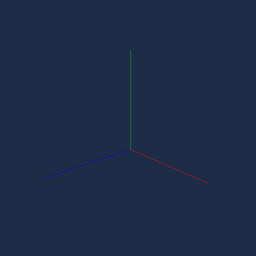
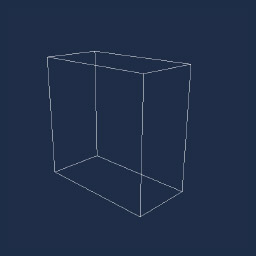
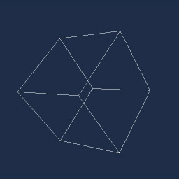
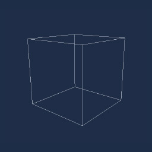
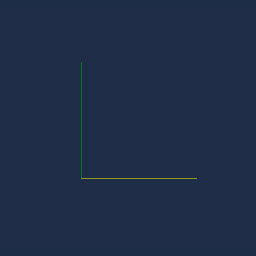
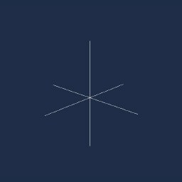
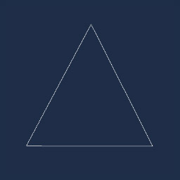

# Using LineBatch
---


**LineBatch** can only be used from code. In the scene **RenderManager**, you will find the LineBatch3D to draw lines in 3D space and the LineBatch2D to draw lines in 2D space.

If you want to add a debug or helper mode to your entity, you can add a [Drawable3D](../../basics/component_arch/components/drawables.md) component to your scene, and from this, you will have access to the LineBatch:

The following example draws a red line from (0,0,0) to (0,1,0).

**From your scene.cs**
```csharp
protected override void CreateScene()
{
    ...
    // Add dummy entity to your scene
    var dummyEntity = new Entity()
        .AddComponent(new Transform3D())
        .AddComponent(new MyDrawable());
    this.Managers.EntityManager.Add(dummyEntity);
}
```
**Drawable component implementation**
```csharp
// Drawable component using LineBatch3D
public class MyDrawable : Drawable3D
{
    public override void Draw(DrawContext drawContext)
    {
        this.RenderManager.LineBatch3D.DrawLine(Vector3.Zero, Vector3.Up, Color.Red);
    }
}
```
The LineBatch3D not only draws lines but can also draw Point, Sphere, Box, etc. The LineBatch2D is similar but with shapes (Circle, Square, etc.).

> [!NOTE]
> LineBatch3D must be used with Drawable3D and LineBatch2D with Drawable2D.

## LineBatch
This section shows with examples all geometries that LineBatch can draw:

**DrawArc**
```csharp
Vector3 origin = Vector3.Zero;
Color color = Color.White;
this.RenderManager.LineBatch3D.DrawArc(ref origin, 0.5f, 0.5f, ref color);
``` 


**DrawAxis**
```csharp
this.RenderManager.LineBatch3D.DrawAxis(Matrix4x4.Identity, 1.0f);
``` 


**DrawBoundingBox**
```csharp
this.RenderManager.LineBatch3D.DrawBoundingBox(new BoundingBox(Vector3.Zero, Vector3.One), Color.White);
``` 


**DrawBoundingFrustum**
```csharp
this.RenderManager.LineBatch3D.DrawBoundingFrustum(new BoundingFrustum(Matrix4x4.Identity), Color.White);
``` 


**DrawBoundingOrientedBox**
```csharp
this.RenderManager.LineBatch3D.DrawBoundingOrientedBox(new BoundingOrientedBox(Vector3.Zero, Vector3.One * 0.5f, Quaternion.CreateFromAxisAngle(Vector3.Right, MathHelper.PiOver4)), Color.White);
``` 


**DrawBoundingSphere**
```csharp
this.RenderManager.LineBatch3D.DrawBoundingSphere(new BoundingSphere(Vector3.Zero, 1.0f), Color.White);
``` 


**DrawRectangle**
```csharp
this.RenderManager.LineBatch3D.DrawRectangle(Vector3.Zero, Vector3.One, Color.White);
``` 


**DrawCircle**
```csharp
this.RenderManager.LineBatch3D.DrawCircle(Vector3.Zero, 1.0f, Color.White);
``` 


**DrawCone**
```csharp
this.RenderManager.LineBatch3D.DrawCone(0.5f, 1.0f, Vector3.Zero, Vector3.Down, Color.White);
``` 


**DrawCube**
```csharp
this.RenderManager.LineBatch3D.DrawCube(Vector3.Zero, Vector3.One, Color.White);
``` 


**DrawForward**
```csharp
this.RenderManager.LineBatch3D.DrawForward(Matrix4x4.Identity, 1.0f);
``` 


**DrawPoint**
```csharp
this.RenderManager.LineBatch3D.DrawPoint(Vector3.Zero, 0.5f, Color.White);
``` 


**DrawRay**
```csharp
this.RenderManager.LineBatch3D.DrawRay(Vector3.Zero, Vector3.Forward, Color.White);
``` 


**DrawTriangle**
```csharp
this.RenderManager.LineBatch3D.DrawTriangle(new Vector3(-0.5f, 0, 0), new Vector3(0, 1.0f, 0), new Vector3(0.5f, 0, 0), Color.White);
``` 
