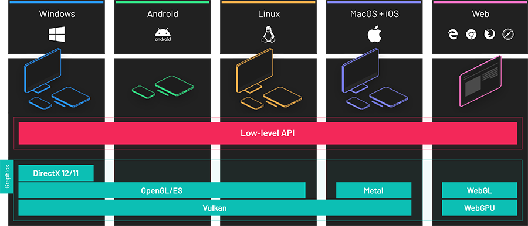

# Low-level API

---

**Evergine** uses a custom low-level graphics API to send commands to the GPU.

This is a cross-platform agnostic library that runs on top of DirectX, Vulkan, OpenGL, and Metal. In this section, we will take a look at all the classes and objects used by **Evergine** to share data with the GPU. It is a new graphics API inspired by the latest advances in DirectX 12, Vulkan, and Metal to achieve the maximum graphics performance when using any of these APIs. It also maintains backward compatibility to support APIs like DirectX 11, OpenGL, and WebGL.

## In this section

* [GraphicsContext](graphicscontext.md)
* [ResourceFactory](resourcefactory.md)
* [Buffer](buffer.md)
* [Texture](texture.md)
* [Sampler](sampler.md)
* [Swapchain](swapchain.md)
* [Framebuffer](framebuffer.md)
* [QueryHeap](queryheap.md)
<!-- * [Shader](shader.md)
* [ResourceLayout](resourcelayout.md)
* [GraphicsPipeline](graphicspipeline.md)
* [ComputePipeline](computepipeline.md)
* [RayTracingPipeline](raytracingpipeline.md)
* [ResourceSet](resourceset.md)
* [CommandQueue](commandqueue.md)
* [CommandBuffer](commandbuffer.md) -->
