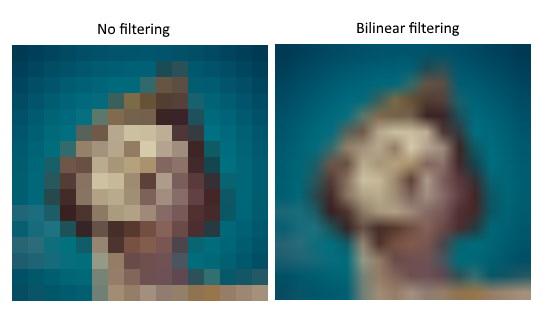
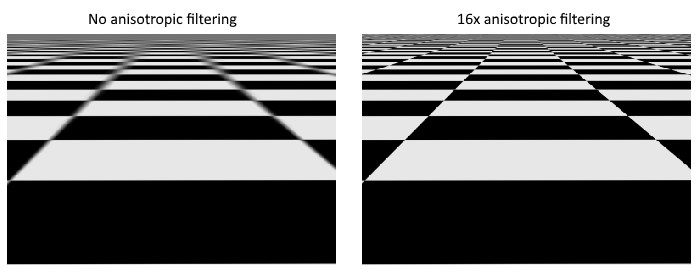

# Sampler

Create a sampler-state object that encapsulates sampling information for a texture.

## Creation

To create a sampler, first you need to create the BufferDescription struct:

```csharp
// Linear clamp sampler state
var samplerDescription = new SamplerStateDescription()
{
    Filter = TextureFilter.MinLinear_MagLinear_MipLinear,
    AddressU = TextureAddressMode.Clamp,
    AddressV = TextureAddressMode.Clamp,
    AddressW = TextureAddressMode.Clamp,
    MinLOD = -1000, // DirectX -float.MaxValue | OpenGL -1000
    MaxLOD = 1000, // DirectX float.MaxValue | OpenGL 1000
    MipLODBias = 0f,
    MaxAnisotropy = 1,
    ComparisonFunc = ComparisonFunction.Never,
    BorderColor = SamplerBorderColor.OpaqueWhite,
};

var samplerState = this.graphicsContext.Factory.CreateSamplerState(ref samplerDescription);
```

### SamplerStateDescription

| Property | Type | Description |
|--------| ----------- |----------- |
| **Filter** | TextureFilter | Filtering method to use when sampling a texture. |
| **AddressU** | TextureAddressMode | Method to use for resolving a u texture coordinate that is outside the 0 to 1 range. |
| **AddressV** | TextureAddressMode | Method to use for resolving a v texture coordinate that is outside the 0 to 1 range. |
| **AddressW** | TextureAddressMode | Method to use for resolving a w texture coordinate that is outside the 0 to 1 range. |
| **MipLODBias** | float | Offset from the calculated mipmap level. For example, if Direct3D calculates that a texture should be sampled at mipmap level 3 and MipLODBias is 2, then the texture will be sampled at mipmap level 5. |
| **MaxAnisotropy** | uint | Clamping value used if D3D11_FILTER_ANISOTROPIC or D3D11_FILTER_COMPARISON_ANISOTROPIC is specified in Filter. Valid values are between 1 and 16. |
| **ComparisonFunc** | ComparisonFunction | A function that compares sampled data against existing sampled data. |
| **BorderColor** | SamplerBorderColor | Border color. |
| **MinLOD** | float | Lower end of the mipmap range to clamp access to, where 0 is the largest and most detailed mipmap level and any level higher than that is less detailed. |
| **MaxLOD** | float | Upper end of the mipmap range to clamp access to, where 0 is the largest and most detailed mipmap level and any level higher than that is less detailed. This value must be greater than or equal to MinLOD. |

### TextureFilter

Defines texture filtering modes for a texture stage.



| Value | Description |
|--------| ----------- |----------- |
| **MinPoint_MagPoint_MipPoint** | Use point sampling for minification, magnification, and mip-level sampling. |
| **MinPoint_MagPoint_MipLinear** | Use point sampling for minification and magnification; use linear interpolation for mip-level sampling. |
| **MinPoint_MagLinear_MipPoint** | Use point sampling for minification; use linear interpolation for magnification; use point sampling for mip-level sampling. |
| **MinPoint_MagLinear_MipLinear** | Use point sampling for minification; use linear interpolation for magnification and mip-level sampling. |
| **MinLinear_MagPoint_MipPoint** | Use linear interpolation for minification; use point sampling for magnification and mip-level sampling. |
| **MinLinear_MagPoint_MipLinear** | Use linear interpolation for minification; use point sampling for magnification; use linear interpolation for mip-level sampling. |
| **MinLinear_MagLinear_MipPoint** | Use linear interpolation for minification and magnification; use point sampling for mip-level sampling. |
| **MinLinear_MagLinear_MipLinear** | Use linear interpolation for minification, magnification, and mip-level sampling. |
| **Anisotropic** | Use anisotropic interpolation for minification, magnification, and mip-level sampling. |

### TextureAddressMode

Your application can assign texture coordinates to any vertex of any primitive. Typically, the u- and v-texture coordinates that you assign to a vertex are in the range of 0.0 to 1.0 inclusive. However, by assigning texture coordinates outside that range, you can create certain special texturing effects.

| Value | Description |
|--------| ----------- |
| **Wrap** | Tile the texture at every (u,v) integer junction. For example, for u values between 0 and 3, the texture is repeated three times. |
| **Mirror** | Flip the texture at every (u,v) integer junction. For u values between 0 and 1. |
| **Clamp** | Texture coordinates outside the range [0.0, 1.0] are set to the texture color at 0.0 or 1.0, respectively. |
| **Border** | Texture coordinates outside the range [0.0, 1.0] are set to the border color specified in SamplerStateDescription. |
| **Mirror_One** | Takes the absolute value of the texture coordinate (thus, mirroring around 0), and then clamps to the maximum value. |


### MaxAnisotropy

Retrieves a value that indicates the maximum valid value for anisotropic filtering.
Valid values are between 1 and 16.



## Presets

To make the sampler construction easy, you can use `Evergine.Common.SamplerStates` to describe the most common sampler descriptions:

| Value |
|--------|
| **PointClamp** |
| **PointWrap** |
| **PointMirror** |
| **LinearClamp** |
| **LinearWrap** |
| **LinearMirror** |
| **AnisotropicClamp** |
| **AnisotropicWrap** |
| **AnisotropicMirror** |

### Default initialization

```csharp
public void SetDefault()
{
    this.Filter = TextureFilter.MinLinear_MagLinear_MipLinear;
    this.AddressU = TextureAddressMode.Clamp;
    this.AddressV = TextureAddressMode.Clamp;
    this.AddressW = TextureAddressMode.Clamp;
    this.MinLOD = -1000; // DirectX -float.MaxValue | OpenGL -1000
    this.MaxLOD = 1000; // DirectX float.MaxValue | OpenGL 1000
    this.MipLODBias = 0f;
    this.MaxAnisotropy = 1;
    this.ComparisonFunc = ComparisonFunction.Never;
    this.BorderColor = SamplerBorderColor.OpaqueWhite;
}
```

### Presets initialization

```csharp
PointClamp = SamplerStateDescription.Default;
PointClamp.Filter = TextureFilter.MinPoint_MagPoint_MipPoint;

PointWrap = SamplerStateDescription.Default;
PointClamp.Filter = TextureFilter.MinPoint_MagPoint_MipPoint;
PointWrap.AddressU = TextureAddressMode.Wrap;
PointWrap.AddressV = TextureAddressMode.Wrap;
PointWrap.AddressW = TextureAddressMode.Wrap;

PointMirror = SamplerStateDescription.Default;
PointClamp.Filter = TextureFilter.MinPoint_MagPoint_MipPoint;
PointMirror.AddressU = TextureAddressMode.Mirror;
PointMirror.AddressV = TextureAddressMode.Mirror;
PointMirror.AddressW = TextureAddressMode.Mirror;

LinearClamp = SamplerStateDescription.Default;

LinearWrap = SamplerStateDescription.Default;
LinearWrap.AddressU = TextureAddressMode.Wrap;
LinearWrap.AddressV = TextureAddressMode.Wrap;
LinearWrap.AddressW = TextureAddressMode.Wrap;

LinearMirror = SamplerStateDescription.Default;
LinearMirror.AddressU = TextureAddressMode.Mirror;
LinearMirror.AddressV = TextureAddressMode.Mirror;
LinearMirror.AddressW = TextureAddressMode.Mirror;

AnisotropicClamp = SamplerStateDescription.Default;
AnisotropicClamp.Filter = TextureFilter.Anisotropic;

AnisotropicWrap = SamplerStateDescription.Default;
AnisotropicWrap.Filter = TextureFilter.Anisotropic;
AnisotropicWrap.AddressU = TextureAddressMode.Wrap;
AnisotropicWrap.AddressV = TextureAddressMode.Wrap;
AnisotropicWrap.AddressW = TextureAddressMode.Wrap;

AnisotropicMirror = SamplerStateDescription.Default;
AnisotropicMirror.Filter = TextureFilter.Anisotropic;
AnisotropicMirror.AddressU = TextureAddressMode.Mirror;
AnisotropicMirror.AddressV = TextureAddressMode.Mirror;
AnisotropicMirror.AddressW = TextureAddressMode.Mirror;
```