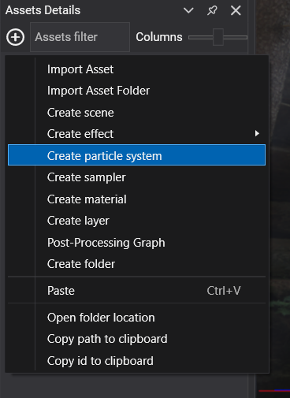

# Create Particle Systems
---


Particle systems simulates and renders a large amount of quads called particles. 

## Create a Particle Systems asset in Evergine Studio
You can create a material click button on  from [Assets Details](../../evergine_studio/interface.md) panel to deploy a create menu options and click on the option _"Create particles"_



### Inspect Particle Systems in Asset Details
You can find the particle system assets in the [**Assets Details**](../../evergine_studio/interface.md) panel when you select a folder in the [**Project Explorer**](../../evergine_studio/interface.md).


### Particle System files in content directory
The particle system file has the `.weps` extension.


## Create a new Particle System from code
The following sample code can be used to create a new particle system and apply to an entity in your scene:

```csharp
var assetsService = Application.Current.Container.Resolve<AssetsService>();
var graphicsContext = Application.Current.Container.Resolve<GraphicsContext>();

// Sets its particle emitter.
ParticleEmitterDescription emitterDesc = new ParticleEmitterDescription()
{
    ParticleTexture = EvergineContent.Textures.particle_png,
    ParticleSampler = EvergineContent.Samplers.LinearClampSampler,
    RenderLayer = EvergineContent.RenderLayers.Alpha,

    MaxParticles = 1000,

    InitLife = 2,
    InitSpeed = 1,
    InitSize = 0.1f,
    InitColor = Color.Red,
};

ParticlesEmitter emitter = new ParticlesEmitter(emitterDesc, graphicsContext, assetsService);

// Creates the asset and sets its emitter.
ParticleSystem pAsset = new ParticleSystem();
pAsset.AddEmitter(emitter);

// Apply to an entity
Entity pSystem = new Entity()
        .AddComponent(new Transform3D())
        .AddComponent(new ParticlesComponent()
        {
            ParticleSystem = pAsset
        })
        .AddComponent(new ParticlesRenderer());

this.Managers.EntityManager.Add(pSystem);