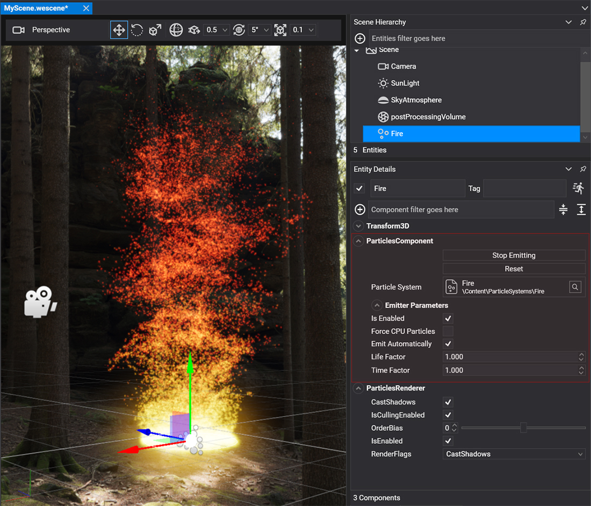

# Using Particles


In this document you will learn how to load and use **Particle Systems** in your applications.

## How to create particle systems from Evergine Studio.

For instantiating a **Particle System** into a **Scene** just drag the particle system asset from the *Asset Details Panel* into  your **Scene**.


This will create a new entity the **Scene**.



The new created entity has a **Transform3D** component and 2 new components:

#### ParticlesComponent

This component loads the **Particle System** asset and manages its simulation and resources.

It has the following methods:

| Property | Description |
| --------- | --------- |--------------- |
| **StartEmitting ()**  | Starts the particle system emission if it was stopped |
| **StopEmitting ()**  | Stops the particle system emission if it was already emitting |
| **Reset ()**  | Resets all the particles to its initial state |

And the following properties:

| Property | Type |Description |
| --------- | --------- |--------------- |
| **ParticleSystem**  | _ParticleSystem_ | Selects the particle system asset into this entity.
| **Force CPU Particles** | _boolean_| Forces the particle system to use a CPU simulation, even if the platform supports GPU particles. _(false by default)_
| **Emit Automatically** | _boolean_ | When _true_, starts emitting particles when the scene is loaded. If _false_ it will be idle until it's manually started. _(true by default)_
| **Life Factor** | _float_ | Factor applied to the life time of the particle. 2 will cause particles life reduced by half. _(1 by default)_
| **Time Factor** | _float_ | Time factor applied to the **whole particle simulation**. A value of 2 will cause particles move at double speed, while 0.5 will slow down particles to half speed. _(1 by default)_

## Load Particle System from code
The following sample code can be used to instantiate an existing material asset and apply to an entity in your scene.
```csharp
protected override void CreateScene()
{
    // Load Particle System
    ParticleSystem particlesAsset = this.Managers.AssetSceneManager.Load<ParticleSystem>(EvergineContent.Particles.MyParticleSystem);

    // Apply to an entity
    Entity particlesEntity = new Entity()
    .AddComponent(new Transform3D())
    .AddComponent(new ParticlesComponent() 
    { 
        ParticleSystem = particlesAsset 
    })
    .AddComponent(new ParticlesRenderer());

    this.Managers.EntityManager.Add(particlesEntity);
}
```