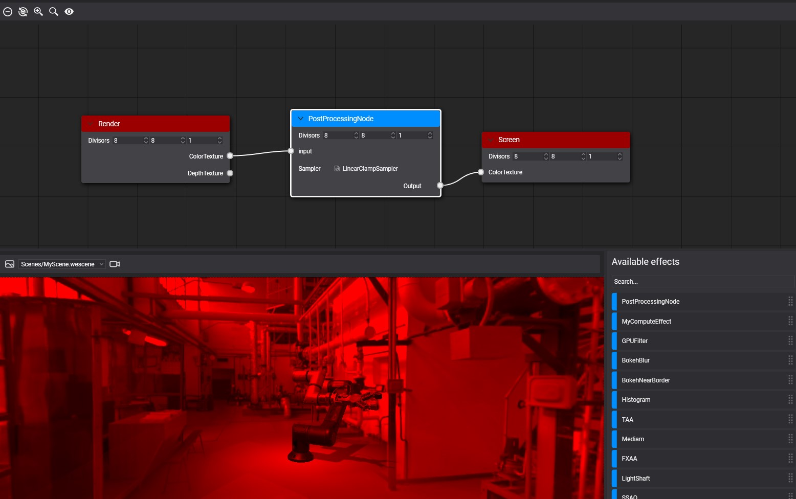

# Custom Postprocessing graph
---

In this section, it is explain how to create your custom postprocessing graph. This can be useful for create and test no available effects in the default postprocessing graph.

## Example

For this example we are going to create a simple filter that render only the red component of the image.

First, create a compute effect from [**Assets Details panel**](../../evergine_studio/interface.md):


Write the code of our custom filter from [**Effect Editor**](../effects/effect_editor.md):

```csharp
 [Begin_ResourceLayout]

    Texture2D input : register(t0);
    RWTexture2D<float4> Output : register(u0);

    SamplerState Sampler : register(s0);

[End_ResourceLayout]

[Begin_Pass:Default]

    [Profile 11_0]
    [Entrypoints CS = CS]

    [numthreads(8, 8, 1)]
    void CS(uint3 threadID : SV_DispatchThreadID)
    {
        float2 outputSize;
        Output.GetDimensions(outputSize.x, outputSize.y);
        float2 uv = (threadID.xy + 0.5) / outputSize;		

        float4 color = input.SampleLevel(Sampler, uv, 0);

        Output[threadID.xy] = float4(color.x,0,0,1);	
    }

[End_Pass]
```

Create a new Postprocessing graph asset from [**Assets Details panel**](../../evergine_studio/interface.md)


After create the postprocessing graph asset make double click on the asset to open the Postprocessing Graph Editor. You can see an empty postprocessing graph where the render node connect directly with the Screen node.


Drag our compute effect from the Available effects panel to the graph editor to create a new node. Then connect render node _Color texture_ port with Custom node _Input_ port and Custom node _Output_ port with Screen node _Color Texture_ port.


After save the graph, you can see the result on the viewport panel.



To use your custom postprocssing graph in your scene read more details in [using postprocessing graph section](using_postprocessing_graphs.md)
